# Source: index.md

---
body_class: object index
---

# Refdog

#### Concepts

[Concept overview](concepts/overview.html) 
[Concept index](concepts/index.html)

#### Resources

[Resource overview](resources/overview.html) 
[Resource index](resources/index.html)

#### Commands

[Command overview](commands/overview.html) 
[Command index](commands/index.html)

---

# Source: toc.md

# Table of Contents

- index.md
- toc.md
- commands/index.md
- commands/overview.md
- commands/version.md
- commands/connector/create.md
- commands/connector/delete.md
- commands/connector/generate.md
- commands/connector/index.md
- commands/connector/status.md
- commands/connector/update.md
- commands/debug/check.md
- commands/debug/dump.md
- commands/debug/index.md
- commands/link/delete.md
- commands/link/generate.md
- commands/link/index.md
- commands/link/status.md
- commands/link/update.md
- commands/listener/create.md
- commands/listener/delete.md
- commands/listener/generate.md
- commands/listener/index.md
- commands/listener/status.md
- commands/listener/update.md
- commands/site/create.md
- commands/site/delete.md
- commands/site/generate.md
- commands/site/index.md
- commands/site/reload.md
- commands/site/start.md
- commands/site/status.md
- commands/site/stop.md
- commands/site/update.md
- commands/system/apply.md
- commands/system/index.md
- commands/system/install.md
- commands/system/reload.md
- commands/system/start.md
- commands/system/status.md
- commands/system/stop.md
- commands/system/uninstall.md
- commands/token/index.md
- commands/token/issue.md
- commands/token/redeem.md
- concepts/access-token.md
- concepts/application.md
- concepts/component.md
- concepts/connector.md
- concepts/index.md
- concepts/link.md
- concepts/listener.md
- concepts/network.md
- concepts/overview.md
- concepts/platform.md
- concepts/routing-key.md
- concepts/site.md
- concepts/workload.md
- resources/access-grant.md
- resources/access-token.md
- resources/attached-connector-binding.md
- resources/attached-connector.md
- resources/connector.md
- resources/index.md
- resources/link.md
- resources/listener.md
- resources/overview.md
- resources/router-access.md
- resources/site.md
- topics/application-tls.md
- topics/attached-connectors.md
- topics/components.md
- topics/controller-configuration.md
- topics/debug-dumps.md
- topics/high-availability.md
- topics/index.md
- topics/individual-pod-services.md
- topics/large-networks.md
- topics/load-balancing.md
- topics/resource-settings.md
- topics/resource-status.md
- topics/router-tls.md
- topics/service-exposure.md
- topics/site-configuration.md
- topics/site-linking.md
- topics/skupper-overview.md
- topics/system-namespaces.md
- topics/system-tls-credentials.md

---

# Source: commands/index.md

---
refdog_links:
  - title: Command overview
    url: overview.html
  - title: Concept index
    url: /concepts/index.html
  - title: Resource index
    url: /resources/index.html
---

# Skupper commands

#### Site operations

<table class="objects">
<tr><th><a href="{{site_prefix}}/commands/site/index.html">Site</a></th><td>Overview of site commands</td></tr>
<tr><th><a href="{{site_prefix}}/commands/site/create.html">Site create</a></th><td>Create a site</td></tr>
<tr><th><a href="{{site_prefix}}/commands/site/update.html">Site update</a></th><td>Change site settings</td></tr>
<tr><th><a href="{{site_prefix}}/commands/site/delete.html">Site delete</a></th><td>Delete a site</td></tr>
<tr><th><a href="{{site_prefix}}/commands/site/status.html">Site status</a></th><td>Display the status of a site</td></tr>
<tr><th><a href="{{site_prefix}}/commands/site/generate.html">Site generate</a></th><td>Generate a Site resource</td></tr>
</table>

#### Site linking

<table class="objects">
<tr><th><a href="{{site_prefix}}/commands/token/index.html">Token</a></th><td>Overview of token commands</td></tr>
<tr><th><a href="{{site_prefix}}/commands/token/issue.html">Token issue</a></th><td>Issue a token file redeemable for a link to the current site</td></tr>
<tr><th><a href="{{site_prefix}}/commands/token/redeem.html">Token redeem</a></th><td>Redeem a token file in order to create a link to a remote site</td></tr>
</table>

<table class="objects">
<tr><th><a href="{{site_prefix}}/commands/link/index.html">Link</a></th><td>Overview of link commands</td></tr>
<tr><th><a href="{{site_prefix}}/commands/link/update.html">Link update</a></th><td>Change link settings</td></tr>
<tr><th><a href="{{site_prefix}}/commands/link/delete.html">Link delete</a></th><td>Delete a link</td></tr>
<tr><th><a href="{{site_prefix}}/commands/link/status.html">Link status</a></th><td>Display the status of links in the current site</td></tr>
<tr><th><a href="{{site_prefix}}/commands/link/generate.html">Link generate</a></th><td>Generate a Link resource for use in a remote site</td></tr>
</table>

#### Service exposure

<table class="objects">
<tr><th><a href="{{site_prefix}}/commands/listener/index.html">Listener</a></th><td>Overview of listener commands</td></tr>
<tr><th><a href="{{site_prefix}}/commands/listener/create.html">Listener create</a></th><td>Create a listener</td></tr>
<tr><th><a href="{{site_prefix}}/commands/listener/update.html">Listener update</a></th><td>Update a listener</td></tr>
<tr><th><a href="{{site_prefix}}/commands/listener/delete.html">Listener delete</a></th><td>Delete a listener</td></tr>
<tr><th><a href="{{site_prefix}}/commands/listener/status.html">Listener status</a></th><td>Display the status of listeners in the current site</td></tr>
<tr><th><a href="{{site_prefix}}/commands/listener/generate.html">Listener generate</a></th><td>Generate a Listener resource</td></tr>
</table>

<table class="objects">
<tr><th><a href="{{site_prefix}}/commands/connector/index.html">Connector</a></th><td>Overview of connector commands</td></tr>
<tr><th><a href="{{site_prefix}}/commands/connector/create.html">Connector create</a></th><td>Create a connector</td></tr>
<tr><th><a href="{{site_prefix}}/commands/connector/update.html">Connector update</a></th><td>Update a connector</td></tr>
<tr><th><a href="{{site_prefix}}/commands/connector/delete.html">Connector delete</a></th><td>Delete a connector</td></tr>
<tr><th><a href="{{site_prefix}}/commands/connector/status.html">Connector status</a></th><td>Display the status of connectors in the current site</td></tr>
<tr><th><a href="{{site_prefix}}/commands/connector/generate.html">Connector generate</a></th><td>Generate a Connector resource</td></tr>
</table>

#### System operations

<table class="objects">
<tr><th><a href="{{site_prefix}}/commands/system/index.html">System</a></th><td>Overview of system commands</td></tr>
<tr><th><a href="{{site_prefix}}/commands/system/install.html">System install</a></th><td>Install the Skupper components</td></tr>
<tr><th><a href="{{site_prefix}}/commands/system/uninstall.html">System uninstall</a></th><td>Remove the Skupper components</td></tr>
<tr><th><a href="{{site_prefix}}/commands/system/start.html">System start</a></th><td>Start up the Skupper components for the current site</td></tr>
<tr><th><a href="{{site_prefix}}/commands/system/stop.html">System stop</a></th><td>Shut down the Skupper components for the current site</td></tr>
<tr><th><a href="{{site_prefix}}/commands/system/reload.html">System reload</a></th><td>Reload the site configuration</td></tr>
<tr><th><a href="{{site_prefix}}/commands/system/status.html">System status</a></th><td>Display the status of the system</td></tr>
</table>

#### Debugging operations

<table class="objects">
<tr><th><a href="{{site_prefix}}/commands/debug/index.html">Debug</a></th><td>Overview of debug commands</td></tr>
<tr><th><a href="{{site_prefix}}/commands/debug/check.html">Debug check</a></th><td>Run diagnostic checks</td></tr>
<tr><th><a href="{{site_prefix}}/commands/debug/dump.html">Debug dump</a></th><td>Generate a debug dump file</td></tr>
</table>

#### Other operations

<table class="objects">
<tr><th><a href="{{site_prefix}}/commands/version.html">Version</a></th><td>Display versions of Skupper components</td></tr>
</table>

---

# Source: commands/overview.md

---
refdog_links:
  - title: Command index
    url: index.html
  - title: Concept overview
    url: /concepts/overview.html
  - title: Resource overview
    url: /resources/overview.html
---

# Skupper command overview

Skupper uses the `skupper` command as its command-line interface (CLI)
for creating and operating Skupper networks.

#### Capabilities

In its primary role, the Skupper CLI is a thin layer on top of the
standard Skupper resources.  Its job is to configure sites, listeners,
and connectors.  It additionally provides commands for site linking,
system operation, and troubleshooting.

- **Resource configuration:** Create, update, and delete Skupper
  resources.
- **Resource status:** Display the current state of Skupper resources.
- **Resource generation:** Produce Skupper resources in YAML or JSON
  format.
- **Site linking:** Use tokens to set up site-to-site links.
- **System operation:** Install and operate Skupper runtime
  components.
- **Troubleshooting:** Use debugging tools to identify and fix
  problems.

By design, the Skupper CLI does not do everything the Skupper
resources can do.  We encourage you to use the resources directly for
advanced use cases.

#### Usage

~~~
skupper [command] [subcommand] [options]
~~~

- `command`: A resource type or functional area.
- `subcommand`: The specific operation you want to perform.
- `options`: Additional arguments that change the operation's
  behavior.

#### Context

Skupper commands operate with a current platform and namespace (with a
few exceptions).  On Kubernetes, there is additionally a current
kubeconfig and context.  You can use CLI options or environment
variables to change the current selection.

| Context | Default | CLI option | Environment variable |
|-|-|-|-|
| Platform | `kubernetes` | `--platform` | `SKUPPER_PLATFORM` |
| Namespace | _From kubeconfig_ | `--namespace` | _None_ |
| Kubeconfig context | _From kubeconfig_ | `--context` | _None_ |
| Kubeconfig | `~/.kube/config` | `--kubeconfig` | `KUBECONFIG` |

On Docker, Podman, and Linux, the current namespace defaults to
`default`.

#### Blocking

On Kubernetes, resource operations block until the desired outcome is
achieved, an error occurs, or the timeout is exceeded.  You can change
the wait condition and the timeout duration using the `--wait` and
`--timeout` options.

- Site and link operations block until the resource is ready.
- Listener and connector operations block until the resource is
  configured.
- All resource delete operations block until deletion is complete.

On Docker, Podman, and Linux, resource operations do not block.
Instead, they place the resources in the input location.  Changes are
applied when the user invokes `skupper system reload`.

#### Errors

The Skupper CLI returns a non-zero exit code indicating an error when:

* User input is invalid.
* Referenced resources are not found.
* The operation fails or times out.

## Resource commands

~~~
skupper <resource-type> create <resource-name> [options]
skupper <resource-type> update <resource-name> [options]
skupper <resource-type> delete <resource-name> [options]
skupper <resource-type> status [resource-name] [options]
skupper <resource-type> generate <resource-name> [options]
~~~

These commands operate on Skupper sites, links, listeners, and
connectors.

Resource properties are set using one or more `--some-key some-value`
command-line options.  YAML resource options in camel case (`someKey`)
are exposed as hyphenated names (`--some-key`) when used as options.

The `create`, `update`, and `delete` commands control the lifecycle of
Skupper resources and configure their properties.

The `status` commands display the current state of resources.  If no
resource name is specified, they list the status of all resources of
the given type.

The `generate` commands produce Skupper resources as YAML or JSON
output.  They are useful for directing the output to files or other
tools.

## Token commands

~~~
skupper token issue <token-file> [options]
skupper token redeem <token-file> [options]
~~~

These commands use access tokens to create links between sites.

The `token issue` command creates an access token for use in remote
sites.  The `token redeem` command uses an access token to create a
link to the issuing site.

## System commands

~~~
skupper system install [options]
skupper system uninstall [options]
skupper system start [options]
skupper system stop [options]
skupper system reload [options]
skupper system status [options]
~~~

These commands configure and operate the Skupper runtime components
for Docker, Podman, and Linux sites.

## Debug commands

~~~
skupper debug check [options]
skupper debug dump [options]
~~~

These commands help you troubleshoot problems.

## Version command

~~~
skupper version
~~~

The `version` command displays the versions of Skupper components.

<!-- ## Hello World using the CLI -->

<!-- ~~~ console -->
<!-- # Get the CLI -->

<!-- $ curl https://skupper.io/install.sh | sh -->

<!-- # West -->

<!-- $ export KUBECONFIG=~/.kube/config-west -->
<!-- $ kubectl apply -f https://skupper.io/install.yaml -->
<!-- $ kubectl create deployment frontend --image quay.io/skupper/hello-world-frontend -->

<!-- $ skupper site create --enable-link-access -->
<!-- $ skupper listener create backend 8080 -->
<!-- $ skupper token issue ~/token.yaml -->

<!-- # East -->

<!-- $ export KUBECONFIG=~/.kube/config-east -->
<!-- $ kubectl apply -f https://skupper.io/install.yaml -->
<!-- $ kubectl create deployment backend --image quay.io/skupper/hello-world-backend --replicas 3 -->

<!-- $ skupper site create -->
<!-- $ skupper connector create backend 8080 -->
<!-- $ skupper token redeem ~/token.yaml -->
<!-- ~~~ -->

---

# Source: commands/version.md

---
body_class: object command
refdog_links: []
refdog_object_has_attributes: true
---

# Version command

~~~ shell
skupper version [options]
~~~

Display versions of Skupper components.

<table class="fields"><tr><th>Platforms</th><td>Kubernetes, Docker, Podman, Linux</td></table>

## Examples

~~~ console
# Show component versions
$ skupper version
COMPONENT          VERSION
cli                2.0.0
controller         2.0.0
router             3.0.0

# Show version details in YAML format
$ skupper version --output yaml
components:
  cli:
    version: 2.0.0
  controller:
    version: 2.0.0
    images:
      controller:
        name: quay.io/skupper/controller:2.0.0
        digest: sha256:663d97f86ff3fcce27a3842cd2b3a8e32af791598a46d815c07b0aec07505f55
  router:
    version: 3.0.0
    images:
      router:
        name: quay.io/skupper/router:3.0.0
        digest: sha256:dc5e27385a1e110dd2db1903ba7ec3e0d50b57f742aa02d7dd0a7b1b68c34394
      kube-adaptor:
        name: quay.io/skupper/kube-adaptor:2.0.0
        digest: sha256:4dc24bb3d605ed3fcec2f8ef7d45ca883d9d87b278bfedd5fcca74281d617a5e
~~~

## Primary options

<h3 id="option-output">--output</h3>

(-o) &lt;format&gt;

Produce verbose structured output.

<table class="fields"><tr><th>Choices</th><td><table class="choices"><tr><th><code>json</code></th><td>
Produce JSON output

</td></tr><tr><th><code>yaml</code></th><td>
Produce YAML output

</td></tr></table></td><tr><th>Platforms</th><td>Kubernetes, Docker, Podman, Linux</td></table>

## Global options

<h3 id="option-context">--context</h3>

&lt;name&gt;

global

Set the kubeconfig context.

<table class="fields"><tr><th>Platforms</th><td>Kubernetes</td><tr><th>See also</th><td><a href="https://kubernetes.io/docs/concepts/configuration/organize-cluster-access-kubeconfig/">Kubernetes kubeconfigs</a></td></table>

<h3 id="option-kubeconfig">--kubeconfig</h3>

&lt;file&gt;

global

Set the path to the kubeconfig file.

<table class="fields"><tr><th>Platforms</th><td>Kubernetes</td><tr><th>See also</th><td><a href="https://kubernetes.io/docs/concepts/configuration/organize-cluster-access-kubeconfig/">Kubernetes kubeconfigs</a></td></table>

<h3 id="option-namespace">--namespace</h3>

(-n) &lt;name&gt;

global

Set the current namespace.

<table class="fields"><tr><th>Platforms</th><td>Kubernetes, Docker, Podman, Linux</td><tr><th>See also</th><td><a href="https://kubernetes.io/docs/concepts/overview/working-with-objects/namespaces/">Kubernetes namespaces</a>, <a href="{{site_prefix}}/topics/system-namespaces.html">System namespaces</a></td></table>

<h3 id="option-platform">--platform</h3>

&lt;platform&gt;

global

Set the Skupper platform.

<!-- You can also use the `SKUPPER_PLATFORM` environment variable. -->

<table class="fields"><tr><th>Default</th><td>
<code>kubernetes</code>

</td><tr><th>Choices</th><td><table class="choices"><tr><th><code>kubernetes</code></th><td>
Kubernetes

</td></tr><tr><th><code>docker</code></th><td>
Docker

</td></tr><tr><th><code>podman</code></th><td>
Podman

</td></tr><tr><th><code>linux</code></th><td>
Linux

</td></tr></table></td><tr><th>Platforms</th><td>Kubernetes, Docker, Podman, Linux</td><tr><th>See also</th><td><a href="{{site_prefix}}/concepts/platform.html">Platform concept</a></td></table>

<h3 id="option-help">--help</h3>

(-h) boolean

global

Display help and exit.

<table class="fields"><tr><th>Platforms</th><td>Kubernetes, Docker, Podman, Linux</td></table>

---

# Source: concepts/access-token.md

---
body_class: object concept
refdog_links:
- title: Site linking
  url: /topics/site-linking.html
- title: AccessToken resource
  url: /resources/access-token.html
- title: Link concept
  url: /concepts/link.html
- title: AccessGrant resource
  url: /resources/access-grant.html
- title: AccessToken resource
  url: /resources/access-token.html
- title: Token command
  url: /commands/token/index.html
---

# Access token concept

An access token is a short-lived credential used to create a
[link](link.html).  An access token contains the URL and secret code
of a corresponding _access grant_.

<figure>
  
  <figcaption>Issuing tokens</figcaption>
</figure>

<figure>
  
  <figcaption>Redeeming tokens</figcaption>
</figure>

Access tokens are issued from access grants.  A grant issues zero or
more tokens.  Tokens are redeemed for links.

Access tokens have limited redemptions and limited lifespans.
By default, they can be redeemed only once, and they expire 15
minutes after being issued.  You can set custom limits by
configuring the access grant.

<figure>
  
  <figcaption>The sequence for issuing and redeeming access tokens</figcaption>
</figure>

* A site wishing to accept a link (site 1) creates an access grant.

* It uses the access grant to issue a corresponding access token
  and transfers it to a remote site (site 2).

* Site 2 submits the access token to site 1 for redemption.

* If the token is valid, site 1 sends site 2 the TLS host, port, and
  credentials required to create a link to site 1.

---

# Source: concepts/application.md

---
body_class: object concept
refdog_links:
- title: Network concept
  url: /concepts/network.html
- title: Component concept
  url: /concepts/component.html
---

# Application concept

An application is a set of [components](component.html) that work
together.  A Skupper [network](network.html) is dedicated to one
application.

<figure>
  
  <figcaption>The application model</figcaption>
</figure>

An application has one or more components.

<figure>
  
  <figcaption>A simple application with two components</figcaption>
</figure>

<figure>
  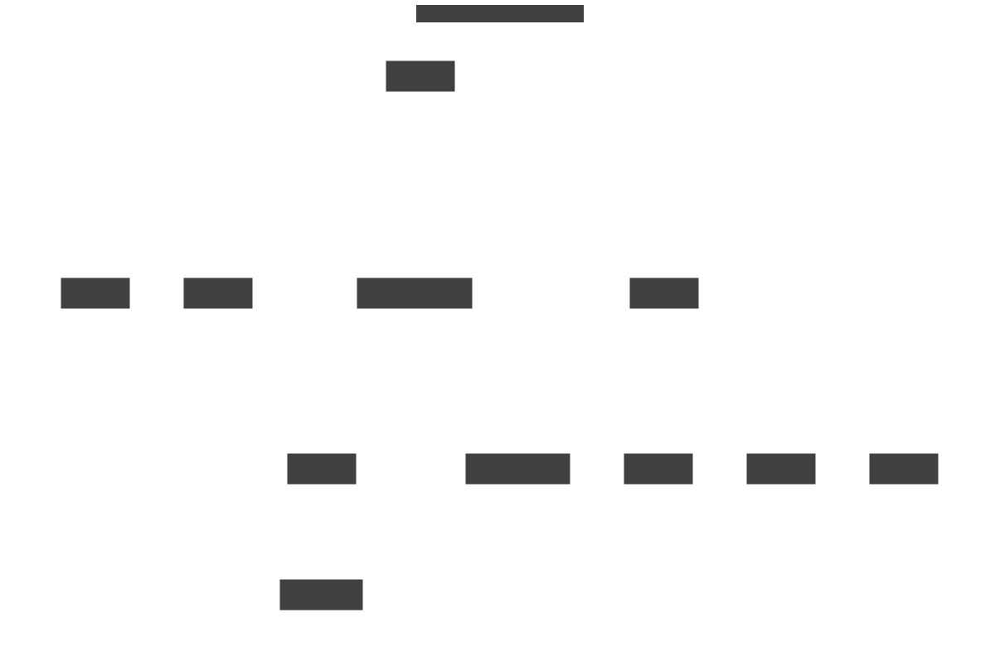
  <figcaption>The components of the Online Boutique example application</figcaption>
</figure>

---

# Source: concepts/component.md

---
body_class: object concept
refdog_links:
- title: Application concept
  url: /concepts/application.html
- title: Workload concept
  url: /concepts/workload.html
---

# Component concept

A component is a logical part of an [application](application.html).
Each component has a set of responsibilities in achieving the goals
of the application.  Components provide and require _interfaces_
such as REST APIs or database listeners.  A component is implemented
by [workloads](workload.html).

<figure>
  
  <figcaption>The component model</figcaption>
</figure>

An application has one or more components.  Each component provides
and requires zero or more interfaces.  Each component is implemented
by zero or more workloads.

<figure>
  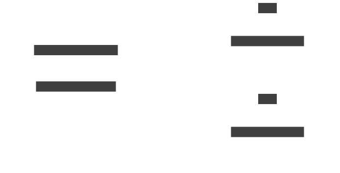
  <figcaption>A component with workloads in two different
  sites</figcaption>
</figure>

<figure>
  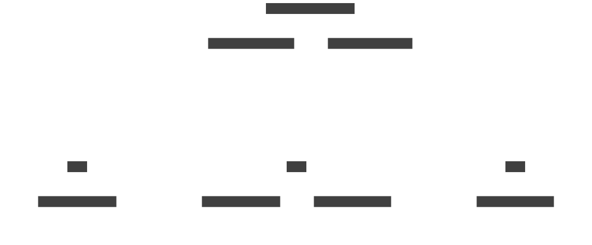
  <figcaption>Hello World with its components implemented by
  workloads in three different sites</figcaption>
</figure>

---

# Source: concepts/connector.md

---
body_class: object concept
refdog_links:
- title: Service exposure
  url: /topics/service-exposure.html
- title: Connector resource
  url: /resources/connector.html
- title: Connector command
  url: /commands/connector/index.html
- title: Listener concept
  url: /concepts/listener.html
- title: Routing key concept
  url: /concepts/routing-key.html
---

# Connector concept

A connector binds a local [workload](workload.html) to
[listeners](listener.html) in remote [sites](site.html).  Listeners
and connectors are matched using [routing keys](routing-key.html).

<figure>
  
  <figcaption>The connector model</figcaption>
</figure>

<figure>
  
  <figcaption>The routing key model</figcaption>
</figure>

A site has zero or more connectors.  Each connector has an
associated workload and routing key.  The workload can be specified
as a Kubernetes pod selector or as the host and port of a local
network service.  The routing key is a string identifier that binds
the connector to listeners in remote sites.

On Kubernetes, the workload is usually specified using a pod
[selector][kube-selector].  On Docker, Podman, and Linux, it is
specified using a host and port.

[kube-selector]: https://kubernetes.io/docs/concepts/overview/working-with-objects/labels/

<figure>
  
  <figcaption>Client connections forwarded to servers</figcaption>
</figure>

Skupper routers forward client connections across the network from
listeners to connectors with matching routing keys.  The connectors
then forward the client connections to the workload servers.

<figure>
  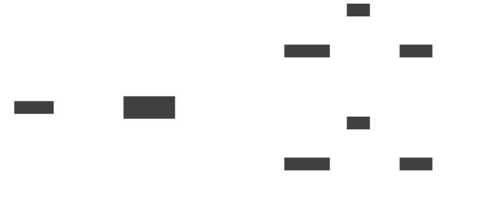
  <figcaption>A database service with connectors in two
  sites</figcaption>
</figure>

---

# Source: concepts/index.md

---
refdog_links:
  - title: Concept overview
    url: overview.html
  - title: Resource index
    url: /resources/index.html
  - title: Command index
    url: /commands/index.html
---

# Skupper concepts

#### Sites

<table class="objects">
<tr><th><a href="{{site_prefix}}/concepts/site.html">Site</a></th><td>A site is a place on the network where application workloads are running</td></tr>
<tr><th><a href="{{site_prefix}}/concepts/workload.html">Workload</a></th><td>A workload is a set of processes running on a platform</td></tr>
<tr><th><a href="{{site_prefix}}/concepts/platform.html">Platform</a></th><td>A platform is a system for running application workloads</td></tr>
</table>

#### Networks

<table class="objects">
<tr><th><a href="{{site_prefix}}/concepts/network.html">Network</a></th><td>A network is a set of sites joined by links</td></tr>
<tr><th><a href="{{site_prefix}}/concepts/link.html">Link</a></th><td>A link is a channel for communication between sites</td></tr>
<tr><th><a href="{{site_prefix}}/concepts/access-token.html">Access token</a></th><td>An access token is a short-lived credential used to create a link</td></tr>
</table>

#### Services

<table class="objects">
<tr><th><a href="{{site_prefix}}/concepts/listener.html">Listener</a></th><td>A listener binds a local connection endpoint to connectors in remote sites</td></tr>
<tr><th><a href="{{site_prefix}}/concepts/connector.html">Connector</a></th><td>A connector binds a local workload to listeners in remote sites</td></tr>
<tr><th><a href="{{site_prefix}}/concepts/routing-key.html">Routing key</a></th><td>A routing key is a string identifier for matching listeners and connectors</td></tr>
</table>

#### Applications

<table class="objects">
<tr><th><a href="{{site_prefix}}/concepts/application.html">Application</a></th><td>An application is a set of components that work together</td></tr>
<tr><th><a href="{{site_prefix}}/concepts/component.html">Component</a></th><td>A component is a logical part of an application</td></tr>
</table>

---

# Source: concepts/link.md

---
body_class: object concept
refdog_links:
- title: Site linking
  url: /topics/site-linking.html
- title: Link resource
  url: /resources/link.html
- title: Link command
  url: /commands/link/index.html
- title: Network concept
  url: /concepts/network.html
- title: Site concept
  url: /concepts/site.html
- title: Access token concept
  url: /concepts/access-token.html
---

# Link concept

A link is a channel for communication between [sites](site.html).
Links carry application connections and requests.  A set of linked
sites constitutes a [network](network.html).

To create a link to a remote site, the remote site must enable
_link access_.  Link access provides an external access point for
accepting links.

<figure>
  
  <figcaption>The link model</figcaption>
</figure>

<figure>
  
  <figcaption>The link access model</figcaption>
</figure>

A site has zero or more links.  Each link has a host, port, and TLS
credentials for making a mutual TLS connection to a remote site.  In
addition, a site has zero or more link accesses.  Usually only one
is needed per site.  Each link access has a host, port, and TLS
credentials for exposing a TLS endpoint that accepts connections
from remote sites.

Application connections and requests flow across links in both
directions.  A linked site can communicate with any other site in
the network, even if it is not linked directly.  Links can be added
and removed dynamically.

You can use [access tokens](access-token.html) to securely exchange
the connection details required to create a link.

<figure>
  
  <figcaption>A link joining two sites to create a simple network</figcaption>
</figure>

<figure>
  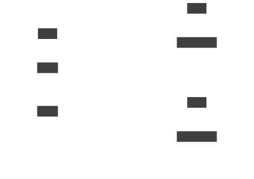
  <figcaption>A site with two links, to two remote sites</figcaption>
</figure>

<figure>
  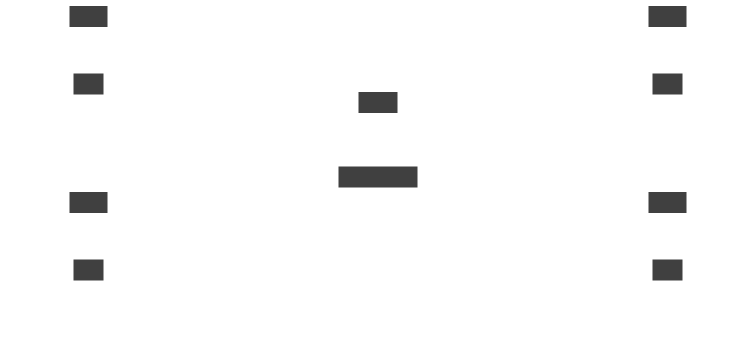
  <figcaption>A larger network with links to a central hub site</figcaption>
</figure>

---

# Source: concepts/listener.md

---
body_class: object concept
refdog_links:
- title: Service exposure
  url: /topics/service-exposure.html
- title: Listener resource
  url: /resources/listener.html
- title: Listener command
  url: /commands/listener/index.html
- title: Connector concept
  url: /concepts/connector.html
- title: Routing key concept
  url: /concepts/routing-key.html
---

# Listener concept

A listener binds a local connection endpoint to
[connectors](connector.html) in remote [sites](site.html).
Listeners and connectors are matched using [routing
keys](routing-key.html).

<figure>
  
  <figcaption>The listener model</figcaption>
</figure>

<figure>
  
  <figcaption>The routing key model</figcaption>
</figure>

A site has zero or more listeners.  Each listener has an associated
connection endpoint and routing key.  The connection endpoint
exposes a host and port for accepting connections from local
clients.  The routing key is a string identifier that binds the
listener to connectors in remote sites.

On Kubernetes, a listener is implemented as a
[Service][kube-service].  On Docker, Podman, and Linux, it is a
listening socket bound to a local network interface.

[kube-service]: https://kubernetes.io/docs/concepts/services-networking/service/

<figure>
  
  <figcaption>Client connections forwarded to servers</figcaption>
</figure>

Skupper routers forward client connections across the network from
listeners to connectors with matching routing keys.  The connectors
then forward the client connections to the workload servers.

<figure>
  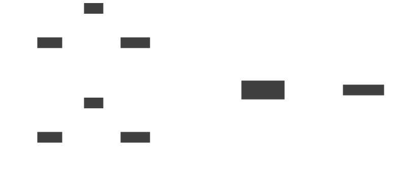
  <figcaption>A database service with listeners in two
  sites</figcaption>
</figure>

---

# Source: concepts/network.md

---
body_class: object concept
refdog_links:
- title: Site linking
  url: /topics/site-linking.html
- title: Site concept
  url: /concepts/site.html
- title: Link concept
  url: /concepts/link.html
---

# Network concept

A network is a set of [sites](site.html) joined by
[links](link.html). A Skupper network is also known as an
application network or virtual application network (VAN).

<figure>
  
  <figcaption>The network model</figcaption>
</figure>

A network has one or more sites.  Each site belongs to only one
network.

Each site in the network can expose services to other sites in the
network. In turn, each site in the network can access those exposed
services.  Each network is meant for one distributed application.
This provides isolation from other applications and networks.

<figure>
  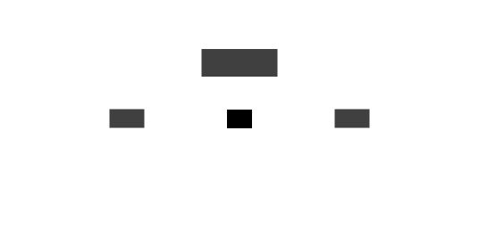
  <figcaption>A simple network with two sites</figcaption>
</figure>

<figure>
  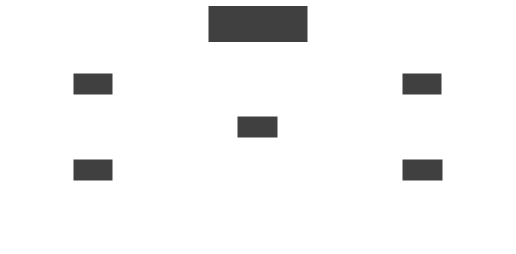
  <figcaption>A larger network</figcaption>
</figure>

---

# Source: concepts/overview.md

---
refdog_links:
  - title: Concept index
    url: index.html
  - title: Resource overview
    url: /resources/overview.html
  - title: Command overview
    url: /commands/overview.html
---

# Skupper concept overview

<figure>
  
  <figcaption>The primary concepts in the Skupper model</figcaption>
</figure>

## Sites

Skupper's job is to provide connectivity for applications that have
parts running in multiple locations and on different platforms.  A
[site](site.html) represents a particular location and a particular
[platform](platform.html).  It's a place where you have real running
[workloads](workload.html).  Each site corresponds to one platform
namespace, so you can have multiple sites on one platform.

<figure>
  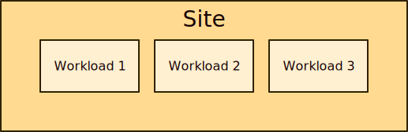
  <figcaption>A site with three workloads</figcaption>
</figure>

## Networks

In a distributed application, those workloads need to communicate with
other workloads in other sites.  Skupper uses [links](link.html)
between sites to provide site-to-site communication.  Links are always
secured using mutual TLS authentication and encryption.

When a set of sites are linked, they function as one
application-focused [network](network.html).  You can use short-lived
[access tokens](access-token.html) to securely create links.

<figure>
  
  <figcaption>A simple network with two sites</figcaption>
</figure>

## Services

Site-to-site links are distinct from application connections.  Links
form the transport for your network. Application connections are
carried on top of this transport. Application connections can be
established in any direction and to any site, regardless of how the
underlying links are established.

Services are exposed on the network by creating corresponding
[listeners](listener.html) and [connectors](connector.html).  A
listener in one site provides a connection endpoint for client
workloads.  A connector in another site binds to local server
workloads.

The listener and connector are associated using a [routing
key](routing-key.html).  Skupper routers use the routing key to
forward client connections to the sites where the server workload is
running.

<figure>
  
  <figcaption>A workload exposed as a service in a remote site</figcaption>
</figure>

## Applications

An [application](application.html) is a set of
[components](component.html) that work together to do something
useful. A *distributed* application has components that can be
deployed as workloads in different locations. Distributed applications
are often built with a multitier, service-oriented, or microservices
architecture.

Because Skupper makes communication transparent to the application,
the location of the running workloads is a concern independent of the
application's design. You can deploy your application workloads to
locations that suit you today, and you can safely change to new
locations later.

<figure>
  
  <figcaption>A simple application with two components</figcaption>
</figure>

<figure>
  
  <figcaption>Hello World with its components implemented by
  workloads in three different sites</figcaption>
</figure>

---

# Source: concepts/platform.md

---
body_class: object concept
refdog_links:
- title: Site concept
  url: /concepts/site.html
---

# Platform concept

A platform is a system for running application
[workloads](workload.html).  A platform hosts [sites](site.html).
Skupper supports Kubernetes, Docker, Podman, and Linux.  Each site
in a network can run on any supported platform.

Platforms provide _namespaces_ for related workloads and resources.
Skupper uses namespaces to host multiple independent sites on one
instance of a platform.  Each site on a platform can belong to a
distinct application network.

<figure>
  
  <figcaption>The platform model</figcaption>
</figure>

A platform has zero or more namespaces.  Each namespace is
associated with zero or more workloads.  A namespace may be
associated with a site.

<figure>
  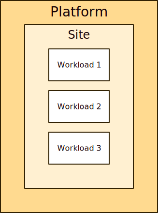
  <figcaption>A simple network with sites on two different
  platforms</figcaption>
</figure>

<figure>
  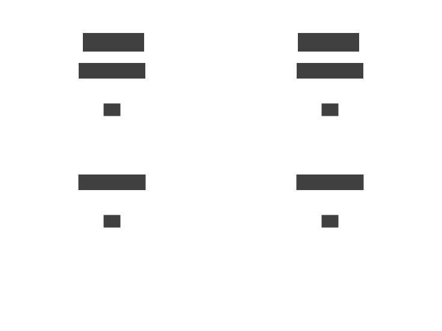
  <figcaption>Two different networks spanning two
  platforms</figcaption>
</figure>

---

# Source: concepts/routing-key.md

---
body_class: object concept
refdog_links:
- title: Service exposure
  url: /topics/service-exposure.html
- title: Listener concept
  url: /concepts/listener.html
- title: Connector concept
  url: /concepts/connector.html
---

# Routing key concept

A routing key is a string identifier for matching
[listeners](listener.html) and [connectors](connector.html).

<figure>
  
  <figcaption>The routing key model</figcaption>
</figure>

A routing key has zero or more listeners and zero or more
connectors.  A service is exposed on the application network when it
has at least one listener and one connector, matched by routing key.

<figure>
  
  <figcaption>A workload exposed as a service in a remote
  site</figcaption>
</figure>

<figure>
  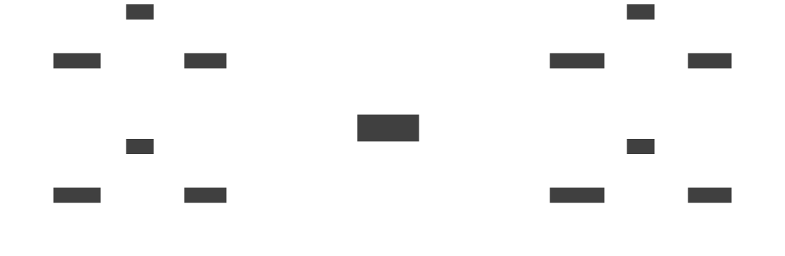
  <figcaption>A routing key with two listeners and two
  connectors</figcaption>
</figure>

---

# Source: concepts/site.md

---
body_class: object concept
refdog_links:
- title: Site resource
  url: /resources/site.html
- title: Site command
  url: /commands/site/index.html
- title: Link concept
  url: /concepts/link.html
- title: Network concept
  url: /concepts/network.html
- title: Platform concept
  url: /concepts/platform.html
- title: Workload concept
  url: /concepts/workload.html
---

# Site concept

A site is a place on the [network](network.html) where application
[workloads](workload.html) are running.  Sites are joined by
[links](link.html).

<figure>
  
  <figcaption>The site model</figcaption>
</figure>

A site is associated with one platform and one network.  Each site
has zero or more workloads and zero or more links.

Sites operate on multiple [platforms](platform.html).  One site
corresponds to one namespace in a platform instance.  Sites can be
added to a network and removed from a network dynamically.

Each site has a Skupper router which is responsible for
communicating with the local workloads and forwarding traffic to
routers in remote sites.

<figure>
  
  <figcaption>A site with three workloads</figcaption>
</figure>

<figure>
  
  <figcaption>Two sites linked to form a network</figcaption>
</figure>

<figure>
  
  <figcaption>A network with sites on three different
  platforms</figcaption>
</figure>

---

# Source: concepts/workload.md

---
body_class: object concept
refdog_links:
- title: Platform concept
  url: /concepts/platform.html
- title: Site concept
  url: /concepts/site.html
- title: Connector concept
  url: /concepts/connector.html
---

# Workload concept

A workload is a set of processes running on a
[platform](platform.html).  A _process_ is a pod, container, or
system process.  Workloads in a [site](site.html) are exposed as
services on the [network](network.html) using
[connectors](connector.html).

<figure>
  
  <figcaption>The workload model</figcaption>
</figure>

A platform has zero or more workloads.  A site also has zero or more
workloads.  Each workload has zero or more processes and zero or
more [connectors](connector.html).

A workload implements one part of an application by providing a
network interface (for example, an API) that other parts of the
application use.  A workload can be both a client and a server.

On Kubernetes, a workload is a Deployment, StatefulSet, or
DaemonSet.  On Docker or Podman, a workload is a set of containers.
On Linux, a workload is a set of system processes.

<figure>
  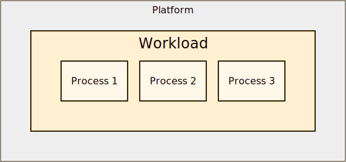
  <figcaption>A workload with three processes</figcaption>
</figure>

<figure>
  
  <figcaption>A workload exposed as a service using a
  connector</figcaption>
</figure>

---

# Source: resources/access-grant.md

---
body_class: object resource
refdog_links:
- title: Site linking
  url: /topics/site-linking.html
- title: Access token concept
  url: /concepts/access-token.html
- title: AccessToken resource
  url: /resources/access-token.html
- title: Token issue command
  url: /commands/token/issue.html
refdog_object_has_attributes: true
---

# AccessGrant resource

Permission to redeem access tokens for links to the local
site.  A remote site can use a token containing the grant
URL and secret code to obtain a certificate signed by the
grant's certificate authority (CA), within a certain
expiration window and for a limited number of redemptions.

The `code`, `url`, and `ca` properties of the resource
status are used to generate access tokens from the grant.

## Metadata properties

<h3 id="metadata-name">name</h3>

string

required

The name of the resource.

<table class="fields"><tr><th>Platforms</th><td>Kubernetes, Docker, Podman, Linux</td><tr><th>See also</th><td><a href="https://kubernetes.io/docs/concepts/overview/working-with-objects/names/">Kubernetes object names</a></td></table>

<h3 id="metadata-namespace">namespace</h3>

string

The namespace of the resource.

<table class="fields"><tr><th>Platforms</th><td>Kubernetes, Docker, Podman, Linux</td><tr><th>See also</th><td><a href="{{site_prefix}}/concepts/platform.html">Platform concept</a>, <a href="https://kubernetes.io/docs/concepts/overview/working-with-objects/namespaces/">Kubernetes namespaces</a>, <a href="{{site_prefix}}/topics/system-namespaces.html">System namespaces</a></td></table>

## Spec properties

<h3 id="spec-redemptions-allowed">redemptionsAllowed</h3>

integer

The number of times an access token for this grant can
be redeemed.

<table class="fields"><tr><th>Default</th><td>1</td><tr><th>Platforms</th><td>Kubernetes, Docker, Podman, Linux</td></table>

<h3 id="spec-expiration-window">expirationWindow</h3>

string (duration)

The period of time in which an access token for this
grant can be redeemed.

<table class="fields"><tr><th>Default</th><td>
<code>15m</code>

</td><tr><th>Platforms</th><td>Kubernetes, Docker, Podman, Linux</td></table>

<h3 id="spec-code">code</h3>

string

advanced

The secret code to use to authenticate access tokens submitted
for redemption.

If not set, a value is generated and placed in the `code`
status property.

<table class="fields"><tr><th>Platforms</th><td>Kubernetes, Docker, Podman, Linux</td></table>

<h3 id="spec-issuer">issuer</h3>

string

advanced

The name of a Kubernetes secret used to generate a
certificate when redeeming a token for this grant.

If not set, `defaultIssuer` on the Site rsource is used.

<table class="fields"><tr><th>Platforms</th><td>Kubernetes</td><tr><th>See also</th><td><a href="{{site_prefix}}/topics/router-tls.html">Router TLS</a>, <a href="https://kubernetes.io/docs/concepts/configuration/secret/#tls-secrets">Kubernetes TLS secrets</a></td></table>

<h3 id="spec-settings">settings</h3>

object

advanced

A map containing additional settings.  Each map entry has a
string name and a string value.

**Note:** In general, we recommend not changing settings from
their default values.

<table class="fields"><tr><th>Platforms</th><td>Kubernetes, Docker, Podman, Linux</td><tr><th>See also</th><td><a href="{{site_prefix}}/topics/resource-settings.html">Resource settings</a></td></table>

## Status properties

<h3 id="status-status">status</h3>

string

The current state of the resource.

- `Pending`: The resource is being processed.
- `Error`: There was an error processing the resource.  See
  `message` for more information.
- `Ready`: The resource is ready to use.

<table class="fields"><tr><th>Platforms</th><td>Kubernetes, Docker, Podman, Linux</td><tr><th>See also</th><td><a href="{{site_prefix}}/topics/resource-status.html">Resource status</a></td></table>

<h3 id="status-message">message</h3>

string

A human-readable status message.  Error messages are reported
here.

<table class="fields"><tr><th>Platforms</th><td>Kubernetes, Docker, Podman, Linux</td><tr><th>See also</th><td><a href="{{site_prefix}}/topics/resource-status.html">Resource status</a></td></table>

<h3 id="status-redemptions">redemptions</h3>

integer

The number of times a token for this grant has been
redeemed.

<table class="fields"><tr><th>Platforms</th><td>Kubernetes, Docker, Podman, Linux</td></table>

<h3 id="status-expiration-time">expirationTime</h3>

string (date-time)

The point in time when the grant expires.

<table class="fields"><tr><th>Platforms</th><td>Kubernetes, Docker, Podman, Linux</td></table>

<h3 id="status-url">url</h3>

string

The URL of the token-redemption service for this grant.

<table class="fields"><tr><th>Platforms</th><td>Kubernetes, Docker, Podman, Linux</td></table>

<h3 id="status-ca">ca</h3>

string

The trusted server certificate of the token-redemption
service for this grant.

<table class="fields"><tr><th>Platforms</th><td>Kubernetes, Docker, Podman, Linux</td></table>

<h3 id="status-code">code</h3>

string

The secret code used to authenticate access tokens
submitted for redemption.

<table class="fields"><tr><th>Default</th><td>
<em>Generated</em>

</td><tr><th>Platforms</th><td>Kubernetes, Docker, Podman, Linux</td></table>

<h3 id="status-conditions">conditions</h3>

array

advanced

A set of named conditions describing the current state of the
resource.

- `Processed`: The controller has accepted the grant.
- `Resolved`: The grant service is available to process tokens
  for this grant.
- `Ready`: The grant is ready to use.  All other
  conditions are true.

<table class="fields"><tr><th>Platforms</th><td>Kubernetes</td><tr><th>See also</th><td><a href="{{site_prefix}}/topics/resource-status.html">Resource status</a>, <a href="https://maelvls.dev/kubernetes-conditions/">Kubernetes conditions</a></td></table>

---

# Source: resources/access-token.md

---
body_class: object resource
refdog_links:
- title: Site linking
  url: /topics/site-linking.html
- title: Access token concept
  url: /concepts/access-token.html
- title: Access token concept
  url: /concepts/access-token.html
- title: AccessGrant resource
  url: /resources/access-grant.html
- title: Token issue command
  url: /commands/token/issue.html
- title: Token redeem command
  url: /commands/token/redeem.html
refdog_object_has_attributes: true
---

# AccessToken resource

A short-lived credential used to create a link.  An access token
contains the URL and secret code of a corresponding access grant.

**Note:** Access tokens are often [issued][issue] and
[redeemed][redeem] using the Skupper CLI.

[issue]: {{site_prefix}}/commands/token/issue.html
[redeem]: {{site_prefix}}/commands/token/redeem.html

## Metadata properties

<h3 id="metadata-name">name</h3>

string

required

The name of the resource.

<table class="fields"><tr><th>Platforms</th><td>Kubernetes, Docker, Podman, Linux</td><tr><th>See also</th><td><a href="https://kubernetes.io/docs/concepts/overview/working-with-objects/names/">Kubernetes object names</a></td></table>

<h3 id="metadata-namespace">namespace</h3>

string

The namespace of the resource.

<table class="fields"><tr><th>Platforms</th><td>Kubernetes, Docker, Podman, Linux</td><tr><th>See also</th><td><a href="{{site_prefix}}/concepts/platform.html">Platform concept</a>, <a href="https://kubernetes.io/docs/concepts/overview/working-with-objects/namespaces/">Kubernetes namespaces</a>, <a href="{{site_prefix}}/topics/system-namespaces.html">System namespaces</a></td></table>

## Spec properties

<h3 id="spec-url">url</h3>

string

required

The URL of the grant service at the remote site.

<table class="fields"><tr><th>Platforms</th><td>Kubernetes, Docker, Podman, Linux</td></table>

<h3 id="spec-code">code</h3>

string

required

The secret code used to authenticate the token when
submitted for redemption.

<table class="fields"><tr><th>Platforms</th><td>Kubernetes, Docker, Podman, Linux</td></table>

<h3 id="spec-ca">ca</h3>

string

The trusted server certificate of the grant service at the
remote site.

<table class="fields"><tr><th>Platforms</th><td>Kubernetes, Docker, Podman, Linux</td></table>

<h3 id="spec-link-cost">linkCost</h3>

integer

The link cost to use when creating the link.

<table class="fields"><tr><th>Default</th><td>1</td><tr><th>Platforms</th><td>Kubernetes, Docker, Podman, Linux</td><tr><th>See also</th><td><a href="{{site_prefix}}/topics/load-balancing.html">Load balancing</a></td></table>

<h3 id="spec-settings">settings</h3>

object

advanced

A map containing additional settings.  Each map entry has a
string name and a string value.

**Note:** In general, we recommend not changing settings from
their default values.

<table class="fields"><tr><th>Platforms</th><td>Kubernetes, Docker, Podman, Linux</td><tr><th>See also</th><td><a href="{{site_prefix}}/topics/resource-settings.html">Resource settings</a></td></table>

## Status properties

<h3 id="status-redeemed">redeemed</h3>

boolean

True if the token has been redeemed.  Once a token is
redeemed, it cannot be used again.

<table class="fields"><tr><th>Default</th><td>False</td><tr><th>Platforms</th><td>Kubernetes, Docker, Podman, Linux</td></table>

<h3 id="status-status">status</h3>

string

The current state of the resource.

- `Pending`: The resource is being processed.
- `Error`: There was an error processing the resource.  See
  `message` for more information.
- `Ready`: The resource is ready to use.

<table class="fields"><tr><th>Platforms</th><td>Kubernetes, Docker, Podman, Linux</td><tr><th>See also</th><td><a href="{{site_prefix}}/topics/resource-status.html">Resource status</a></td></table>

<h3 id="status-message">message</h3>

string

A human-readable status message.  Error messages are reported
here.

<table class="fields"><tr><th>Platforms</th><td>Kubernetes, Docker, Podman, Linux</td><tr><th>See also</th><td><a href="{{site_prefix}}/topics/resource-status.html">Resource status</a></td></table>

<h3 id="status-conditions">conditions</h3>

array

advanced

A set of named conditions describing the current state of the
resource.

- `Redeemed`: The token has been exchanged for a link.

<table class="fields"><tr><th>Platforms</th><td>Kubernetes</td><tr><th>See also</th><td><a href="{{site_prefix}}/topics/resource-status.html">Resource status</a>, <a href="https://maelvls.dev/kubernetes-conditions/">Kubernetes conditions</a></td></table>

---

# Source: resources/attached-connector-binding.md

---
body_class: object resource
refdog_links:
- title: Attached connectors
  url: /topics/attached-connectors.html
- title: AttachedConnector resource
  url: /resources/attached-connector.html
refdog_object_has_attributes: true
---

# AttachedConnectorBinding resource

A binding to an attached connector in a peer namespace.

## Metadata properties

<h3 id="metadata-name">name</h3>

string

required

The name of the resource.

The name must be the same as that of the associated
AttachedConnector resource in the connector namespace.

<table class="fields"><tr><th>Platforms</th><td>Kubernetes, Docker, Podman, Linux</td><tr><th>See also</th><td><a href="https://kubernetes.io/docs/concepts/overview/working-with-objects/names/">Kubernetes object names</a></td></table>

<h3 id="metadata-namespace">namespace</h3>

string

The namespace of the resource.

<table class="fields"><tr><th>Platforms</th><td>Kubernetes, Docker, Podman, Linux</td><tr><th>See also</th><td><a href="{{site_prefix}}/concepts/platform.html">Platform concept</a>, <a href="https://kubernetes.io/docs/concepts/overview/working-with-objects/namespaces/">Kubernetes namespaces</a>, <a href="{{site_prefix}}/topics/system-namespaces.html">System namespaces</a></td></table>

## Spec properties

<h3 id="spec-connector-namespace">connectorNamespace</h3>

string

required

The name of the namespace where the associated
AttachedConnector is located.

<table class="fields"><tr><th>Platforms</th><td>Kubernetes, Docker, Podman, Linux</td></table>

<h3 id="spec-routing-key">routingKey</h3>

string

required

The identifier used to route traffic from listeners to
connectors.  To expose a local workload to a remote site, the
remote listener and the local connector must have matching
routing keys.

<table class="fields"><tr><th>Platforms</th><td>Kubernetes, Docker, Podman, Linux</td><tr><th>Updatable</th><td>True</td><tr><th>See also</th><td><a href="{{site_prefix}}/concepts/routing-key.html">Routing key concept</a></td></table>

<h3 id="spec-expose-pods-by-name">exposePodsByName</h3>

boolean

advanced

If true, expose each pod as an individual service.

<table class="fields"><tr><th>Default</th><td>False</td><tr><th>Platforms</th><td>Kubernetes</td><tr><th>See also</th><td><a href="{{site_prefix}}/topics/individual-pod-services.html">Individual pod services</a></td></table>

<h3 id="spec-settings">settings</h3>

object

advanced

A map containing additional settings.  Each map entry has a
string name and a string value.

**Note:** In general, we recommend not changing settings from
their default values.

<table class="fields"><tr><th>Platforms</th><td>Kubernetes, Docker, Podman, Linux</td><tr><th>See also</th><td><a href="{{site_prefix}}/topics/resource-settings.html">Resource settings</a></td></table>

## Status properties

<h3 id="status-status">status</h3>

string

The current state of the resource.

- `Pending`: The resource is being processed.
- `Error`: There was an error processing the resource.  See
  `message` for more information.
- `Ready`: The resource is ready to use.

<table class="fields"><tr><th>Platforms</th><td>Kubernetes, Docker, Podman, Linux</td><tr><th>See also</th><td><a href="{{site_prefix}}/topics/resource-status.html">Resource status</a></td></table>

<h3 id="status-has-matching-listener">hasMatchingListener</h3>

boolean

True if there is at least one listener with a matching routing
key (usually in a remote site).

<table class="fields"><tr><th>Default</th><td>False</td><tr><th>Platforms</th><td>Kubernetes, Docker, Podman, Linux</td><tr><th>See also</th><td><a href="{{site_prefix}}/concepts/routing-key.html">Routing key concept</a></td></table>

<h3 id="status-conditions">conditions</h3>

array

advanced

A set of named conditions describing the current state of the
resource.

<table class="fields"><tr><th>Platforms</th><td>Kubernetes</td><tr><th>See also</th><td><a href="{{site_prefix}}/topics/resource-status.html">Resource status</a>, <a href="https://maelvls.dev/kubernetes-conditions/">Kubernetes conditions</a></td></table>

---

# Source: resources/attached-connector.md

---
body_class: object resource
refdog_links:
- title: Attached connectors
  url: /topics/attached-connectors.html
- title: AttachedConnectorBinding resource
  url: /resources/attached-connector-binding.html
refdog_object_has_attributes: true
---

# AttachedConnector resource

A connector in a peer namespace.

## Metadata properties

<h3 id="metadata-name">name</h3>

string

required

The name of the resource.

The name must be the same as that of the associated
AttachedConnectorBinding resource in the site namespace.

<table class="fields"><tr><th>Platforms</th><td>Kubernetes, Docker, Podman, Linux</td><tr><th>See also</th><td><a href="https://kubernetes.io/docs/concepts/overview/working-with-objects/names/">Kubernetes object names</a></td></table>

<h3 id="metadata-namespace">namespace</h3>

string

The namespace of the resource.

<table class="fields"><tr><th>Platforms</th><td>Kubernetes, Docker, Podman, Linux</td><tr><th>See also</th><td><a href="{{site_prefix}}/concepts/platform.html">Platform concept</a>, <a href="https://kubernetes.io/docs/concepts/overview/working-with-objects/namespaces/">Kubernetes namespaces</a>, <a href="{{site_prefix}}/topics/system-namespaces.html">System namespaces</a></td></table>

## Spec properties

<h3 id="spec-site-namespace">siteNamespace</h3>

string

required

The name of the namespace in which the site this connector
should be attached to is defined.

<table class="fields"><tr><th>Platforms</th><td>Kubernetes, Docker, Podman, Linux</td></table>

<h3 id="spec-port">port</h3>

integer

required

The port on the target server to connect to.

<table class="fields"><tr><th>Platforms</th><td>Kubernetes, Docker, Podman, Linux</td><tr><th>Updatable</th><td>True</td></table>

<h3 id="spec-selector">selector</h3>

string

required

A Kubernetes label selector for specifying target server pods.  It
uses `<label-name>=<label-value>` syntax.

On Kubernetes, either `selector` or `host` is required.

<table class="fields"><tr><th>Platforms</th><td>Kubernetes</td><tr><th>Updatable</th><td>True</td><tr><th>See also</th><td><a href="https://kubernetes.io/docs/concepts/overview/working-with-objects/labels/#label-selectors">Kubernetes label selectors</a></td></table>

<h3 id="spec-include-not-ready-pods">includeNotReadyPods</h3>

boolean

advanced

If true, include server pods in the `NotReady` state.

<table class="fields"><tr><th>Default</th><td>False</td><tr><th>Platforms</th><td>Kubernetes</td></table>

<h3 id="spec-tls-credentials">tlsCredentials</h3>

string

advanced

The name of a bundle of TLS certificates used for secure
router-to-server communication.  The bundle contains the trusted
server certificate (usually a CA).  It optionally includes a
client certificate and key for mutual TLS.

On Kubernetes, the value is the name of a Secret in the current
namespace. On Docker, Podman, and Linux, the value is the name of
a directory under `input/certs/` in the current namespace.

<table class="fields"><tr><th>Platforms</th><td>Kubernetes, Docker, Podman, Linux</td><tr><th>See also</th><td><a href="{{site_prefix}}/topics/application-tls.html">Application TLS</a>, <a href="https://kubernetes.io/docs/concepts/configuration/secret/#tls-secrets">Kubernetes TLS secrets</a>, <a href="{{site_prefix}}/topics/system-tls-credentials.html">System TLS credentials</a></td></table>

<h3 id="spec-settings">settings</h3>

object

advanced

A map containing additional settings.  Each map entry has a
string name and a string value.

**Note:** In general, we recommend not changing settings from
their default values.

<table class="fields"><tr><th>Platforms</th><td>Kubernetes, Docker, Podman, Linux</td><tr><th>See also</th><td><a href="{{site_prefix}}/topics/resource-settings.html">Resource settings</a></td></table>

## Status properties

<h3 id="status-status">status</h3>

string

The current state of the resource.

- `Pending`: The resource is being processed.
- `Error`: There was an error processing the resource.  See
  `message` for more information.
- `Ready`: The resource is ready to use.

<table class="fields"><tr><th>Platforms</th><td>Kubernetes, Docker, Podman, Linux</td><tr><th>See also</th><td><a href="{{site_prefix}}/topics/resource-status.html">Resource status</a></td></table>

<h3 id="status-conditions">conditions</h3>

array

advanced

A set of named conditions describing the current state of the
resource.

<table class="fields"><tr><th>Platforms</th><td>Kubernetes</td><tr><th>See also</th><td><a href="{{site_prefix}}/topics/resource-status.html">Resource status</a>, <a href="https://maelvls.dev/kubernetes-conditions/">Kubernetes conditions</a></td></table>

<h3 id="status-selected-pods">selectedPods</h3>

array

advanced

<table class="fields"><tr><th>Platforms</th><td>Kubernetes, Docker, Podman, Linux</td></table>

---

# Source: resources/connector.md

---
body_class: object resource
refdog_links:
- title: Service exposure
  url: /topics/service-exposure.html
- title: Connector concept
  url: /concepts/connector.html
- title: Connector command
  url: /commands/connector/index.html
- title: Listener resource
  url: /resources/listener.html
refdog_object_has_attributes: true
---

# Connector resource

A connector binds a local workload to [listeners](listener.html) in
remote [sites](site.html).  Listeners and connectors are matched by
routing key.

On Kubernetes, a Connector resource has a selector and port for
specifying workload pods.

On Docker, Podman, and Linux, a Connector resource has a host and
port for specifying a local server.  Optionally, Kubernetes can also
use a host and port.

## Examples

A connector in site East for the Hello World backend service:

~~~ yaml
apiVersion: skupper.io/v2alpha1
kind: Connector
metadata:
  name: backend
  namespace: hello-world-east
spec:
  routingKey: backend
  selector: app=backend
  port: 8080
~~~

## Metadata properties

<h3 id="metadata-name">name</h3>

string

required

The name of the resource.

<table class="fields"><tr><th>Platforms</th><td>Kubernetes, Docker, Podman, Linux</td><tr><th>See also</th><td><a href="https://kubernetes.io/docs/concepts/overview/working-with-objects/names/">Kubernetes object names</a></td></table>

<h3 id="metadata-namespace">namespace</h3>

string

The namespace of the resource.

<table class="fields"><tr><th>Platforms</th><td>Kubernetes, Docker, Podman, Linux</td><tr><th>See also</th><td><a href="{{site_prefix}}/concepts/platform.html">Platform concept</a>, <a href="https://kubernetes.io/docs/concepts/overview/working-with-objects/namespaces/">Kubernetes namespaces</a>, <a href="{{site_prefix}}/topics/system-namespaces.html">System namespaces</a></td></table>

## Spec properties

<h3 id="spec-routing-key">routingKey</h3>

string

required

The identifier used to route traffic from listeners to
connectors.  To expose a local workload to a remote site, the
remote listener and the local connector must have matching
routing keys.

<table class="fields"><tr><th>Platforms</th><td>Kubernetes, Docker, Podman, Linux</td><tr><th>Updatable</th><td>True</td><tr><th>See also</th><td><a href="{{site_prefix}}/concepts/routing-key.html">Routing key concept</a></td></table>

<h3 id="spec-port">port</h3>

integer

required

The port on the target server to connect to.

<table class="fields"><tr><th>Platforms</th><td>Kubernetes, Docker, Podman, Linux</td><tr><th>Updatable</th><td>True</td></table>

<h3 id="spec-selector">selector</h3>

string

frequently used

A Kubernetes label selector for specifying target server pods.  It
uses `<label-name>=<label-value>` syntax.

On Kubernetes, either `selector` or `host` is required.

<table class="fields"><tr><th>Platforms</th><td>Kubernetes</td><tr><th>Updatable</th><td>True</td><tr><th>See also</th><td><a href="https://kubernetes.io/docs/concepts/overview/working-with-objects/labels/#label-selectors">Kubernetes label selectors</a></td></table>

<h3 id="spec-host">host</h3>

string

frequently used

The hostname or IP address of the server.  This is an
alternative to `selector` for specifying the target server.

On Kubernetes, either `selector` or `host` is required.

On Docker, Podman, or Linux, `host` is required.

<table class="fields"><tr><th>Platforms</th><td>Kubernetes, Docker, Podman, Linux</td><tr><th>Updatable</th><td>True</td></table>

<h3 id="spec-include-not-ready-pods">includeNotReadyPods</h3>

boolean

advanced

If true, include server pods in the `NotReady` state.

<table class="fields"><tr><th>Default</th><td>False</td><tr><th>Platforms</th><td>Kubernetes</td></table>

<h3 id="spec-expose-pods-by-name">exposePodsByName</h3>

boolean

advanced

If true, expose each pod as an individual service.

<table class="fields"><tr><th>Default</th><td>False</td><tr><th>Platforms</th><td>Kubernetes</td><tr><th>See also</th><td><a href="{{site_prefix}}/topics/individual-pod-services.html">Individual pod services</a></td></table>

<h3 id="spec-tls-credentials">tlsCredentials</h3>

string

advanced

The name of a bundle of TLS certificates used for secure
router-to-server communication.  The bundle contains the trusted
server certificate (usually a CA).  It optionally includes a
client certificate and key for mutual TLS.

On Kubernetes, the value is the name of a Secret in the current
namespace. On Docker, Podman, and Linux, the value is the name of
a directory under `input/certs/` in the current namespace.

<table class="fields"><tr><th>Platforms</th><td>Kubernetes, Docker, Podman, Linux</td><tr><th>See also</th><td><a href="{{site_prefix}}/topics/application-tls.html">Application TLS</a>, <a href="https://kubernetes.io/docs/concepts/configuration/secret/#tls-secrets">Kubernetes TLS secrets</a>, <a href="{{site_prefix}}/topics/system-tls-credentials.html">System TLS credentials</a></td></table>

<h3 id="spec-use-client-cert">useClientCert</h3>

boolean

advanced

Send the client certificate when connecting in order to enable
mutual TLS.

<table class="fields"><tr><th>Default</th><td>False</td><tr><th>Platforms</th><td>Kubernetes, Docker, Podman, Linux</td><tr><th>See also</th><td><a href="{{site_prefix}}/topics/application-tls.html">Application TLS</a></td></table>

<h3 id="spec-verify-hostname">verifyHostname</h3>

boolean

advanced

If true, require that the hostname of the server connected to
matches the hostname in the server's certificate.

<table class="fields"><tr><th>Default</th><td>False</td><tr><th>Platforms</th><td>Kubernetes, Docker, Podman, Linux</td><tr><th>See also</th><td><a href="{{site_prefix}}/topics/application-tls.html">Application TLS</a></td></table>

<h3 id="spec-settings">settings</h3>

object

advanced

A map containing additional settings.  Each map entry has a
string name and a string value.

**Note:** In general, we recommend not changing settings from
their default values.

<table class="fields"><tr><th>Platforms</th><td>Kubernetes, Docker, Podman, Linux</td><tr><th>See also</th><td><a href="{{site_prefix}}/topics/resource-settings.html">Resource settings</a></td></table>

## Status properties

<h3 id="status-status">status</h3>

string

The current state of the resource.

- `Pending`: The resource is being processed.
- `Error`: There was an error processing the resource.  See
  `message` for more information.
- `Ready`: The resource is ready to use.

<table class="fields"><tr><th>Platforms</th><td>Kubernetes, Docker, Podman, Linux</td><tr><th>See also</th><td><a href="{{site_prefix}}/topics/resource-status.html">Resource status</a></td></table>

<h3 id="status-message">message</h3>

string

A human-readable status message.  Error messages are reported
here.

<table class="fields"><tr><th>Platforms</th><td>Kubernetes, Docker, Podman, Linux</td><tr><th>See also</th><td><a href="{{site_prefix}}/topics/resource-status.html">Resource status</a></td></table>

<h3 id="status-has-matching-listener">hasMatchingListener</h3>

boolean

True if there is at least one listener with a matching routing
key (usually in a remote site).

<table class="fields"><tr><th>Default</th><td>False</td><tr><th>Platforms</th><td>Kubernetes, Docker, Podman, Linux</td><tr><th>See also</th><td><a href="{{site_prefix}}/concepts/routing-key.html">Routing key concept</a></td></table>

<h3 id="status-conditions">conditions</h3>

array

advanced

A set of named conditions describing the current state of the
resource.

- `Configured`: The connector configuration has been applied
  to the router.
- `Matched`: There is at least one listener corresponding to
  this connector.
- `Ready`: The connector is ready to use.  All other conditions
  are true.

<table class="fields"><tr><th>Platforms</th><td>Kubernetes, Docker, Podman, Linux</td></table>

<h3 id="status-selected-pods">selectedPods</h3>

array

advanced

<table class="fields"><tr><th>Platforms</th><td>Kubernetes, Docker, Podman, Linux</td></table>

---

# Source: resources/index.md

---
refdog_links:
  - title: Resource overview
    url: overview.html
  - title: Concept index
    url: /concepts/index.html
  - title: Command index
    url: /commands/index.html
---

# Skupper resources

#### Primary resources

<table class="objects">
<tr><th><a href="{{site_prefix}}/resources/site.html">Site</a></th><td>A site is a place on the network where application workloads are running</td></tr>
<tr><th><a href="{{site_prefix}}/resources/link.html">Link</a></th><td>A link is a channel for communication between sites</td></tr>
<tr><th><a href="{{site_prefix}}/resources/listener.html">Listener</a></th><td>A listener binds a local connection endpoint to connectors in remote sites</td></tr>
<tr><th><a href="{{site_prefix}}/resources/connector.html">Connector</a></th><td>A connector binds a local workload to listeners in remote sites</td></tr>
</table>

#### Sites and site linking

<table class="objects">
<tr><th><a href="{{site_prefix}}/resources/site.html">Site</a></th><td>A site is a place on the network where application workloads are running</td></tr>
<tr><th><a href="{{site_prefix}}/resources/link.html">Link</a></th><td>A link is a channel for communication between sites</td></tr>
<tr><th><a href="{{site_prefix}}/resources/access-grant.html">AccessGrant</a></th><td>Permission to redeem access tokens for links to the local site</td></tr>
<tr><th><a href="{{site_prefix}}/resources/access-token.html">AccessToken</a></th><td>A short-lived credential used to create a link</td></tr>
<tr><th><a href="{{site_prefix}}/resources/router-access.html">RouterAccess</a></th><td>Configuration for secure access to the site router</td></tr>
</table>

#### Service exposure

<table class="objects">
<tr><th><a href="{{site_prefix}}/resources/listener.html">Listener</a></th><td>A listener binds a local connection endpoint to connectors in remote sites</td></tr>
<tr><th><a href="{{site_prefix}}/resources/connector.html">Connector</a></th><td>A connector binds a local workload to listeners in remote sites</td></tr>
<tr><th><a href="{{site_prefix}}/resources/attached-connector.html">AttachedConnector</a></th><td>A connector in a peer namespace</td></tr>
<tr><th><a href="{{site_prefix}}/resources/attached-connector-binding.html">AttachedConnectorBinding</a></th><td>A binding to an attached connector in a peer namespace</td></tr>
</table>

---

# Source: resources/link.md

---
body_class: object resource
refdog_links:
- title: Site linking
  url: /topics/site-linking.html
- title: Link concept
  url: /concepts/link.html
- title: Link command
  url: /commands/link/index.html
- title: AccessToken resource
  url: /resources/access-token.html
refdog_object_has_attributes: true
---

# Link resource

A link is a channel for communication between [sites](site.html).
Links carry application connections and requests.  A set of linked
sites constitutes a network.

A Link resource specifies remote connection endpoints and TLS
credentials for establishing a mutual TLS connection to a remote
site.  To create an active link, the remote site must first enable
_link access_.  Link access provides an external access point for
accepting links.

**Note:** Links are not usually created directly.  Instead, you can
use an [access token][token] to obtain a link.

[token]: access-token.html

## Metadata properties

<h3 id="metadata-name">name</h3>

string

required

The name of the resource.

<table class="fields"><tr><th>Platforms</th><td>Kubernetes, Docker, Podman, Linux</td><tr><th>See also</th><td><a href="https://kubernetes.io/docs/concepts/overview/working-with-objects/names/">Kubernetes object names</a></td></table>

<h3 id="metadata-namespace">namespace</h3>

string

The namespace of the resource.

<table class="fields"><tr><th>Platforms</th><td>Kubernetes, Docker, Podman, Linux</td><tr><th>See also</th><td><a href="{{site_prefix}}/concepts/platform.html">Platform concept</a>, <a href="https://kubernetes.io/docs/concepts/overview/working-with-objects/namespaces/">Kubernetes namespaces</a>, <a href="{{site_prefix}}/topics/system-namespaces.html">System namespaces</a></td></table>

## Spec properties

<h3 id="spec-endpoints">endpoints</h3>

array

required

An array of connection endpoints. Each item has a name, host,
port, and group.

<table class="fields"><tr><th>Platforms</th><td>Kubernetes, Docker, Podman, Linux</td></table>

<h3 id="spec-cost">cost</h3>

integer

The configured routing cost of sending traffic over
the link.

<table class="fields"><tr><th>Default</th><td>1</td><tr><th>Platforms</th><td>Kubernetes, Docker, Podman, Linux</td><tr><th>See also</th><td><a href="{{site_prefix}}/topics/load-balancing.html">Load balancing</a></td></table>

<h3 id="spec-tls-credentials">tlsCredentials</h3>

string

The name of a bundle of certificates used for mutual TLS
router-to-router communication.  The bundle contains the
client certificate and key and the trusted server certificate
(usually a CA).

On Kubernetes, the value is the name of a Secret in the
current namespace.

On Docker, Podman, and Linux, the value is the name of a
directory under `input/certs/` in the current namespace.

<table class="fields"><tr><th>Platforms</th><td>Kubernetes, Docker, Podman, Linux</td><tr><th>See also</th><td><a href="{{site_prefix}}/topics/router-tls.html">Router TLS</a>, <a href="https://kubernetes.io/docs/concepts/configuration/secret/#tls-secrets">Kubernetes TLS secrets</a>, <a href="{{site_prefix}}/topics/system-tls-credentials.html">System TLS credentials</a></td></table>

<h3 id="spec-settings">settings</h3>

object

advanced

A map containing additional settings.  Each map entry has a
string name and a string value.

**Note:** In general, we recommend not changing settings from
their default values.

<table class="fields"><tr><th>Platforms</th><td>Kubernetes, Docker, Podman, Linux</td><tr><th>See also</th><td><a href="{{site_prefix}}/topics/resource-settings.html">Resource settings</a></td></table>

## Status properties

<h3 id="status-status">status</h3>

string

The current state of the resource.

- `Pending`: The resource is being processed.
- `Error`: There was an error processing the resource.  See
  `message` for more information.
- `Ready`: The resource is ready to use.

<table class="fields"><tr><th>Platforms</th><td>Kubernetes, Docker, Podman, Linux</td><tr><th>See also</th><td><a href="{{site_prefix}}/topics/resource-status.html">Resource status</a></td></table>

<h3 id="status-message">message</h3>

string

A human-readable status message.  Error messages are reported
here.

<table class="fields"><tr><th>Platforms</th><td>Kubernetes, Docker, Podman, Linux</td><tr><th>See also</th><td><a href="{{site_prefix}}/topics/resource-status.html">Resource status</a></td></table>

<h3 id="status-remote-site-id">remoteSiteId</h3>

string

The unique ID of the site linked to.

<table class="fields"><tr><th>Platforms</th><td>Kubernetes, Docker, Podman, Linux</td></table>

<h3 id="status-remote-site-name">remoteSiteName</h3>

string

The name of the site linked to.

<table class="fields"><tr><th>Platforms</th><td>Kubernetes, Docker, Podman, Linux</td></table>

<h3 id="status-conditions">conditions</h3>

array

advanced

A set of named conditions describing the current state of the
resource.

- `Configured`: The link configuration has been applied to
  the router.
- `Operational`: The link to the remote site is active.
- `Ready`: The link is ready to use.  All other conditions
  are true.

<table class="fields"><tr><th>Platforms</th><td>Kubernetes</td><tr><th>See also</th><td><a href="{{site_prefix}}/topics/resource-status.html">Resource status</a>, <a href="https://maelvls.dev/kubernetes-conditions/">Kubernetes conditions</a></td></table>

---

# Source: resources/listener.md

---
body_class: object resource
refdog_links:
- title: Service exposure
  url: /topics/service-exposure.html
- title: Listener concept
  url: /concepts/listener.html
- title: Listener command
  url: /commands/listener/index.html
- title: Connector resource
  url: /resources/connector.html
refdog_object_has_attributes: true
---

# Listener resource

A listener binds a local connection endpoint to
[connectors](connector.html) in remote [sites](site.html).
Listeners and connectors are matched by routing key.

A Listener resource specifies a host and port for accepting
connections from local clients.  To expose a multi-port service,
create multiple listeners with the same host value.

## Examples

A listener in site West for the Hello World backend service
in site East:

~~~ yaml
apiVersion: skupper.io/v2alpha1
kind: Listener
metadata:
  name: backend
  namespace: hello-world-west
spec:
  routingKey: backend
  host: backend
  port: 8080
~~~

## Metadata properties

<h3 id="metadata-name">name</h3>

string

required

The name of the resource.

<table class="fields"><tr><th>Platforms</th><td>Kubernetes, Docker, Podman, Linux</td><tr><th>See also</th><td><a href="https://kubernetes.io/docs/concepts/overview/working-with-objects/names/">Kubernetes object names</a></td></table>

<h3 id="metadata-namespace">namespace</h3>

string

The namespace of the resource.

<table class="fields"><tr><th>Platforms</th><td>Kubernetes, Docker, Podman, Linux</td><tr><th>See also</th><td><a href="{{site_prefix}}/concepts/platform.html">Platform concept</a>, <a href="https://kubernetes.io/docs/concepts/overview/working-with-objects/namespaces/">Kubernetes namespaces</a>, <a href="{{site_prefix}}/topics/system-namespaces.html">System namespaces</a></td></table>

## Spec properties

<h3 id="spec-routing-key">routingKey</h3>

string

required

The identifier used to route traffic from listeners to
connectors.  To enable connecting to a service at a
remote site, the local listener and the remote connector
must have matching routing keys.

<table class="fields"><tr><th>Platforms</th><td>Kubernetes, Docker, Podman, Linux</td><tr><th>Updatable</th><td>True</td><tr><th>See also</th><td><a href="{{site_prefix}}/concepts/routing-key.html">Routing key concept</a></td></table>

<h3 id="spec-host">host</h3>

string

required

The hostname or IP address of the local listener.  Clients
at this site use the listener host and port to
establish connections to the remote service.

<table class="fields"><tr><th>Platforms</th><td>Kubernetes, Docker, Podman, Linux</td><tr><th>Updatable</th><td>True</td></table>

<h3 id="spec-port">port</h3>

integer

required

The port of the local listener.  Clients at this site use
the listener host and port to establish connections to
the remote service.

<table class="fields"><tr><th>Platforms</th><td>Kubernetes, Docker, Podman, Linux</td><tr><th>Updatable</th><td>True</td></table>

<h3 id="spec-expose-pods-by-name">exposePodsByName</h3>

boolean

advanced

If true, expose each pod as an individual service.

<table class="fields"><tr><th>Default</th><td>False</td><tr><th>Platforms</th><td>Kubernetes</td><tr><th>See also</th><td><a href="{{site_prefix}}/topics/individual-pod-services.html">Individual pod services</a></td></table>

<h3 id="spec-tls-credentials">tlsCredentials</h3>

string

advanced

The name of a bundle of TLS certificates used for secure
client-to-router communication.  The bundle contains the
server certificate and key.  It optionally includes the
trusted client certificate (usually a CA) for mutual TLS.

On Kubernetes, the value is the name of a Secret in the
current namespace.  On Docker, Podman, and Linux, the value is
the name of a directory under `input/certs/` in the current
namespace.

<table class="fields"><tr><th>Platforms</th><td>Kubernetes, Docker, Podman, Linux</td><tr><th>See also</th><td><a href="{{site_prefix}}/topics/application-tls.html">Application TLS</a>, <a href="https://kubernetes.io/docs/concepts/configuration/secret/#tls-secrets">Kubernetes TLS secrets</a>, <a href="{{site_prefix}}/topics/system-tls-credentials.html">System TLS credentials</a></td></table>

<h3 id="spec-settings">settings</h3>

object

advanced

A map containing additional settings.  Each map entry has a
string name and a string value.

**Note:** In general, we recommend not changing settings from
their default values.

- `observer`: Set the protocol observer used to generate
  traffic metrics. 
  Default: `auto`.  Choices: `auto`, `none`, `http1`, `http2`.

<table class="fields"><tr><th>Platforms</th><td>Kubernetes, Docker, Podman, Linux</td><tr><th>See also</th><td><a href="{{site_prefix}}/topics/resource-settings.html">Resource settings</a></td></table>

## Status properties

<h3 id="status-status">status</h3>

string

The current state of the resource.

- `Pending`: The resource is being processed.
- `Error`: There was an error processing the resource.  See
  `message` for more information.
- `Ready`: The resource is ready to use.

<table class="fields"><tr><th>Platforms</th><td>Kubernetes, Docker, Podman, Linux</td><tr><th>See also</th><td><a href="{{site_prefix}}/topics/resource-status.html">Resource status</a></td></table>

<h3 id="status-message">message</h3>

string

A human-readable status message.  Error messages are reported
here.

<table class="fields"><tr><th>Platforms</th><td>Kubernetes, Docker, Podman, Linux</td><tr><th>See also</th><td><a href="{{site_prefix}}/topics/resource-status.html">Resource status</a></td></table>

<h3 id="status-has-matching-connector">hasMatchingConnector</h3>

boolean

True if there is at least one connector with a matching
routing key (usually in a remote site).

<table class="fields"><tr><th>Default</th><td>False</td><tr><th>Platforms</th><td>Kubernetes, Docker, Podman, Linux</td><tr><th>See also</th><td><a href="{{site_prefix}}/concepts/routing-key.html">Routing key concept</a></td></table>

<h3 id="status-conditions">conditions</h3>

array

advanced

A set of named conditions describing the current state of the
resource.

- `Configured`: The listener configuration has been applied
  to the router.
- `Matched`: There is at least one connector corresponding to
  this listener.
- `Ready`: The listener is ready to use.  All other conditions
  are true.

<table class="fields"><tr><th>Platforms</th><td>Kubernetes</td><tr><th>See also</th><td><a href="{{site_prefix}}/topics/resource-status.html">Resource status</a>, <a href="https://maelvls.dev/kubernetes-conditions/">Kubernetes conditions</a></td></table>

---

# Source: resources/overview.md

---
refdog_links:
  - title: Resource index
    url: index.html
  - title: Concept overview
    url: /concepts/overview.html
  - title: Command overview
    url: /commands/overview.html
---

<!-- - Some resource fields are "updatable" - you can change their values -->
<!--   without . -->

# Skupper resource overview

Skupper provides custom resource definitions (CRDs) that define the
API for configuring and deploying Skupper networks.  Skupper uses
custom resources not only for Kubernetes but also for Docker, Podman,
and Linux.  The Skupper resources are designed to provide a uniform
declarative interface that simplifies automation and supports
integration with other tools.

#### Capabilities

- **Site configuration:** Create and update Skupper sites.
- **Site linking:** Create and update site-to-site links.
- **Service exposure:** Expose application workloads on Skupper
  networks.

#### Controller

The Skupper controller is responsible for taking the desired state
expressed in your Skupper custom resources and producing a
corresponding runtime state.  It does this by generating
platform-specific output resources that configure the local site and
router.

For example, a Site input resource on Kubernetes results in the
following output resources:

- A Deployment and ConfigMap for the router
- A ServiceAccount, Role, and RoleBinding for running site components
- A Secret containing a signing CA for site linking

#### Operations

On Kubernetes:

- *Create and update:* `kubectl apply -f <yaml-file>`
- *Delete:* `kubectl delete -f <yaml-file>`

On Docker, Podman, and Linux:

- *Create and update:* `skupper system apply -f <yaml-file>`
- *Delete:* `skupper system delete -f <yaml-file>`

On Docker, Podman, and Linux, resources are stored on the local
filesystem under
`~/.local/share/skupper/namespaces/default/input/resources`.

The Skupper CLI provides additional commands to help create and
configure Skupper resources.

#### Common properties

- spec.settings
- spec.tlsCredentials
- status.Status
- status.Message
- status.Conditions

#### Labels and annotations

{{lipsum()}}

## Primary resources

- **Site:** {{lipsum(10)}}
- **Link:** {{lipsum(10)}}
- **Listener:** {{lipsum(10)}}
- **Connector:** {{lipsum(10)}}

These are the main resources you interact with.  The others are for
less common scenarios.

Site is the heart of things.  The Site resource represents a location
in a Skupper network.  It carries all the configuration for the site.
The starting point.  The parent of other Skupper resources.

Links....  The Link resource is usually not created directly.
Instead, you use access tokens.

Listener and connector are the key resources for service exposure.

## Site linking resources

- **Link:** {{lipsum(10)}}
- **AccessGrant:** {{lipsum(10)}}
- **AccessToken:** {{lipsum(10)}}
- **RouterAccess:** {{lipsum(10)}}

You may want to use the CLI (or some other automation) to do the
linking part.

## Service exposure resources

- **Listener:** {{lipsum(10)}}
- **Connector:** {{lipsum(10)}}
- **AttachedConnector:** {{lipsum(10)}}
- **AttachedConnectorBinding:** {{lipsum(10)}}

<!-- ## Hello World using YAML -->

<!-- Site West: -->

<!-- ~~~ -->
<!-- apiVersion: skupper.io/v2alpha1 -->
<!-- kind: Site -->
<!-- metadata: -->
<!--   name: west -->
<!--   namespace: hello-world-west -->
<!-- spec: -->
<!--   linkAccess: default -->
<!-- --- -->
<!-- apiVersion: skupper.io/v2alpha1 -->
<!-- kind: Listener -->
<!-- metadata: -->
<!--   name: backend -->
<!--   namespace: hello-world-west -->
<!-- spec: -->
<!--   routingKey: backend -->
<!--   port: 8080 -->
<!--   host: backend -->
<!-- ~~~ -->

<!-- ~~~ -->
<!-- skupper token issue ~/west-token.yaml -->
<!-- ~~~ -->

<!-- Site East: -->

<!-- ~~~ -->
<!-- apiVersion: skupper.io/v2alpha1 -->
<!-- kind: Site -->
<!-- metadata: -->
<!--   name: east -->
<!--   namespace: hello-world-east -->
<!-- --- -->
<!-- apiVersion: skupper.io/v2alpha1 -->
<!-- kind: Connector -->
<!-- metadata: -->
<!--   name: backend -->
<!--   namespace: hello-world-east -->
<!-- spec: -->
<!--   routingKey: backend -->
<!--   port: 8080 -->
<!--   selector: app=backend -->
<!-- ~~~ -->

<!-- ~~~ -->
<!-- skupper token redeem ~/west-token.yaml -->
<!-- ~~~ -->

---

# Source: resources/router-access.md

---
body_class: object resource
refdog_links:
- title: Site linking
  url: /topics/site-linking.html
- title: Site resource
  url: /resources/site.html
- title: Link resource
  url: /resources/link.html
refdog_object_has_attributes: true
---

# RouterAccess resource

Configuration for secure access to the site router.  The
configuration includes TLS credentials and router ports.  The
RouterAccess resource is used to implement link access for sites.

## Metadata properties

<h3 id="metadata-name">name</h3>

string

required

The name of the resource.

<table class="fields"><tr><th>Platforms</th><td>Kubernetes, Docker, Podman, Linux</td><tr><th>See also</th><td><a href="https://kubernetes.io/docs/concepts/overview/working-with-objects/names/">Kubernetes object names</a></td></table>

<h3 id="metadata-namespace">namespace</h3>

string

The namespace of the resource.

<table class="fields"><tr><th>Platforms</th><td>Kubernetes, Docker, Podman, Linux</td><tr><th>See also</th><td><a href="{{site_prefix}}/concepts/platform.html">Platform concept</a>, <a href="https://kubernetes.io/docs/concepts/overview/working-with-objects/namespaces/">Kubernetes namespaces</a>, <a href="{{site_prefix}}/topics/system-namespaces.html">System namespaces</a></td></table>

## Spec properties

<h3 id="spec-roles">roles</h3>

array

required

The named interfaces by which a router can be accessed.  These
include "inter-router" for links between interior routers and
"edge" for links from edge routers to interior routers.

<table class="fields"><tr><th>Platforms</th><td>Kubernetes, Docker, Podman, Linux</td></table>

<h3 id="spec-tls-credentials">tlsCredentials</h3>

string

required

The name of a bundle of TLS certificates used for mutual TLS
router-to-router communication.  The bundle contains the
server certificate and key and the trusted client certificate
(usually a CA).

On Kubernetes, the value is the name of a Secret in the
current namespace.

On Docker, Podman, and Linux, the value is the name of a
directory under `input/certs/` in the current namespace.

<table class="fields"><tr><th>Platforms</th><td>Kubernetes, Docker, Podman, Linux</td><tr><th>See also</th><td><a href="{{site_prefix}}/topics/router-tls.html">Router TLS</a>, <a href="https://kubernetes.io/docs/concepts/configuration/secret/#tls-secrets">Kubernetes TLS secrets</a>, <a href="{{site_prefix}}/topics/system-tls-credentials.html">System TLS credentials</a></td></table>

<h3 id="spec-generate-tls-credentials">generateTlsCredentials</h3>

boolean

<table class="fields"><tr><th>Default</th><td>False</td><tr><th>Platforms</th><td>Kubernetes, Docker, Podman, Linux</td></table>

<h3 id="spec-issuer">issuer</h3>

string

<table class="fields"><tr><th>Platforms</th><td>Kubernetes, Docker, Podman, Linux</td></table>

<h3 id="spec-access-type">accessType</h3>

string

<table class="fields"><tr><th>Default</th><td>
<em>On OpenShift, the default is <code>route</code>.  For other
Kubernetes flavors, the default is <code>loadbalancer</code>.</em>

</td><tr><th>Choices</th><td><table class="choices"><tr><th><code>route</code></th><td>
Use an OpenShift route.  <em>OpenShift only.</em>

</td></tr><tr><th><code>loadbalancer</code></th><td>
Use a Kubernetes load balancer.

</td></tr></table></td><tr><th>Platforms</th><td>Kubernetes</td></table>

<h3 id="spec-bind-host">bindHost</h3>

string

The hostname or IP address of the network interface to bind
to.  By default, Skupper binds all the interfaces on the host.

<table class="fields"><tr><th>Default</th><td>
<code>0.0.0.0</code>

</td><tr><th>Platforms</th><td>Docker, Podman, Linux</td></table>

<h3 id="spec-subject-alternative-names">subjectAlternativeNames</h3>

array

The hostnames and IPs secured by the router TLS certificate.

<table class="fields"><tr><th>Default</th><td>
<em>The current hostname and the IP address of each bound network
interface</em>

</td><tr><th>Platforms</th><td>Docker, Podman, Linux</td></table>

<h3 id="spec-settings">settings</h3>

object

advanced

A map containing additional settings.  Each map entry has a
string name and a string value.

**Note:** In general, we recommend not changing settings from
their default values.

<table class="fields"><tr><th>Platforms</th><td>Kubernetes, Docker, Podman, Linux</td><tr><th>See also</th><td><a href="{{site_prefix}}/topics/resource-settings.html">Resource settings</a></td></table>

## Status properties

<h3 id="status-status">status</h3>

string

The current state of the resource.

- `Pending`: The resource is being processed.
- `Error`: There was an error processing the resource.  See
  `message` for more information.
- `Ready`: The resource is ready to use.

<table class="fields"><tr><th>Platforms</th><td>Kubernetes, Docker, Podman, Linux</td><tr><th>See also</th><td><a href="{{site_prefix}}/topics/resource-status.html">Resource status</a></td></table>

<h3 id="status-message">message</h3>

string

A human-readable status message.  Error messages are reported
here.

<table class="fields"><tr><th>Platforms</th><td>Kubernetes, Docker, Podman, Linux</td><tr><th>See also</th><td><a href="{{site_prefix}}/topics/resource-status.html">Resource status</a></td></table>

<h3 id="status-conditions">conditions</h3>

array

advanced

A set of named conditions describing the current state of the
resource.

- `Configured`: The router access configuration has been applied to
  the router.
- `Resolved`: The connection endpoints are available.
- `Ready`: The router access is ready to use.  All other
  conditions are true.

<table class="fields"><tr><th>Platforms</th><td>Kubernetes</td><tr><th>See also</th><td><a href="{{site_prefix}}/topics/resource-status.html">Resource status</a>, <a href="https://maelvls.dev/kubernetes-conditions/">Kubernetes conditions</a></td></table>

<h3 id="status-endpoints">endpoints</h3>

array

advanced

An array of connection endpoints.  Each item has a name, host,
port, and group.

<table class="fields"><tr><th>Platforms</th><td>Kubernetes, Docker, Podman, Linux</td></table>

---

# Source: resources/site.md

---
body_class: object resource
refdog_links:
- title: Site configuration
  url: /topics/site-configuration.html
- title: Site concept
  url: /concepts/site.html
- title: Site command
  url: /commands/site/index.html
- title: Link resource
  url: /resources/link.html
refdog_object_has_attributes: true
---

# Site resource

A site is a place on the network where application workloads are
running.  Sites are joined by [links](link.html).

The Site resource is the basis for site configuration.  It is the
parent of all Skupper resources in its namespace.  There can be only
one active Site resource per namespace.

## Examples

A minimal site:

~~~ yaml
apiVersion: skupper.io/v2alpha1
kind: Site
metadata:
  name: east
  namespace: hello-world-east
~~~

A site configured to accept links:

~~~ yaml
apiVersion: skupper.io/v2alpha1
kind: Site
metadata:
  name: west
  namespace: hello-world-west
spec:
  linkAccess: default
~~~

## Metadata properties

<h3 id="metadata-name">name</h3>

string

required

The name of the resource.

<table class="fields"><tr><th>Platforms</th><td>Kubernetes, Docker, Podman, Linux</td><tr><th>See also</th><td><a href="https://kubernetes.io/docs/concepts/overview/working-with-objects/names/">Kubernetes object names</a></td></table>

<h3 id="metadata-namespace">namespace</h3>

string

The namespace of the resource.

<table class="fields"><tr><th>Platforms</th><td>Kubernetes, Docker, Podman, Linux</td><tr><th>See also</th><td><a href="{{site_prefix}}/concepts/platform.html">Platform concept</a>, <a href="https://kubernetes.io/docs/concepts/overview/working-with-objects/namespaces/">Kubernetes namespaces</a>, <a href="{{site_prefix}}/topics/system-namespaces.html">System namespaces</a></td></table>

## Spec properties

<h3 id="spec-link-access">linkAccess</h3>

string

frequently used

Configure external access for links from remote sites.

Sites and links are the basis for creating application
networks.  In a simple two-site network, at least one of
the sites must have link access enabled.

<table class="fields"><tr><th>Default</th><td>
<code>none</code>

</td><tr><th>Choices</th><td><table class="choices"><tr><th><code>none</code></th><td>
No linking to this site is permitted.

</td></tr><tr><th><code>default</code></th><td>
Use the default link access for the current platform. On OpenShift, the default is <code>route</code>.  For other Kubernetes flavors, the default is <code>loadbalancer</code>.

</td></tr><tr><th><code>route</code></th><td>
Use an OpenShift route.  <em>OpenShift only.</em>

</td></tr><tr><th><code>loadbalancer</code></th><td>
Use a Kubernetes load balancer.

</td></tr></table></td><tr><th>Platforms</th><td>Kubernetes, Docker, Podman, Linux</td><tr><th>Updatable</th><td>True</td><tr><th>See also</th><td><a href="{{site_prefix}}/concepts/link.html">Link concept</a>, <a href="{{site_prefix}}/topics/site-linking.html">Site linking</a></td></table>

<h3 id="spec-ha">ha</h3>

boolean

Configure the site for high availability (HA).  HA sites
have two active routers.

Note that Skupper routers are stateless, and they restart
after failure.  This already provides a high level of
availability.  Enabling HA goes further and reduces the
window of downtime caused by restarts.

<table class="fields"><tr><th>Default</th><td>False</td><tr><th>Platforms</th><td>Kubernetes</td><tr><th>Updatable</th><td>True</td><tr><th>See also</th><td><a href="{{site_prefix}}/topics/high-availability.html">High availability</a></td></table>

<h3 id="spec-default-issuer">defaultIssuer</h3>

string

advanced

The name of a Kubernetes secret containing the signing CA
used to generate a certificate from a token.  A secret is
generated if none is specified.

This issuer is used by AccessGrant and RouterAccess if a
specific issuer is not set.

<table class="fields"><tr><th>Default</th><td>
<code>skupper-site-ca</code>

</td><tr><th>Platforms</th><td>Kubernetes</td><tr><th>Updatable</th><td>True</td><tr><th>See also</th><td><a href="{{site_prefix}}/topics/router-tls.html">Router TLS</a>, <a href="https://kubernetes.io/docs/concepts/configuration/secret/#tls-secrets">Kubernetes TLS secrets</a></td></table>

<h3 id="spec-edge">edge</h3>

boolean

advanced

Configure the site to operate in edge mode.  Edge sites
cannot accept links from remote sites.

Edge mode can help you scale your network to large numbers
of sites.  However, for networks with 16 or fewer sites,
there is little benefit.

Currently, edge sites cannot also have HA enabled.

<!-- Future: An edge site has the exclusive ability to set a
"VAN ID" that enables multiple VANs to operate on shared
router infrastructure. -->

<table class="fields"><tr><th>Default</th><td>False</td><tr><th>Platforms</th><td>Kubernetes, Docker, Podman, Linux</td><tr><th>See also</th><td><a href="{{site_prefix}}/topics/large-networks.html">Large networks</a></td></table>

<h3 id="spec-service-account">serviceAccount</h3>

string

advanced

The name of the Kubernetes service account under which to run
the Skupper router.  A service account is generated if none is
specified.

<table class="fields"><tr><th>Default</th><td>
<em>Generated</em>

</td><tr><th>Platforms</th><td>Kubernetes</td><tr><th>See also</th><td><a href="https://kubernetes.io/docs/concepts/security/service-accounts/">Kubernetes service accounts</a></td></table>

<h3 id="spec-settings">settings</h3>

object

advanced

A map containing additional settings.  Each map entry has a
string name and a string value.

**Note:** In general, we recommend not changing settings from
their default values.

- `routerDataConnections`: Set the number of data
  connections the router uses when linking to other
  routers. 
  Default: *Computed based on the number of router worker
  threads.  Minimum 2.*
- `routerLogging`: Set the router logging level. 
  Default: `info`.  Choices: `info`, `warning`, `error`.

<table class="fields"><tr><th>Platforms</th><td>Kubernetes, Docker, Podman, Linux</td><tr><th>See also</th><td><a href="{{site_prefix}}/topics/resource-settings.html">Resource settings</a></td></table>

## Status properties

<h3 id="status-status">status</h3>

string

The current state of the resource.

- `Pending`: The resource is being processed.
- `Error`: There was an error processing the resource.  See
  `message` for more information.
- `Ready`: The resource is ready to use.

<table class="fields"><tr><th>Platforms</th><td>Kubernetes, Docker, Podman, Linux</td><tr><th>See also</th><td><a href="{{site_prefix}}/topics/resource-status.html">Resource status</a></td></table>

<h3 id="status-message">message</h3>

string

A human-readable status message.  Error messages are reported
here.

<table class="fields"><tr><th>Platforms</th><td>Kubernetes, Docker, Podman, Linux</td><tr><th>See also</th><td><a href="{{site_prefix}}/topics/resource-status.html">Resource status</a></td></table>

<h3 id="status-conditions">conditions</h3>

array

advanced

A set of named conditions describing the current state of the
resource.

- `Configured`: The output resources for this resource have
  been created.
- `Running`: There is at least one router pod running.
- `Resolved`: The hostname or IP address for link access is
  available.
- `Ready`: The site is ready for use.  All other conditions
  are true.

<table class="fields"><tr><th>Platforms</th><td>Kubernetes</td><tr><th>See also</th><td><a href="{{site_prefix}}/topics/resource-status.html">Resource status</a>, <a href="https://maelvls.dev/kubernetes-conditions/">Kubernetes conditions</a></td></table>

<h3 id="status-default-issuer">defaultIssuer</h3>

string

advanced

The name of the Kubernetes secret containing the active
default signing CA.

<table class="fields"><tr><th>Platforms</th><td>Kubernetes</td><tr><th>See also</th><td><a href="{{site_prefix}}/topics/router-tls.html">Router TLS</a>, <a href="https://kubernetes.io/docs/concepts/configuration/secret/#tls-secrets">Kubernetes TLS secrets</a></td></table>

<h3 id="status-endpoints">endpoints</h3>

array

advanced

An array of connection endpoints.  Each item has a name, host,
port, and group.

These include connection endpoints for link access.

<table class="fields"><tr><th>Platforms</th><td>Kubernetes, Docker, Podman, Linux</td><tr><th>See also</th><td><a href="{{site_prefix}}/concepts/link.html">Link concept</a>, <a href="{{site_prefix}}/topics/site-linking.html">Site linking</a></td></table>

<h3 id="status-network">network</h3>

array

advanced

<table class="fields"><tr><th>Platforms</th><td>Kubernetes, Docker, Podman, Linux</td></table>

<h3 id="status-sites-in-network">sitesInNetwork</h3>

integer

advanced

<table class="fields"><tr><th>Platforms</th><td>Kubernetes, Docker, Podman, Linux</td><tr><th>See also</th><td><a href="{{site_prefix}}/concepts/network.html">Network concept</a></td></table>

---

# Source: topics/application-tls.md

# Application TLS

- Client-to-router and router-to-server TLS.
- Hop-by-hop TLS, not end-to-end TLS.
- An alternative to purely application-level end-to-end TLS.
- Simplifies certificate management.

---

# Source: topics/attached-connectors.md

# Attached connectors

- An attached connector is one not directly in the site namespace but
  in a peer namespace.
- Useful for sharing services across networks.
- Requires the router namespace and the workload namespace to opt in
  to the attachment.
- The router side controls the routing key.  The workload side
  controls the selector.
- siteNamespace and connectorNamespace must correspond.
- AttachedConnector and AttachedConnectorBinding must have matching
  names.
- The connector side is responsible for selecting pods, while the
  binding side controls the routing key.
- If you want to expose a workload (say a database) in multiple
  networks, you need multiple AttachedConnectors, one for each
  corresponding binding that resides in a particular site belonging to
  a network.
- You can't create attached connectors with the CLI.  You have to use
  YAML resources.

An _attached connector_ is a connector in a peer namespace.

<figure>
  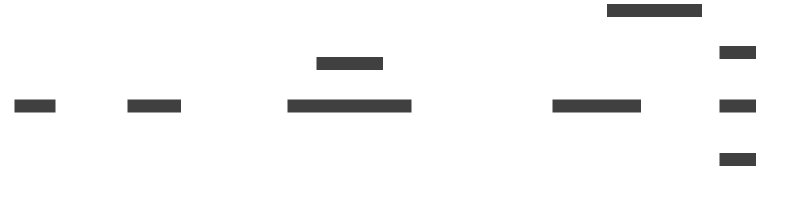
  <figcaption>XXX</figcaption>
</figure>

---

# Source: topics/components.md

# Components

- The controller is focused on interacting with the Kube API
- The controller is all about reconciling input and output resources within the Kube API
- All direct interaction with the router is the job of "kube-adaptor"

---

# Source: topics/controller-configuration.md

# Controller configuration

The controller configuration controls two aspects at present: the
access types supported and their configuration, and whether the grant
server is enabled and how it is configured.

Access type configuration:

| Option | Description |
| :---- | :---- |
| `-default-access-type` | The default access type. |
| `-enabled-access-types` | The access types which should be enabled for sites to choose from. (default `local,loadbalancer,route`) |
| `-cluster-host` | The hostname or IP address through which the cluster can be reached. Required for configuring nodeport as an access type. |
| `-ingress-domain` | The domain to use in constructing the fully qualified hostname for Ingress resources, through which the ingress controller can be reached. Only used when selecting `ingress-nginx` as an access type. |
| `-http-proxy-domain` | The domain to use in constructing the fully qualified hostname for contour HttpProxy resources, through which the contour controller can be reached. Only used when selecting `contour-http-proxy` as an access type. |
| `-gateway-class` | The class of Gateway to use. This is required to enable `gateway` as an access type. |
| `-gateway-domain` | The domain to use in constructing the fully qualified hostname for TLSRoutes resources. Only used when selecting `gateway` as an access type. |
| `-gateway-port` | The port the Gateway should be configured to listen on. This is only used if `gateway` is enabled as an access type. (default 8443)  |

Grant server configuration:

| Option | Description |
| :---- | :---- |
| `-enable-grants` | Enable use of AccessGrants. |
| `-grant-server-autoconfigure` | Automatically configure the URL and TLS credentials for the AccessGrant Server. |
| `-grant-server-base-url` | The base url through which the AccessGrant server can be reached. |
| `-grant-server-port`  | The port on which the AccessGrant server should listen. (default 9090) |
| `-grant-server-tls-credentials` | The name of a secret in which TLS credentials for the AccessGrant server are found. (default `skupper-grant-server`) |
| `-grant-server-podname` | The name of the pod in which the AccessGrant server is running (default `$HOSTNAME`) |

---

# Source: topics/debug-dumps.md

# Debug dumps

- The purpose of a debug dump is to package up the details of a site
  so another party can identify and fix a problem.
- A dump is a tarball containing various files with the site details.
- Key elements include site resources and status; component versions,
  config files, and logs; and info about the environment where Skupper
  is running.
- Should we include workloads in the namespace?  Services, deployments, pods?
- .txt file summaries for some things?
- What details about the overall network should we get?
  - Links from other sites?

~~~
# Same as the output of 'skupper version -o yaml'
version.yaml

# Same as the output of 'kubectl -n <site-namespace> get <kind>/<name> -o yaml'
resources/<kind>-<name>.yaml

# Same as the output of 'kubectl -n <skupper-namespace> get <kind>/<name> -o yaml'
resources/<kind>-<name>.yaml
~~~

<!-- components/controller/pods/<name>/log.txt -->
<!-- components/controller/pods/<name>/log.txt -->
<!-- components/router/log.txt -->

<!-- platform.yaml  # Info about the platform and namespace hosting the site -->

<!-- components/ -->
<!--   controller/ -->
<!--     <config file> -->
<!--     controller.log -->
<!--   router/ -->
<!--     <config file> -->
<!--     router.log -->
<!--     kube-adaptor.log -->
<!--   network-observer/ -->
<!--     <config file> -->
<!--     network-observer.log -->

---

# Source: topics/high-availability.md

# High availability

- Multiple routers, not controllers.
- HA is two routers, each with its own link access.
- Reduces the time to recover after a router restarts.

---

# Source: topics/index.md

# Topics

{{directory_nav(page)}}

---

# Source: topics/individual-pod-services.md

# Individual pod services

- Directly connect to individual pods across a Skupper network.
- Uses the pod name to create each service.
- This is for Kubernetes only.

---

# Source: topics/large-networks.md

# Large networks

- Skupper can scale up to networks with many sites.
- Beyond 16 sites, you may want to configure some sites to be edge sites.
- But you should not try to put a bunch of applications on one big
  network.  It's less secure and less performant.

---

# Source: topics/load-balancing.md

# Load balancing

- Skupper load balances connections (not requests) across connectors
  for the same routing key.
- The load balancing is not round robin.  It is balanced according to
  capacity.
- The capacity calculation can be adjusted using link cost.

---

# Source: topics/resource-settings.md

# Resource settings

- Each Skupper resource has a set of additional settings.
- These are key-value pairs, where the key and the value are strings.
- These are less frequently used and exist to handle more marginal
  scenarios.
- Normally it's best if users leave this at their default values.

---

# Source: topics/resource-status.md

# Resource status

---

# Source: topics/router-tls.md

# Router TLS

- Routers always communicate using mutual TLS.
- By default, the certs for this are automatically generated.
- You can provide your own certs if you wish.

---

# Source: topics/service-exposure.md

# Service exposure

- To expose multi-port services, create multiple listeners and
  connectors, one for each port (and using the same host).

---

# Source: topics/site-configuration.md

# Site configuration

---

# Source: topics/site-linking.md

# Site linking

- Using tokens and the CLI
- Using tokens and YAML
- Token distribution methods
- Using link generation
- Using a network-scoped CA
- Special concerns for non-Kube sites

## Using kubectl to generate an access token from an access grant

~~~ sh
kubectl -n sk1 get accessgrant/<grant-name> -o template --template '
apiVersion: skupper.io/v2alpha1
kind: AccessToken
metadata:
  name: <token-name>
spec:
  code: "{{{ .status.code }}}"
  ca: {{{ printf "%q" .status.ca }}}
  url: "{{{ .status.url }}}"
' > token.yaml
~~~

---

# Source: topics/skupper-overview.md

# Skupper overview

---

# Source: topics/system-namespaces.md

# System namespaces

- Kubernetes already has namespaces.  This is for non-Kubernetes
  platforms: Docker, Podman, and Linux.
- Filesystem path: ~/.local/share/skupper/namespaces/<name>
- The default namespace is named `default`.
- Each namespace contains...

---

# Source: topics/system-tls-credentials.md

# System TLS credentials

- Kubernetes already has secrets.  The Docker, Podman, and Linux
  platforms use a directory in a well-known location.
- Location: <namespace>/input/certs and <namespace>/input/issuers
- Also: <namespace>/runtime/certs and issuers
- Each directory has the files...

---

# Source: commands/connector/create.md

---
body_class: object command
refdog_links:
- title: Service exposure
  url: /topics/service-exposure.html
- title: Connector concept
  url: /concepts/connector.html
- title: Connector resource
  url: /resources/connector.html
- title: Listener create command
  url: /commands/listener/create.html
- title: Listener command
  url: /commands/listener/index.html
refdog_object_has_attributes: true
---

# Connector create command

~~~ shell
skupper connector create <name> <port> [options]
~~~

Create a connector.

<table class="fields"><tr><th>Platforms</th><td>Kubernetes, Docker, Podman, Linux</td><tr><th>Waits for</th><td>Configured</td></table>

## Examples

~~~ console
# Create a connector for a database
$ skupper connector create database 5432
Waiting for status...
Connector "database" is configured.

# Set the routing key and selector explicitly
$ skupper connector create backend 8080 --routing-key be1 --selector app=be1

# Use the workload option to select pods
$ skupper connector create backend 8080 --workload deployment/backend
~~~

## Primary options

<h3 id="option-name">&lt;name&gt;</h3>

string

required

The name of the resource to be created.

The name is the default routing key if the `--routing-key`
option is not specified.  On Kubernetes, the name defines
the default pod selector if the `--selector` and
`--workload` options are not specified.

<table class="fields"><tr><th>Platforms</th><td>Kubernetes, Docker, Podman, Linux</td><tr><th>See also</th><td><a href="https://kubernetes.io/docs/concepts/overview/working-with-objects/names/">Kubernetes object names</a></td></table>

<h3 id="option-port">&lt;port&gt;</h3>

integer

required

The port on the target server to connect to.

<table class="fields"><tr><th>Platforms</th><td>Kubernetes, Docker, Podman, Linux</td><tr><th>Updatable</th><td>True</td></table>

<h3 id="option-routing-key">--routing-key</h3>

&lt;string&gt;

frequently used

The identifier used to route traffic from listeners to
connectors.  To expose a local workload to a remote site, the
remote listener and the local connector must have matching
routing keys.

<table class="fields"><tr><th>Default</th><td>
<em>Value of name</em>

</td><tr><th>Platforms</th><td>Kubernetes, Docker, Podman, Linux</td><tr><th>Updatable</th><td>True</td></table>

<h3 id="option-workload">--workload</h3>

&lt;resource&gt;

frequently used

A Kubernetes resource name that identifies a workload.  It uses
`<resource-type>/<resource-name>` syntax and resolves to an
equivalent pod selector.

This is an alternative to setting the `--selector` or
`--host` options.

<table class="fields"><tr><th>Platforms</th><td>Kubernetes</td><tr><th>See also</th><td><a href="https://kubernetes.io/docs/concepts/workloads/">Kubernetes workloads</a></td></table>

<h3 id="option-selector">--selector</h3>

&lt;string&gt;

A Kubernetes label selector for specifying target server pods.  It
uses `<label-name>=<label-value>` syntax.

This is an alternative to setting the `--workload` or
`--host` options.

<table class="fields"><tr><th>Default</th><td>
<code>app=[value-of-name]</code>

</td><tr><th>Platforms</th><td>Kubernetes</td><tr><th>Updatable</th><td>True</td><tr><th>See also</th><td><a href="https://kubernetes.io/docs/concepts/overview/working-with-objects/labels/#label-selectors">Kubernetes label selectors</a></td></table>

<h3 id="option-host">--host</h3>

&lt;string&gt;

The hostname or IP address of the server.  This is an
alternative to `selector` for specifying the target server.

This is an alternative to setting the `--selector` or
`--workload` options.

<table class="fields"><tr><th>Default</th><td>
<em>Value of name</em>

</td><tr><th>Platforms</th><td>Kubernetes, Docker, Podman, Linux</td><tr><th>Updatable</th><td>True</td></table>

<h3 id="option-wait">--wait</h3>

&lt;status&gt;

Wait for the given status before exiting.

<table class="fields"><tr><th>Default</th><td>
<code>ready</code>

</td><tr><th>Choices</th><td><table class="choices"><tr><th><code>none</code></th><td>
Do not wait.

</td></tr><tr><th><code>configured</code></th><td>
Wait until the configuration is applied.

</td></tr><tr><th><code>ready</code></th><td>
Wait until the resource is ready to use.

</td></tr></table></td><tr><th>Platforms</th><td>Kubernetes</td><tr><th>See also</th><td><a href="{{site_prefix}}/topics/resource-status.html">Resource status</a></td></table>

<h3 id="option-timeout">--timeout</h3>

&lt;duration&gt;

Raise an error if the operation does not complete in the given
period of time.

<table class="fields"><tr><th>Default</th><td>
<code>60s</code>

</td><tr><th>Platforms</th><td>Kubernetes</td><tr><th>See also</th><td><a href="https://pkg.go.dev/time#ParseDuration">Duration format</a></td></table>

## Global options

<h3 id="option-context">--context</h3>

&lt;name&gt;

global

Set the kubeconfig context.

<table class="fields"><tr><th>Platforms</th><td>Kubernetes</td><tr><th>See also</th><td><a href="https://kubernetes.io/docs/concepts/configuration/organize-cluster-access-kubeconfig/">Kubernetes kubeconfigs</a></td></table>

<h3 id="option-kubeconfig">--kubeconfig</h3>

&lt;file&gt;

global

Set the path to the kubeconfig file.

<table class="fields"><tr><th>Platforms</th><td>Kubernetes</td><tr><th>See also</th><td><a href="https://kubernetes.io/docs/concepts/configuration/organize-cluster-access-kubeconfig/">Kubernetes kubeconfigs</a></td></table>

<h3 id="option-namespace">--namespace</h3>

(-n) &lt;name&gt;

global

Set the current namespace.

<table class="fields"><tr><th>Platforms</th><td>Kubernetes, Docker, Podman, Linux</td><tr><th>See also</th><td><a href="https://kubernetes.io/docs/concepts/overview/working-with-objects/namespaces/">Kubernetes namespaces</a>, <a href="{{site_prefix}}/topics/system-namespaces.html">System namespaces</a></td></table>

<h3 id="option-platform">--platform</h3>

&lt;platform&gt;

global

Set the Skupper platform.

<!-- You can also use the `SKUPPER_PLATFORM` environment variable. -->

<table class="fields"><tr><th>Default</th><td>
<code>kubernetes</code>

</td><tr><th>Choices</th><td><table class="choices"><tr><th><code>kubernetes</code></th><td>
Kubernetes

</td></tr><tr><th><code>docker</code></th><td>
Docker

</td></tr><tr><th><code>podman</code></th><td>
Podman

</td></tr><tr><th><code>linux</code></th><td>
Linux

</td></tr></table></td><tr><th>Platforms</th><td>Kubernetes, Docker, Podman, Linux</td><tr><th>See also</th><td><a href="{{site_prefix}}/concepts/platform.html">Platform concept</a></td></table>

<h3 id="option-help">--help</h3>

(-h) boolean

global

Display help and exit.

<table class="fields"><tr><th>Platforms</th><td>Kubernetes, Docker, Podman, Linux</td></table>

---

# Source: commands/connector/delete.md

---
body_class: object command
refdog_links:
- title: Service exposure
  url: /topics/service-exposure.html
- title: Connector concept
  url: /concepts/connector.html
- title: Connector resource
  url: /resources/connector.html
- title: Listener delete command
  url: /commands/listener/delete.html
- title: Listener command
  url: /commands/listener/index.html
refdog_object_has_attributes: true
---

# Connector delete command

~~~ shell
skupper connector delete <name> [options]
~~~

Delete a connector.

<table class="fields"><tr><th>Platforms</th><td>Kubernetes, Docker, Podman, Linux</td><tr><th>Waits for</th><td>Deletion</td></table>

## Examples

~~~ console
# Delete a connector
$ skupper connector delete database
Waiting for deletion...
Connector "database" is deleted.
~~~

## Primary options

<h3 id="option-name">&lt;name&gt;</h3>

string

required

The name of the resource to be deleted.

<table class="fields"><tr><th>Platforms</th><td>Kubernetes, Docker, Podman, Linux</td><tr><th>See also</th><td><a href="https://kubernetes.io/docs/concepts/overview/working-with-objects/names/">Kubernetes object names</a></td></table>

<h3 id="option-timeout">--timeout</h3>

&lt;duration&gt;

Raise an error if the operation does not complete in the given
period of time.

<table class="fields"><tr><th>Default</th><td>
<code>60s</code>

</td><tr><th>Platforms</th><td>Kubernetes</td></table>

<h3 id="option-wait">--wait</h3>

boolean

Wait for deletion to complete before exiting.

<table class="fields"><tr><th>Default</th><td>true</td><tr><th>Platforms</th><td>Kubernetes</td></table>

## Global options

<h3 id="option-context">--context</h3>

&lt;name&gt;

global

Set the kubeconfig context.

<table class="fields"><tr><th>Platforms</th><td>Kubernetes</td><tr><th>See also</th><td><a href="https://kubernetes.io/docs/concepts/configuration/organize-cluster-access-kubeconfig/">Kubernetes kubeconfigs</a></td></table>

<h3 id="option-kubeconfig">--kubeconfig</h3>

&lt;file&gt;

global

Set the path to the kubeconfig file.

<table class="fields"><tr><th>Platforms</th><td>Kubernetes</td><tr><th>See also</th><td><a href="https://kubernetes.io/docs/concepts/configuration/organize-cluster-access-kubeconfig/">Kubernetes kubeconfigs</a></td></table>

<h3 id="option-namespace">--namespace</h3>

(-n) &lt;name&gt;

global

Set the current namespace.

<table class="fields"><tr><th>Platforms</th><td>Kubernetes, Docker, Podman, Linux</td><tr><th>See also</th><td><a href="https://kubernetes.io/docs/concepts/overview/working-with-objects/namespaces/">Kubernetes namespaces</a>, <a href="{{site_prefix}}/topics/system-namespaces.html">System namespaces</a></td></table>

<h3 id="option-platform">--platform</h3>

&lt;platform&gt;

global

Set the Skupper platform.

<!-- You can also use the `SKUPPER_PLATFORM` environment variable. -->

<table class="fields"><tr><th>Default</th><td>
<code>kubernetes</code>

</td><tr><th>Choices</th><td><table class="choices"><tr><th><code>kubernetes</code></th><td>
Kubernetes

</td></tr><tr><th><code>docker</code></th><td>
Docker

</td></tr><tr><th><code>podman</code></th><td>
Podman

</td></tr><tr><th><code>linux</code></th><td>
Linux

</td></tr></table></td><tr><th>Platforms</th><td>Kubernetes, Docker, Podman, Linux</td><tr><th>See also</th><td><a href="{{site_prefix}}/concepts/platform.html">Platform concept</a></td></table>

<h3 id="option-help">--help</h3>

(-h) boolean

global

Display help and exit.

<table class="fields"><tr><th>Platforms</th><td>Kubernetes, Docker, Podman, Linux</td></table>

---

# Source: commands/connector/generate.md

---
body_class: object command
refdog_links:
- title: Service exposure
  url: /topics/service-exposure.html
- title: Connector concept
  url: /concepts/connector.html
- title: Connector resource
  url: /resources/connector.html
- title: Listener generate command
  url: /commands/listener/generate.html
- title: Listener command
  url: /commands/listener/index.html
refdog_object_has_attributes: true
---

# Connector generate command

~~~ shell
skupper connector generate <name> <port> [options]
~~~

Generate a Connector resource.

<table class="fields"><tr><th>Platforms</th><td>Kubernetes, Docker, Podman, Linux</td></table>

## Examples

~~~ console
# Generate a Connector resource and print it to the console
$ skupper connector generate backend 8080
apiVersion: skupper.io/v2alpha1
kind: Connector
metadata:
  name: backend
spec:
  routingKey: backend
  port: 8080
  selector: app=backend

# Generate a Connector resource and direct the output to a file
$ skupper connector generate backend 8080 > backend.yaml
~~~

## Primary options

<h3 id="option-name">&lt;name&gt;</h3>

string

required

The name of the resource to be generated.

<table class="fields"><tr><th>Platforms</th><td>Kubernetes, Docker, Podman, Linux</td><tr><th>See also</th><td><a href="https://kubernetes.io/docs/concepts/overview/working-with-objects/names/">Kubernetes object names</a></td></table>

<h3 id="option-port">&lt;port&gt;</h3>

integer

required

The port on the target server to connect to.

<table class="fields"><tr><th>Platforms</th><td>Kubernetes, Docker, Podman, Linux</td><tr><th>Updatable</th><td>True</td></table>

<h3 id="option-routing-key">--routing-key</h3>

&lt;string&gt;

frequently used

The identifier used to route traffic from listeners to
connectors.  To expose a local workload to a remote site, the
remote listener and the local connector must have matching
routing keys.

<table class="fields"><tr><th>Default</th><td>
<em>Value of name</em>

</td><tr><th>Platforms</th><td>Kubernetes, Docker, Podman, Linux</td><tr><th>Updatable</th><td>True</td></table>

<h3 id="option-workload">--workload</h3>

&lt;resource&gt;

frequently used

A Kubernetes resource name that identifies a workload.  It uses
`<resource-type>/<resource-name>` syntax and resolves to an
equivalent pod selector.

This is an alternative to setting the `--selector` or
`--host` options.

<table class="fields"><tr><th>Platforms</th><td>Kubernetes</td><tr><th>See also</th><td><a href="https://kubernetes.io/docs/concepts/workloads/">Kubernetes workloads</a></td></table>

<h3 id="option-selector">--selector</h3>

&lt;string&gt;

A Kubernetes label selector for specifying target server pods.  It
uses `<label-name>=<label-value>` syntax.

This is an alternative to setting the `--workload` or
`--host` options.

<table class="fields"><tr><th>Default</th><td>
<code>app=[value-of-name]</code>

</td><tr><th>Platforms</th><td>Kubernetes</td><tr><th>Updatable</th><td>True</td><tr><th>See also</th><td><a href="https://kubernetes.io/docs/concepts/overview/working-with-objects/labels/#label-selectors">Kubernetes label selectors</a></td></table>

<h3 id="option-host">--host</h3>

&lt;string&gt;

The hostname or IP address of the server.  This is an
alternative to `selector` for specifying the target server.

This is an alternative to setting the `--selector` or
`--workload` options.

<table class="fields"><tr><th>Default</th><td>
<em>Value of name</em>

</td><tr><th>Platforms</th><td>Kubernetes, Docker, Podman, Linux</td><tr><th>Updatable</th><td>True</td></table>

<h3 id="option-wait">--wait</h3>

&lt;status&gt;

Wait for the given status before exiting.

<table class="fields"><tr><th>Default</th><td>
<code>configured</code>

</td><tr><th>Choices</th><td><table class="choices"><tr><th><code>none</code></th><td>
<em>Do not wait</em>

</td></tr><tr><th><code>configured</code></th><td>
Configured

</td></tr><tr><th><code>ready</code></th><td>
Ready

</td></tr></table></td><tr><th>Platforms</th><td>Kubernetes, Docker, Podman, Linux</td></table>

<h3 id="option-output">--output</h3>

(-o) &lt;format&gt;

Select the output format.

<table class="fields"><tr><th>Default</th><td>
<code>yaml</code>

</td><tr><th>Choices</th><td><table class="choices"><tr><th><code>json</code></th><td>
Produce JSON output

</td></tr><tr><th><code>yaml</code></th><td>
Produce YAML output

</td></tr></table></td><tr><th>Platforms</th><td>Kubernetes, Docker, Podman, Linux</td></table>

## Global options

<h3 id="option-platform">--platform</h3>

&lt;platform&gt;

global

Set the Skupper platform.

<!-- You can also use the `SKUPPER_PLATFORM` environment variable. -->

<table class="fields"><tr><th>Default</th><td>
<code>kubernetes</code>

</td><tr><th>Choices</th><td><table class="choices"><tr><th><code>kubernetes</code></th><td>
Kubernetes

</td></tr><tr><th><code>docker</code></th><td>
Docker

</td></tr><tr><th><code>podman</code></th><td>
Podman

</td></tr><tr><th><code>linux</code></th><td>
Linux

</td></tr></table></td><tr><th>Platforms</th><td>Kubernetes, Docker, Podman, Linux</td><tr><th>See also</th><td><a href="{{site_prefix}}/concepts/platform.html">Platform concept</a></td></table>

<h3 id="option-help">--help</h3>

(-h) boolean

global

Display help and exit.

<table class="fields"><tr><th>Platforms</th><td>Kubernetes, Docker, Podman, Linux</td></table>

---

# Source: commands/connector/index.md

---
body_class: object command
refdog_links:
- title: Service exposure
  url: /topics/service-exposure.html
- title: Connector concept
  url: /concepts/connector.html
- title: Connector resource
  url: /resources/connector.html
- title: Listener command
  url: /commands/listener/index.html
refdog_object_has_attributes: true
---

# Connector command

~~~ shell
skupper connector [subcommand] [options]
~~~

<table class="fields"><tr><th>Platforms</th><td>Kubernetes, Docker, Podman, Linux</td></table>

## Subcommands

<table class="objects">
<tr><th><a href="{{site_prefix}}/commands/connector/create.html">Connector create</a></th><td>Create a connector</td></tr>
<tr><th><a href="{{site_prefix}}/commands/connector/update.html">Connector update</a></th><td>Update a connector</td></tr>
<tr><th><a href="{{site_prefix}}/commands/connector/delete.html">Connector delete</a></th><td>Delete a connector</td></tr>
<tr><th><a href="{{site_prefix}}/commands/connector/status.html">Connector status</a></th><td>Display the status of connectors in the current site</td></tr>
<tr><th><a href="{{site_prefix}}/commands/connector/generate.html">Connector generate</a></th><td>Generate a Connector resource</td></tr>
</table>

---

# Source: commands/connector/status.md

---
body_class: object command
refdog_links:
- title: Service exposure
  url: /topics/service-exposure.html
- title: Connector concept
  url: /concepts/connector.html
- title: Connector resource
  url: /resources/connector.html
- title: Listener status command
  url: /commands/listener/status.html
- title: Listener command
  url: /commands/listener/index.html
refdog_object_has_attributes: true
---

# Connector status command

~~~ shell
skupper connector status [name] [options]
~~~

Display the status of connectors in the current site.

<table class="fields"><tr><th>Platforms</th><td>Kubernetes, Docker, Podman, Linux</td></table>

## Examples

~~~ console
# Show the status of all connectors in the current site
$ skupper connector status
NAME       STATUS   ROUTING-KEY   SELECTOR         HOST     PORT   LISTENERS
backend    Ready    backend       app=backend      <none>   8080   true
database   Ready    database      app=postgresql   <none>   5432   true

# Show the status of one connector
$ skupper connector status backend
Name:                     backend
Status:                   Ready
Message:                  <none>
Routing key:              backend
Selector:                 app=backend
Host:                     <none>
Port:                     8080
Has matching listeners:   1
~~~

## Primary options

<h3 id="option-name">[name]</h3>

string

optional

An optional resource name.  If set, the status command reports
status for the named resource only.

<table class="fields"><tr><th>Platforms</th><td>Kubernetes, Docker, Podman, Linux</td><tr><th>See also</th><td><a href="https://kubernetes.io/docs/concepts/overview/working-with-objects/names/">Kubernetes object names</a></td></table>

<h3 id="option-timeout">--timeout</h3>

&lt;duration&gt;

Raise an error if the operation does not complete in the given
period of time.

<table class="fields"><tr><th>Default</th><td>
<code>60s</code>

</td><tr><th>Platforms</th><td>Kubernetes</td><tr><th>See also</th><td><a href="https://pkg.go.dev/time#ParseDuration">Duration format</a></td></table>

<h3 id="option-output">--output</h3>

(-o) &lt;format&gt;

Print status to the console in a structured output format.

<table class="fields"><tr><th>Choices</th><td><table class="choices"><tr><th><code>json</code></th><td>
Produce JSON output

</td></tr><tr><th><code>yaml</code></th><td>
Produce YAML output

</td></tr></table></td><tr><th>Platforms</th><td>Kubernetes, Docker, Podman, Linux</td></table>

## Global options

<h3 id="option-context">--context</h3>

&lt;name&gt;

global

Set the kubeconfig context.

<table class="fields"><tr><th>Platforms</th><td>Kubernetes</td><tr><th>See also</th><td><a href="https://kubernetes.io/docs/concepts/configuration/organize-cluster-access-kubeconfig/">Kubernetes kubeconfigs</a></td></table>

<h3 id="option-kubeconfig">--kubeconfig</h3>

&lt;file&gt;

global

Set the path to the kubeconfig file.

<table class="fields"><tr><th>Platforms</th><td>Kubernetes</td><tr><th>See also</th><td><a href="https://kubernetes.io/docs/concepts/configuration/organize-cluster-access-kubeconfig/">Kubernetes kubeconfigs</a></td></table>

<h3 id="option-namespace">--namespace</h3>

(-n) &lt;name&gt;

global

Set the current namespace.

<table class="fields"><tr><th>Platforms</th><td>Kubernetes, Docker, Podman, Linux</td><tr><th>See also</th><td><a href="https://kubernetes.io/docs/concepts/overview/working-with-objects/namespaces/">Kubernetes namespaces</a>, <a href="{{site_prefix}}/topics/system-namespaces.html">System namespaces</a></td></table>

<h3 id="option-platform">--platform</h3>

&lt;platform&gt;

global

Set the Skupper platform.

<!-- You can also use the `SKUPPER_PLATFORM` environment variable. -->

<table class="fields"><tr><th>Default</th><td>
<code>kubernetes</code>

</td><tr><th>Choices</th><td><table class="choices"><tr><th><code>kubernetes</code></th><td>
Kubernetes

</td></tr><tr><th><code>docker</code></th><td>
Docker

</td></tr><tr><th><code>podman</code></th><td>
Podman

</td></tr><tr><th><code>linux</code></th><td>
Linux

</td></tr></table></td><tr><th>Platforms</th><td>Kubernetes, Docker, Podman, Linux</td><tr><th>See also</th><td><a href="{{site_prefix}}/concepts/platform.html">Platform concept</a></td></table>

<h3 id="option-help">--help</h3>

(-h) boolean

global

Display help and exit.

<table class="fields"><tr><th>Platforms</th><td>Kubernetes, Docker, Podman, Linux</td></table>

---

# Source: commands/connector/update.md

---
body_class: object command
refdog_links:
- title: Service exposure
  url: /topics/service-exposure.html
- title: Connector concept
  url: /concepts/connector.html
- title: Connector resource
  url: /resources/connector.html
- title: Listener update command
  url: /commands/listener/update.html
- title: Listener command
  url: /commands/listener/index.html
refdog_object_has_attributes: true
---

# Connector update command

~~~ shell
skupper connector update <name> <port> [options]
~~~

Update a connector.

<table class="fields"><tr><th>Platforms</th><td>Kubernetes, Docker, Podman, Linux</td><tr><th>Waits for</th><td>Configured</td></table>

## Examples

~~~ console
# Change the workload and port
$ skupper connector update database --workload deployment/mysql --port 3306
Waiting for status...
Connector "database" is configured.

# Change the routing key
$ skupper connector update backend --routing-key be2
~~~

## Primary options

<h3 id="option-name">&lt;name&gt;</h3>

string

required

The name of the resource to be updated.

<table class="fields"><tr><th>Platforms</th><td>Kubernetes, Docker, Podman, Linux</td><tr><th>See also</th><td><a href="https://kubernetes.io/docs/concepts/overview/working-with-objects/names/">Kubernetes object names</a></td></table>

<h3 id="option-port">&lt;port&gt;</h3>

integer

required

The port on the target server to connect to.

<table class="fields"><tr><th>Platforms</th><td>Kubernetes, Docker, Podman, Linux</td><tr><th>Updatable</th><td>True</td></table>

<h3 id="option-routing-key">--routing-key</h3>

&lt;string&gt;

frequently used

The identifier used to route traffic from listeners to
connectors.  To expose a local workload to a remote site, the
remote listener and the local connector must have matching
routing keys.

<table class="fields"><tr><th>Default</th><td>
<em>Value of name</em>

</td><tr><th>Platforms</th><td>Kubernetes, Docker, Podman, Linux</td><tr><th>Updatable</th><td>True</td></table>

<h3 id="option-workload">--workload</h3>

&lt;resource&gt;

frequently used

A Kubernetes resource name that identifies a workload.  It uses
`<resource-type>/<resource-name>` syntax and resolves to an
equivalent pod selector.

This is an alternative to setting the `--selector` or
`--host` options.

<table class="fields"><tr><th>Platforms</th><td>Kubernetes</td><tr><th>See also</th><td><a href="https://kubernetes.io/docs/concepts/workloads/">Kubernetes workloads</a></td></table>

<h3 id="option-selector">--selector</h3>

&lt;string&gt;

A Kubernetes label selector for specifying target server pods.  It
uses `<label-name>=<label-value>` syntax.

This is an alternative to setting the `--workload` or
`--host` options.

<table class="fields"><tr><th>Default</th><td>
<code>app=[value-of-name]</code>

</td><tr><th>Platforms</th><td>Kubernetes</td><tr><th>Updatable</th><td>True</td><tr><th>See also</th><td><a href="https://kubernetes.io/docs/concepts/overview/working-with-objects/labels/#label-selectors">Kubernetes label selectors</a></td></table>

<h3 id="option-host">--host</h3>

&lt;string&gt;

The hostname or IP address of the server.  This is an
alternative to `selector` for specifying the target server.

This is an alternative to setting the `--selector` or
`--workload` options.

<table class="fields"><tr><th>Default</th><td>
<em>Value of name</em>

</td><tr><th>Platforms</th><td>Kubernetes, Docker, Podman, Linux</td><tr><th>Updatable</th><td>True</td></table>

<h3 id="option-wait">--wait</h3>

&lt;status&gt;

Wait for the given status before exiting.

<table class="fields"><tr><th>Default</th><td>
<code>ready</code>

</td><tr><th>Choices</th><td><table class="choices"><tr><th><code>none</code></th><td>
<em>Do not wait</em>

</td></tr><tr><th><code>configured</code></th><td>
Configured

</td></tr><tr><th><code>ready</code></th><td>
Ready

</td></tr></table></td><tr><th>Platforms</th><td>Kubernetes</td><tr><th>See also</th><td><a href="{{site_prefix}}/topics/resource-status.html">Resource status</a></td></table>

<h3 id="option-timeout">--timeout</h3>

&lt;duration&gt;

Raise an error if the operation does not complete in the given
period of time.

<table class="fields"><tr><th>Default</th><td>
<code>60s</code>

</td><tr><th>Platforms</th><td>Kubernetes</td></table>

## Global options

<h3 id="option-context">--context</h3>

&lt;name&gt;

global

Set the kubeconfig context.

<table class="fields"><tr><th>Platforms</th><td>Kubernetes</td><tr><th>See also</th><td><a href="https://kubernetes.io/docs/concepts/configuration/organize-cluster-access-kubeconfig/">Kubernetes kubeconfigs</a></td></table>

<h3 id="option-kubeconfig">--kubeconfig</h3>

&lt;file&gt;

global

Set the path to the kubeconfig file.

<table class="fields"><tr><th>Platforms</th><td>Kubernetes</td><tr><th>See also</th><td><a href="https://kubernetes.io/docs/concepts/configuration/organize-cluster-access-kubeconfig/">Kubernetes kubeconfigs</a></td></table>

<h3 id="option-namespace">--namespace</h3>

(-n) &lt;name&gt;

global

Set the current namespace.

<table class="fields"><tr><th>Platforms</th><td>Kubernetes, Docker, Podman, Linux</td><tr><th>See also</th><td><a href="https://kubernetes.io/docs/concepts/overview/working-with-objects/namespaces/">Kubernetes namespaces</a>, <a href="{{site_prefix}}/topics/system-namespaces.html">System namespaces</a></td></table>

<h3 id="option-platform">--platform</h3>

&lt;platform&gt;

global

Set the Skupper platform.

<!-- You can also use the `SKUPPER_PLATFORM` environment variable. -->

<table class="fields"><tr><th>Default</th><td>
<code>kubernetes</code>

</td><tr><th>Choices</th><td><table class="choices"><tr><th><code>kubernetes</code></th><td>
Kubernetes

</td></tr><tr><th><code>docker</code></th><td>
Docker

</td></tr><tr><th><code>podman</code></th><td>
Podman

</td></tr><tr><th><code>linux</code></th><td>
Linux

</td></tr></table></td><tr><th>Platforms</th><td>Kubernetes, Docker, Podman, Linux</td><tr><th>See also</th><td><a href="{{site_prefix}}/concepts/platform.html">Platform concept</a></td></table>

<h3 id="option-help">--help</h3>

(-h) boolean

global

Display help and exit.

<table class="fields"><tr><th>Platforms</th><td>Kubernetes, Docker, Podman, Linux</td></table>

---

# Source: commands/debug/check.md

---
body_class: object command
refdog_links: []
refdog_object_has_attributes: true
---

# Debug check command

~~~ shell
skupper debug check [options]
~~~

Run diagnostic checks.

<table class="fields"><tr><th>Platforms</th><td>Kubernetes, Docker, Podman, Linux</td></table>

## Primary options

## Global options

<h3 id="option-context">--context</h3>

&lt;name&gt;

global

Set the kubeconfig context.

<table class="fields"><tr><th>Platforms</th><td>Kubernetes</td><tr><th>See also</th><td><a href="https://kubernetes.io/docs/concepts/configuration/organize-cluster-access-kubeconfig/">Kubernetes kubeconfigs</a></td></table>

<h3 id="option-kubeconfig">--kubeconfig</h3>

&lt;file&gt;

global

Set the path to the kubeconfig file.

<table class="fields"><tr><th>Platforms</th><td>Kubernetes</td><tr><th>See also</th><td><a href="https://kubernetes.io/docs/concepts/configuration/organize-cluster-access-kubeconfig/">Kubernetes kubeconfigs</a></td></table>

<h3 id="option-namespace">--namespace</h3>

(-n) &lt;name&gt;

global

Set the current namespace.

<table class="fields"><tr><th>Platforms</th><td>Kubernetes, Docker, Podman, Linux</td><tr><th>See also</th><td><a href="https://kubernetes.io/docs/concepts/overview/working-with-objects/namespaces/">Kubernetes namespaces</a>, <a href="{{site_prefix}}/topics/system-namespaces.html">System namespaces</a></td></table>

<h3 id="option-platform">--platform</h3>

&lt;platform&gt;

global

Set the Skupper platform.

<!-- You can also use the `SKUPPER_PLATFORM` environment variable. -->

<table class="fields"><tr><th>Default</th><td>
<code>kubernetes</code>

</td><tr><th>Choices</th><td><table class="choices"><tr><th><code>kubernetes</code></th><td>
Kubernetes

</td></tr><tr><th><code>docker</code></th><td>
Docker

</td></tr><tr><th><code>podman</code></th><td>
Podman

</td></tr><tr><th><code>linux</code></th><td>
Linux

</td></tr></table></td><tr><th>Platforms</th><td>Kubernetes, Docker, Podman, Linux</td><tr><th>See also</th><td><a href="{{site_prefix}}/concepts/platform.html">Platform concept</a></td></table>

<h3 id="option-help">--help</h3>

(-h) boolean

global

Display help and exit.

<table class="fields"><tr><th>Platforms</th><td>Kubernetes, Docker, Podman, Linux</td></table>

---

# Source: commands/debug/dump.md

---
body_class: object command
refdog_links:
- title: Debug dumps
  url: /topics/debug-dumps.html
refdog_object_has_attributes: true
---

# Debug dump command

~~~ shell
skupper debug dump [file] [options]
~~~

Generate a debug dump file.  Debug dumps collect the details of
a site so another party can identify and fix a problem.

<table class="fields"><tr><th>Platforms</th><td>Kubernetes, Docker, Podman, Linux</td></table>

## Examples

~~~ console
# Generate a dump file
$ skupper debug dump
Debug dump file: /home/fritz/skupper-dump-west-2024-12-09.tar.gz

# Generate a dump file to a particular path
$ skupper debug dump /tmp/abc.tar.gz
Debug dump file: /tmp/abc.tar.gz
~~~

## Primary options

<h3 id="option-file">[file]</h3>

string

optional

The name of the file to generate.

The command exits with an error if the file already exists.

<table class="fields"><tr><th>Default</th><td>
<code>skupper-dump-&lt;site-name&gt;-&lt;date&gt;.tar.gz</code>

</td><tr><th>Platforms</th><td>Kubernetes, Docker, Podman, Linux</td></table>

## Global options

<h3 id="option-context">--context</h3>

&lt;name&gt;

global

Set the kubeconfig context.

<table class="fields"><tr><th>Platforms</th><td>Kubernetes</td><tr><th>See also</th><td><a href="https://kubernetes.io/docs/concepts/configuration/organize-cluster-access-kubeconfig/">Kubernetes kubeconfigs</a></td></table>

<h3 id="option-kubeconfig">--kubeconfig</h3>

&lt;file&gt;

global

Set the path to the kubeconfig file.

<table class="fields"><tr><th>Platforms</th><td>Kubernetes</td><tr><th>See also</th><td><a href="https://kubernetes.io/docs/concepts/configuration/organize-cluster-access-kubeconfig/">Kubernetes kubeconfigs</a></td></table>

<h3 id="option-namespace">--namespace</h3>

(-n) &lt;name&gt;

global

Set the current namespace.

<table class="fields"><tr><th>Platforms</th><td>Kubernetes, Docker, Podman, Linux</td><tr><th>See also</th><td><a href="https://kubernetes.io/docs/concepts/overview/working-with-objects/namespaces/">Kubernetes namespaces</a>, <a href="{{site_prefix}}/topics/system-namespaces.html">System namespaces</a></td></table>

<h3 id="option-platform">--platform</h3>

&lt;platform&gt;

global

Set the Skupper platform.

<!-- You can also use the `SKUPPER_PLATFORM` environment variable. -->

<table class="fields"><tr><th>Default</th><td>
<code>kubernetes</code>

</td><tr><th>Choices</th><td><table class="choices"><tr><th><code>kubernetes</code></th><td>
Kubernetes

</td></tr><tr><th><code>docker</code></th><td>
Docker

</td></tr><tr><th><code>podman</code></th><td>
Podman

</td></tr><tr><th><code>linux</code></th><td>
Linux

</td></tr></table></td><tr><th>Platforms</th><td>Kubernetes, Docker, Podman, Linux</td><tr><th>See also</th><td><a href="{{site_prefix}}/concepts/platform.html">Platform concept</a></td></table>

<h3 id="option-help">--help</h3>

(-h) boolean

global

Display help and exit.

<table class="fields"><tr><th>Platforms</th><td>Kubernetes, Docker, Podman, Linux</td></table>

---

# Source: commands/debug/index.md

---
body_class: object command
refdog_links: []
refdog_object_has_attributes: true
---

# Debug command

~~~ shell
skupper debug [subcommand] [options]
~~~

<table class="fields"><tr><th>Platforms</th><td>Kubernetes, Docker, Podman, Linux</td></table>

## Subcommands

<table class="objects">
<tr><th><a href="{{site_prefix}}/commands/debug/check.html">Debug check</a></th><td>Run diagnostic checks</td></tr>
<tr><th><a href="{{site_prefix}}/commands/debug/dump.html">Debug dump</a></th><td>Generate a debug dump file</td></tr>
</table>

---

# Source: commands/link/delete.md

---
body_class: object command
refdog_links:
- title: Site linking
  url: /topics/site-linking.html
- title: Link concept
  url: /concepts/link.html
- title: Link resource
  url: /resources/link.html
- title: Token command
  url: /commands/token/index.html
refdog_object_has_attributes: true
---

# Link delete command

~~~ shell
skupper link delete <name> [options]
~~~

Delete a link.

<table class="fields"><tr><th>Platforms</th><td>Kubernetes, Docker, Podman, Linux</td><tr><th>Waits for</th><td>Deletion</td></table>

## Examples

~~~ console
# Delete a link
$ skupper link delete west-6bfn6
Waiting for deletion...
Link "west-6bfn6" is deleted.
~~~

## Primary options

<h3 id="option-name">&lt;name&gt;</h3>

string

required

The name of the resource to be deleted.

<table class="fields"><tr><th>Platforms</th><td>Kubernetes, Docker, Podman, Linux</td><tr><th>See also</th><td><a href="https://kubernetes.io/docs/concepts/overview/working-with-objects/names/">Kubernetes object names</a></td></table>

<h3 id="option-timeout">--timeout</h3>

&lt;duration&gt;

Raise an error if the operation does not complete in the given
period of time.

<table class="fields"><tr><th>Default</th><td>
<code>60s</code>

</td><tr><th>Platforms</th><td>Kubernetes</td></table>

<h3 id="option-wait">--wait</h3>

boolean

Wait for deletion to complete before exiting.

<table class="fields"><tr><th>Default</th><td>true</td><tr><th>Platforms</th><td>Kubernetes</td></table>

## Global options

<h3 id="option-context">--context</h3>

&lt;name&gt;

global

Set the kubeconfig context.

<table class="fields"><tr><th>Platforms</th><td>Kubernetes</td><tr><th>See also</th><td><a href="https://kubernetes.io/docs/concepts/configuration/organize-cluster-access-kubeconfig/">Kubernetes kubeconfigs</a></td></table>

<h3 id="option-kubeconfig">--kubeconfig</h3>

&lt;file&gt;

global

Set the path to the kubeconfig file.

<table class="fields"><tr><th>Platforms</th><td>Kubernetes</td><tr><th>See also</th><td><a href="https://kubernetes.io/docs/concepts/configuration/organize-cluster-access-kubeconfig/">Kubernetes kubeconfigs</a></td></table>

<h3 id="option-namespace">--namespace</h3>

(-n) &lt;name&gt;

global

Set the current namespace.

<table class="fields"><tr><th>Platforms</th><td>Kubernetes, Docker, Podman, Linux</td><tr><th>See also</th><td><a href="https://kubernetes.io/docs/concepts/overview/working-with-objects/namespaces/">Kubernetes namespaces</a>, <a href="{{site_prefix}}/topics/system-namespaces.html">System namespaces</a></td></table>

<h3 id="option-platform">--platform</h3>

&lt;platform&gt;

global

Set the Skupper platform.

<!-- You can also use the `SKUPPER_PLATFORM` environment variable. -->

<table class="fields"><tr><th>Default</th><td>
<code>kubernetes</code>

</td><tr><th>Choices</th><td><table class="choices"><tr><th><code>kubernetes</code></th><td>
Kubernetes

</td></tr><tr><th><code>docker</code></th><td>
Docker

</td></tr><tr><th><code>podman</code></th><td>
Podman

</td></tr><tr><th><code>linux</code></th><td>
Linux

</td></tr></table></td><tr><th>Platforms</th><td>Kubernetes, Docker, Podman, Linux</td><tr><th>See also</th><td><a href="{{site_prefix}}/concepts/platform.html">Platform concept</a></td></table>

<h3 id="option-help">--help</h3>

(-h) boolean

global

Display help and exit.

<table class="fields"><tr><th>Platforms</th><td>Kubernetes, Docker, Podman, Linux</td></table>

---

# Source: commands/link/generate.md

---
body_class: object command
refdog_links:
- title: Site linking
  url: /topics/site-linking.html
- title: Link concept
  url: /concepts/link.html
- title: Link resource
  url: /resources/link.html
- title: Token command
  url: /commands/token/index.html
refdog_object_has_attributes: true
---

# Link generate command

~~~ shell
skupper link generate [name] [options]
~~~

Generate a Link resource for use in a remote site.

Generating a link requires a site with link access enabled.
The command waits for the site to enter the ready state
before producing the link.

<table class="fields"><tr><th>Platforms</th><td>Kubernetes, Docker, Podman, Linux</td><tr><th>Waits for</th><td>Site resource ready</td></table>

## Examples

~~~ console
# Generate a Link resource and print it to the console
$ skupper link generate
apiVersion: skupper.io/v2alpha1
kind: Link
metadata:
  name: south-ac619
spec:
  endpoints:
    - group: skupper-router-1
      host: 10.97.161.185
      name: inter-router
      port: "55671"
    - group: skupper-router-1
      host: 10.97.161.185
      name: edge
      port: "45671"
  tlsCredentials: south-ac619
---
apiVersion: v1
kind: Secret
type: kubernetes.io/tls
metadata:
  name: south-ac619
data:
  ca.crt: LS0tLS1CRUdJTiBDRVJUSUZJQ0FURS0tLS0tCk1JSURKekNDQWcrZ0F3SUJB [...]
  tls.crt: LS0tLS1CRUdJTiBDRVJUSUZJQ0FURS0tLS0tCk1JSURORENDQWh5Z0F3SUJ [...]
  tls.key: LS0tLS1CRUdJTiBSU0EgUFJJVkFURSBLRVktLS0tLQpNSUlFb3dJQkFBS0N [...]

# Generate a Link resource and direct the output to a file
$ skupper link generate > link.yaml
~~~

## Primary options

<h3 id="option-name">[name]</h3>

string

optional

The name of the resource to be generated.  A name is
generated if none is provided.

<table class="fields"><tr><th>Platforms</th><td>Kubernetes, Docker, Podman, Linux</td><tr><th>See also</th><td><a href="https://kubernetes.io/docs/concepts/overview/working-with-objects/names/">Kubernetes object names</a></td></table>

<h3 id="option-cost">--cost</h3>

&lt;integer&gt;

The configured routing cost of sending traffic over
the link.

<table class="fields"><tr><th>Default</th><td>1</td><tr><th>Platforms</th><td>Kubernetes, Docker, Podman, Linux</td><tr><th>See also</th><td><a href="{{site_prefix}}/topics/load-balancing.html">Load balancing</a></td></table>

<h3 id="option-output">--output</h3>

(-o) &lt;format&gt;

Select the output format.

<table class="fields"><tr><th>Default</th><td>
<code>yaml</code>

</td><tr><th>Choices</th><td><table class="choices"><tr><th><code>json</code></th><td>
Produce JSON output

</td></tr><tr><th><code>yaml</code></th><td>
Produce YAML output

</td></tr></table></td><tr><th>Platforms</th><td>Kubernetes, Docker, Podman, Linux</td></table>

## Global options

<h3 id="option-context">--context</h3>

&lt;name&gt;

global

Set the kubeconfig context.

<table class="fields"><tr><th>Platforms</th><td>Kubernetes</td><tr><th>See also</th><td><a href="https://kubernetes.io/docs/concepts/configuration/organize-cluster-access-kubeconfig/">Kubernetes kubeconfigs</a></td></table>

<h3 id="option-kubeconfig">--kubeconfig</h3>

&lt;file&gt;

global

Set the path to the kubeconfig file.

<table class="fields"><tr><th>Platforms</th><td>Kubernetes</td><tr><th>See also</th><td><a href="https://kubernetes.io/docs/concepts/configuration/organize-cluster-access-kubeconfig/">Kubernetes kubeconfigs</a></td></table>

<h3 id="option-namespace">--namespace</h3>

(-n) &lt;name&gt;

global

Set the current namespace.

<table class="fields"><tr><th>Platforms</th><td>Kubernetes, Docker, Podman, Linux</td><tr><th>See also</th><td><a href="https://kubernetes.io/docs/concepts/overview/working-with-objects/namespaces/">Kubernetes namespaces</a>, <a href="{{site_prefix}}/topics/system-namespaces.html">System namespaces</a></td></table>

<h3 id="option-platform">--platform</h3>

&lt;platform&gt;

global

Set the Skupper platform.

<!-- You can also use the `SKUPPER_PLATFORM` environment variable. -->

<table class="fields"><tr><th>Default</th><td>
<code>kubernetes</code>

</td><tr><th>Choices</th><td><table class="choices"><tr><th><code>kubernetes</code></th><td>
Kubernetes

</td></tr><tr><th><code>docker</code></th><td>
Docker

</td></tr><tr><th><code>podman</code></th><td>
Podman

</td></tr><tr><th><code>linux</code></th><td>
Linux

</td></tr></table></td><tr><th>Platforms</th><td>Kubernetes, Docker, Podman, Linux</td><tr><th>See also</th><td><a href="{{site_prefix}}/concepts/platform.html">Platform concept</a></td></table>

<h3 id="option-help">--help</h3>

(-h) boolean

global

Display help and exit.

<table class="fields"><tr><th>Platforms</th><td>Kubernetes, Docker, Podman, Linux</td></table>

---

# Source: commands/link/index.md

---
body_class: object command
refdog_links:
- title: Site linking
  url: /topics/site-linking.html
- title: Link concept
  url: /concepts/link.html
- title: Link resource
  url: /resources/link.html
- title: Token command
  url: /commands/token/index.html
refdog_object_has_attributes: true
---

# Link command

~~~ shell
skupper link [subcommand] [options]
~~~

<table class="fields"><tr><th>Platforms</th><td>Kubernetes, Docker, Podman, Linux</td></table>

## Subcommands

<table class="objects">
<tr><th><a href="{{site_prefix}}/commands/link/update.html">Link update</a></th><td>Change link settings</td></tr>
<tr><th><a href="{{site_prefix}}/commands/link/delete.html">Link delete</a></th><td>Delete a link</td></tr>
<tr><th><a href="{{site_prefix}}/commands/link/status.html">Link status</a></th><td>Display the status of links in the current site</td></tr>
<tr><th><a href="{{site_prefix}}/commands/link/generate.html">Link generate</a></th><td>Generate a Link resource for use in a remote site</td></tr>
</table>

---

# Source: commands/link/status.md

---
body_class: object command
refdog_links:
- title: Site linking
  url: /topics/site-linking.html
- title: Link concept
  url: /concepts/link.html
- title: Link resource
  url: /resources/link.html
- title: Token command
  url: /commands/token/index.html
refdog_object_has_attributes: true
---

# Link status command

~~~ shell
skupper link status [name] [options]
~~~

Display the status of links in the current site.

<table class="fields"><tr><th>Platforms</th><td>Kubernetes, Docker, Podman, Linux</td></table>

## Examples

~~~ console
# Show the status of all links in the current site
$ skupper link status
NAME          STATUS   COST
west-6bfn6    Ready    1
south-ac619   Error    10

Links from remote sites:

<none>

# Show the status of one link
$ skupper link status west-6bfn6
Name:     west-6bfn6
Status:   Ready
Message:  <none>
Cost:     1
~~~

## Primary options

<h3 id="option-name">[name]</h3>

string

optional

An optional resource name.  If set, the status command reports
status for the named resource only.

<table class="fields"><tr><th>Platforms</th><td>Kubernetes, Docker, Podman, Linux</td><tr><th>See also</th><td><a href="https://kubernetes.io/docs/concepts/overview/working-with-objects/names/">Kubernetes object names</a></td></table>

<h3 id="option-timeout">--timeout</h3>

&lt;duration&gt;

Raise an error if the operation does not complete in the given
period of time.

<table class="fields"><tr><th>Default</th><td>
<code>60s</code>

</td><tr><th>Platforms</th><td>Kubernetes</td><tr><th>See also</th><td><a href="https://pkg.go.dev/time#ParseDuration">Duration format</a></td></table>

<h3 id="option-output">--output</h3>

(-o) &lt;format&gt;

Print status to the console in a structured output format.

<table class="fields"><tr><th>Choices</th><td><table class="choices"><tr><th><code>json</code></th><td>
Produce JSON output

</td></tr><tr><th><code>yaml</code></th><td>
Produce YAML output

</td></tr></table></td><tr><th>Platforms</th><td>Kubernetes, Docker, Podman, Linux</td></table>

## Global options

<h3 id="option-context">--context</h3>

&lt;name&gt;

global

Set the kubeconfig context.

<table class="fields"><tr><th>Platforms</th><td>Kubernetes</td><tr><th>See also</th><td><a href="https://kubernetes.io/docs/concepts/configuration/organize-cluster-access-kubeconfig/">Kubernetes kubeconfigs</a></td></table>

<h3 id="option-kubeconfig">--kubeconfig</h3>

&lt;file&gt;

global

Set the path to the kubeconfig file.

<table class="fields"><tr><th>Platforms</th><td>Kubernetes</td><tr><th>See also</th><td><a href="https://kubernetes.io/docs/concepts/configuration/organize-cluster-access-kubeconfig/">Kubernetes kubeconfigs</a></td></table>

<h3 id="option-namespace">--namespace</h3>

(-n) &lt;name&gt;

global

Set the current namespace.

<table class="fields"><tr><th>Platforms</th><td>Kubernetes, Docker, Podman, Linux</td><tr><th>See also</th><td><a href="https://kubernetes.io/docs/concepts/overview/working-with-objects/namespaces/">Kubernetes namespaces</a>, <a href="{{site_prefix}}/topics/system-namespaces.html">System namespaces</a></td></table>

<h3 id="option-platform">--platform</h3>

&lt;platform&gt;

global

Set the Skupper platform.

<!-- You can also use the `SKUPPER_PLATFORM` environment variable. -->

<table class="fields"><tr><th>Default</th><td>
<code>kubernetes</code>

</td><tr><th>Choices</th><td><table class="choices"><tr><th><code>kubernetes</code></th><td>
Kubernetes

</td></tr><tr><th><code>docker</code></th><td>
Docker

</td></tr><tr><th><code>podman</code></th><td>
Podman

</td></tr><tr><th><code>linux</code></th><td>
Linux

</td></tr></table></td><tr><th>Platforms</th><td>Kubernetes, Docker, Podman, Linux</td><tr><th>See also</th><td><a href="{{site_prefix}}/concepts/platform.html">Platform concept</a></td></table>

<h3 id="option-help">--help</h3>

(-h) boolean

global

Display help and exit.

<table class="fields"><tr><th>Platforms</th><td>Kubernetes, Docker, Podman, Linux</td></table>

---

# Source: commands/link/update.md

---
body_class: object command
refdog_links:
- title: Site linking
  url: /topics/site-linking.html
- title: Link concept
  url: /concepts/link.html
- title: Link resource
  url: /resources/link.html
- title: Token command
  url: /commands/token/index.html
refdog_object_has_attributes: true
---

# Link update command

~~~ shell
skupper link update <name> [options]
~~~

Change link settings.

<table class="fields"><tr><th>Platforms</th><td>Kubernetes, Docker, Podman, Linux</td><tr><th>Waits for</th><td>Ready</td></table>

## Examples

~~~ console
# Change the link cost
$ skupper link update west-6bfn6 --cost 10
Waiting for status...
Link "west-6bfn6" is ready.
~~~

## Primary options

<h3 id="option-name">&lt;name&gt;</h3>

string

required

The name of the resource to be updated.

<table class="fields"><tr><th>Platforms</th><td>Kubernetes, Docker, Podman, Linux</td><tr><th>See also</th><td><a href="https://kubernetes.io/docs/concepts/overview/working-with-objects/names/">Kubernetes object names</a></td></table>

<h3 id="option-cost">--cost</h3>

&lt;integer&gt;

The configured routing cost of sending traffic over
the link.

<table class="fields"><tr><th>Default</th><td>1</td><tr><th>Platforms</th><td>Kubernetes, Docker, Podman, Linux</td><tr><th>See also</th><td><a href="{{site_prefix}}/topics/load-balancing.html">Load balancing</a></td></table>

<h3 id="option-timeout">--timeout</h3>

&lt;duration&gt;

Raise an error if the operation does not complete in the given
period of time.

<table class="fields"><tr><th>Default</th><td>
<code>60s</code>

</td><tr><th>Platforms</th><td>Kubernetes</td></table>

<h3 id="option-wait">--wait</h3>

&lt;status&gt;

Wait for the given status before exiting.

<table class="fields"><tr><th>Default</th><td>
<code>ready</code>

</td><tr><th>Choices</th><td><table class="choices"><tr><th><code>none</code></th><td>
<em>Do not wait</em>

</td></tr><tr><th><code>configured</code></th><td>
Configured

</td></tr><tr><th><code>ready</code></th><td>
Ready

</td></tr></table></td><tr><th>Platforms</th><td>Kubernetes</td><tr><th>See also</th><td><a href="{{site_prefix}}/topics/resource-status.html">Resource status</a></td></table>

## Global options

<h3 id="option-context">--context</h3>

&lt;name&gt;

global

Set the kubeconfig context.

<table class="fields"><tr><th>Platforms</th><td>Kubernetes</td><tr><th>See also</th><td><a href="https://kubernetes.io/docs/concepts/configuration/organize-cluster-access-kubeconfig/">Kubernetes kubeconfigs</a></td></table>

<h3 id="option-kubeconfig">--kubeconfig</h3>

&lt;file&gt;

global

Set the path to the kubeconfig file.

<table class="fields"><tr><th>Platforms</th><td>Kubernetes</td><tr><th>See also</th><td><a href="https://kubernetes.io/docs/concepts/configuration/organize-cluster-access-kubeconfig/">Kubernetes kubeconfigs</a></td></table>

<h3 id="option-namespace">--namespace</h3>

(-n) &lt;name&gt;

global

Set the current namespace.

<table class="fields"><tr><th>Platforms</th><td>Kubernetes, Docker, Podman, Linux</td><tr><th>See also</th><td><a href="https://kubernetes.io/docs/concepts/overview/working-with-objects/namespaces/">Kubernetes namespaces</a>, <a href="{{site_prefix}}/topics/system-namespaces.html">System namespaces</a></td></table>

<h3 id="option-platform">--platform</h3>

&lt;platform&gt;

global

Set the Skupper platform.

<!-- You can also use the `SKUPPER_PLATFORM` environment variable. -->

<table class="fields"><tr><th>Default</th><td>
<code>kubernetes</code>

</td><tr><th>Choices</th><td><table class="choices"><tr><th><code>kubernetes</code></th><td>
Kubernetes

</td></tr><tr><th><code>docker</code></th><td>
Docker

</td></tr><tr><th><code>podman</code></th><td>
Podman

</td></tr><tr><th><code>linux</code></th><td>
Linux

</td></tr></table></td><tr><th>Platforms</th><td>Kubernetes, Docker, Podman, Linux</td><tr><th>See also</th><td><a href="{{site_prefix}}/concepts/platform.html">Platform concept</a></td></table>

<h3 id="option-help">--help</h3>

(-h) boolean

global

Display help and exit.

<table class="fields"><tr><th>Platforms</th><td>Kubernetes, Docker, Podman, Linux</td></table>

---

# Source: commands/listener/create.md

---
body_class: object command
refdog_links:
- title: Service exposure
  url: /topics/service-exposure.html
- title: Listener concept
  url: /concepts/listener.html
- title: Listener resource
  url: /resources/listener.html
- title: Connector create command
  url: /commands/connector/create.html
- title: Connector command
  url: /commands/connector/index.html
refdog_object_has_attributes: true
---

# Listener create command

~~~ shell
skupper listener create <name> <port> [options]
~~~

Create a listener.

<table class="fields"><tr><th>Platforms</th><td>Kubernetes, Docker, Podman, Linux</td><tr><th>Waits for</th><td>Configured</td></table>

## Examples

~~~ console
# Create a listener for a database
$ skupper listener create database 5432
Waiting for status...
Listener "database" is configured.

# Set the routing key and host explicitly
$ skupper listener create backend 8080 --routing-key be1 --host apiserver
~~~

## Primary options

<h3 id="option-name">&lt;name&gt;</h3>

string

required

The name of the resource to be created.

The name is the default routing key and host if the
`--routing-key` and `--host` options are not specified.

<table class="fields"><tr><th>Platforms</th><td>Kubernetes, Docker, Podman, Linux</td><tr><th>See also</th><td><a href="https://kubernetes.io/docs/concepts/overview/working-with-objects/names/">Kubernetes object names</a></td></table>

<h3 id="option-port">&lt;port&gt;</h3>

integer

required

The port of the local listener.  Clients at this site use
the listener host and port to establish connections to
the remote service.

<table class="fields"><tr><th>Platforms</th><td>Kubernetes, Docker, Podman, Linux</td><tr><th>Updatable</th><td>True</td></table>

<h3 id="option-routing-key">--routing-key</h3>

&lt;string&gt;

frequently used

The identifier used to route traffic from listeners to
connectors.  To enable connecting to a service at a
remote site, the local listener and the remote connector
must have matching routing keys.

<table class="fields"><tr><th>Default</th><td>
<em>Value of name</em>

</td><tr><th>Platforms</th><td>Kubernetes, Docker, Podman, Linux</td><tr><th>Updatable</th><td>True</td></table>

<h3 id="option-host">--host</h3>

&lt;string&gt;

frequently used

The hostname or IP address of the local listener.  Clients
at this site use the listener host and port to
establish connections to the remote service.

<table class="fields"><tr><th>Default</th><td>
<em>Value of name</em>

</td><tr><th>Platforms</th><td>Kubernetes, Docker, Podman, Linux</td><tr><th>Updatable</th><td>True</td></table>

<h3 id="option-wait">--wait</h3>

&lt;status&gt;

Wait for the given status before exiting.

<table class="fields"><tr><th>Default</th><td>
<code>ready</code>

</td><tr><th>Choices</th><td><table class="choices"><tr><th><code>none</code></th><td>
Do not wait.

</td></tr><tr><th><code>configured</code></th><td>
Wait until the configuration is applied.

</td></tr><tr><th><code>ready</code></th><td>
Wait until the resource is ready to use.

</td></tr></table></td><tr><th>Platforms</th><td>Kubernetes</td><tr><th>See also</th><td><a href="{{site_prefix}}/topics/resource-status.html">Resource status</a></td></table>

<h3 id="option-timeout">--timeout</h3>

&lt;duration&gt;

Raise an error if the operation does not complete in the given
period of time.

<table class="fields"><tr><th>Default</th><td>
<code>60s</code>

</td><tr><th>Platforms</th><td>Kubernetes</td><tr><th>See also</th><td><a href="https://pkg.go.dev/time#ParseDuration">Duration format</a></td></table>

## Global options

<h3 id="option-context">--context</h3>

&lt;name&gt;

global

Set the kubeconfig context.

<table class="fields"><tr><th>Platforms</th><td>Kubernetes</td><tr><th>See also</th><td><a href="https://kubernetes.io/docs/concepts/configuration/organize-cluster-access-kubeconfig/">Kubernetes kubeconfigs</a></td></table>

<h3 id="option-kubeconfig">--kubeconfig</h3>

&lt;file&gt;

global

Set the path to the kubeconfig file.

<table class="fields"><tr><th>Platforms</th><td>Kubernetes</td><tr><th>See also</th><td><a href="https://kubernetes.io/docs/concepts/configuration/organize-cluster-access-kubeconfig/">Kubernetes kubeconfigs</a></td></table>

<h3 id="option-namespace">--namespace</h3>

(-n) &lt;name&gt;

global

Set the current namespace.

<table class="fields"><tr><th>Platforms</th><td>Kubernetes, Docker, Podman, Linux</td><tr><th>See also</th><td><a href="https://kubernetes.io/docs/concepts/overview/working-with-objects/namespaces/">Kubernetes namespaces</a>, <a href="{{site_prefix}}/topics/system-namespaces.html">System namespaces</a></td></table>

<h3 id="option-platform">--platform</h3>

&lt;platform&gt;

global

Set the Skupper platform.

<!-- You can also use the `SKUPPER_PLATFORM` environment variable. -->

<table class="fields"><tr><th>Default</th><td>
<code>kubernetes</code>

</td><tr><th>Choices</th><td><table class="choices"><tr><th><code>kubernetes</code></th><td>
Kubernetes

</td></tr><tr><th><code>docker</code></th><td>
Docker

</td></tr><tr><th><code>podman</code></th><td>
Podman

</td></tr><tr><th><code>linux</code></th><td>
Linux

</td></tr></table></td><tr><th>Platforms</th><td>Kubernetes, Docker, Podman, Linux</td><tr><th>See also</th><td><a href="{{site_prefix}}/concepts/platform.html">Platform concept</a></td></table>

<h3 id="option-help">--help</h3>

(-h) boolean

global

Display help and exit.

<table class="fields"><tr><th>Platforms</th><td>Kubernetes, Docker, Podman, Linux</td></table>

---

# Source: commands/listener/delete.md

---
body_class: object command
refdog_links:
- title: Service exposure
  url: /topics/service-exposure.html
- title: Listener concept
  url: /concepts/listener.html
- title: Listener resource
  url: /resources/listener.html
- title: Connector delete command
  url: /commands/connector/delete.html
- title: Connector command
  url: /commands/connector/index.html
refdog_object_has_attributes: true
---

# Listener delete command

~~~ shell
skupper listener delete <name> [options]
~~~

Delete a listener.

<table class="fields"><tr><th>Platforms</th><td>Kubernetes, Docker, Podman, Linux</td><tr><th>Waits for</th><td>Deletion</td></table>

## Examples

~~~ console
# Delete a listener
$ skupper listener delete database
Waiting for deletion...
Listener "database" is deleted.
~~~

## Primary options

<h3 id="option-name">&lt;name&gt;</h3>

string

required

The name of the resource to be deleted.

<table class="fields"><tr><th>Platforms</th><td>Kubernetes, Docker, Podman, Linux</td><tr><th>See also</th><td><a href="https://kubernetes.io/docs/concepts/overview/working-with-objects/names/">Kubernetes object names</a></td></table>

<h3 id="option-timeout">--timeout</h3>

&lt;duration&gt;

Raise an error if the operation does not complete in the given
period of time.

<table class="fields"><tr><th>Default</th><td>
<code>60s</code>

</td><tr><th>Platforms</th><td>Kubernetes</td></table>

<h3 id="option-wait">--wait</h3>

boolean

Wait for deletion to complete before exiting.

<table class="fields"><tr><th>Default</th><td>true</td><tr><th>Platforms</th><td>Kubernetes</td></table>

## Global options

<h3 id="option-context">--context</h3>

&lt;name&gt;

global

Set the kubeconfig context.

<table class="fields"><tr><th>Platforms</th><td>Kubernetes</td><tr><th>See also</th><td><a href="https://kubernetes.io/docs/concepts/configuration/organize-cluster-access-kubeconfig/">Kubernetes kubeconfigs</a></td></table>

<h3 id="option-kubeconfig">--kubeconfig</h3>

&lt;file&gt;

global

Set the path to the kubeconfig file.

<table class="fields"><tr><th>Platforms</th><td>Kubernetes</td><tr><th>See also</th><td><a href="https://kubernetes.io/docs/concepts/configuration/organize-cluster-access-kubeconfig/">Kubernetes kubeconfigs</a></td></table>

<h3 id="option-namespace">--namespace</h3>

(-n) &lt;name&gt;

global

Set the current namespace.

<table class="fields"><tr><th>Platforms</th><td>Kubernetes, Docker, Podman, Linux</td><tr><th>See also</th><td><a href="https://kubernetes.io/docs/concepts/overview/working-with-objects/namespaces/">Kubernetes namespaces</a>, <a href="{{site_prefix}}/topics/system-namespaces.html">System namespaces</a></td></table>

<h3 id="option-platform">--platform</h3>

&lt;platform&gt;

global

Set the Skupper platform.

<!-- You can also use the `SKUPPER_PLATFORM` environment variable. -->

<table class="fields"><tr><th>Default</th><td>
<code>kubernetes</code>

</td><tr><th>Choices</th><td><table class="choices"><tr><th><code>kubernetes</code></th><td>
Kubernetes

</td></tr><tr><th><code>docker</code></th><td>
Docker

</td></tr><tr><th><code>podman</code></th><td>
Podman

</td></tr><tr><th><code>linux</code></th><td>
Linux

</td></tr></table></td><tr><th>Platforms</th><td>Kubernetes, Docker, Podman, Linux</td><tr><th>See also</th><td><a href="{{site_prefix}}/concepts/platform.html">Platform concept</a></td></table>

<h3 id="option-help">--help</h3>

(-h) boolean

global

Display help and exit.

<table class="fields"><tr><th>Platforms</th><td>Kubernetes, Docker, Podman, Linux</td></table>

---

# Source: commands/listener/generate.md

---
body_class: object command
refdog_links:
- title: Service exposure
  url: /topics/service-exposure.html
- title: Listener concept
  url: /concepts/listener.html
- title: Listener resource
  url: /resources/listener.html
- title: Connector generate command
  url: /commands/connector/generate.html
- title: Connector command
  url: /commands/connector/index.html
refdog_object_has_attributes: true
---

# Listener generate command

~~~ shell
skupper listener generate <name> <port> [options]
~~~

Generate a Listener resource.

<table class="fields"><tr><th>Platforms</th><td>Kubernetes, Docker, Podman, Linux</td></table>

## Examples

~~~ console
# Generate a Listener resource and print it to the console
$ skupper listener generate backend 8080
apiVersion: skupper.io/v2alpha1
kind: Listener
metadata:
  name: backend
spec:
  routingKey: backend
  port: 8080
  host: backend

# Generate a Listener resource and direct the output to a file
$ skupper listener generate backend 8080 > backend.yaml
~~~

## Primary options

<h3 id="option-name">&lt;name&gt;</h3>

string

required

The name of the resource to be generated.

<table class="fields"><tr><th>Platforms</th><td>Kubernetes, Docker, Podman, Linux</td><tr><th>See also</th><td><a href="https://kubernetes.io/docs/concepts/overview/working-with-objects/names/">Kubernetes object names</a></td></table>

<h3 id="option-port">&lt;port&gt;</h3>

integer

required

The port of the local listener.  Clients at this site use
the listener host and port to establish connections to
the remote service.

<table class="fields"><tr><th>Platforms</th><td>Kubernetes, Docker, Podman, Linux</td><tr><th>Updatable</th><td>True</td></table>

<h3 id="option-routing-key">--routing-key</h3>

&lt;string&gt;

frequently used

The identifier used to route traffic from listeners to
connectors.  To enable connecting to a service at a
remote site, the local listener and the remote connector
must have matching routing keys.

<table class="fields"><tr><th>Default</th><td>
<em>Value of name</em>

</td><tr><th>Platforms</th><td>Kubernetes, Docker, Podman, Linux</td><tr><th>Updatable</th><td>True</td></table>

<h3 id="option-host">--host</h3>

&lt;string&gt;

frequently used

The hostname or IP address of the local listener.  Clients
at this site use the listener host and port to
establish connections to the remote service.

<table class="fields"><tr><th>Default</th><td>
<em>Value of name</em>

</td><tr><th>Platforms</th><td>Kubernetes, Docker, Podman, Linux</td><tr><th>Updatable</th><td>True</td></table>

<h3 id="option-wait">--wait</h3>

&lt;status&gt;

Wait for the given status before exiting.

<table class="fields"><tr><th>Default</th><td>
<code>configured</code>

</td><tr><th>Choices</th><td><table class="choices"><tr><th><code>none</code></th><td>
<em>Do not wait</em>

</td></tr><tr><th><code>configured</code></th><td>
Configured

</td></tr><tr><th><code>ready</code></th><td>
Ready

</td></tr></table></td><tr><th>Platforms</th><td>Kubernetes, Docker, Podman, Linux</td></table>

<h3 id="option-output">--output</h3>

(-o) &lt;format&gt;

Select the output format.

<table class="fields"><tr><th>Default</th><td>
<code>yaml</code>

</td><tr><th>Choices</th><td><table class="choices"><tr><th><code>json</code></th><td>
Produce JSON output

</td></tr><tr><th><code>yaml</code></th><td>
Produce YAML output

</td></tr></table></td><tr><th>Platforms</th><td>Kubernetes, Docker, Podman, Linux</td></table>

## Global options

<h3 id="option-platform">--platform</h3>

&lt;platform&gt;

global

Set the Skupper platform.

<!-- You can also use the `SKUPPER_PLATFORM` environment variable. -->

<table class="fields"><tr><th>Default</th><td>
<code>kubernetes</code>

</td><tr><th>Choices</th><td><table class="choices"><tr><th><code>kubernetes</code></th><td>
Kubernetes

</td></tr><tr><th><code>docker</code></th><td>
Docker

</td></tr><tr><th><code>podman</code></th><td>
Podman

</td></tr><tr><th><code>linux</code></th><td>
Linux

</td></tr></table></td><tr><th>Platforms</th><td>Kubernetes, Docker, Podman, Linux</td><tr><th>See also</th><td><a href="{{site_prefix}}/concepts/platform.html">Platform concept</a></td></table>

<h3 id="option-help">--help</h3>

(-h) boolean

global

Display help and exit.

<table class="fields"><tr><th>Platforms</th><td>Kubernetes, Docker, Podman, Linux</td></table>

---

# Source: commands/listener/index.md

---
body_class: object command
refdog_links:
- title: Service exposure
  url: /topics/service-exposure.html
- title: Listener concept
  url: /concepts/listener.html
- title: Listener resource
  url: /resources/listener.html
- title: Connector command
  url: /commands/connector/index.html
refdog_object_has_attributes: true
---

# Listener command

~~~ shell
skupper listener [subcommand] [options]
~~~

<table class="fields"><tr><th>Platforms</th><td>Kubernetes, Docker, Podman, Linux</td></table>

## Subcommands

<table class="objects">
<tr><th><a href="{{site_prefix}}/commands/listener/create.html">Listener create</a></th><td>Create a listener</td></tr>
<tr><th><a href="{{site_prefix}}/commands/listener/update.html">Listener update</a></th><td>Update a listener</td></tr>
<tr><th><a href="{{site_prefix}}/commands/listener/delete.html">Listener delete</a></th><td>Delete a listener</td></tr>
<tr><th><a href="{{site_prefix}}/commands/listener/status.html">Listener status</a></th><td>Display the status of listeners in the current site</td></tr>
<tr><th><a href="{{site_prefix}}/commands/listener/generate.html">Listener generate</a></th><td>Generate a Listener resource</td></tr>
</table>

---

# Source: commands/listener/status.md

---
body_class: object command
refdog_links:
- title: Service exposure
  url: /topics/service-exposure.html
- title: Listener concept
  url: /concepts/listener.html
- title: Listener resource
  url: /resources/listener.html
- title: Connector status command
  url: /commands/connector/status.html
- title: Connector command
  url: /commands/connector/index.html
refdog_object_has_attributes: true
---

# Listener status command

~~~ shell
skupper listener status [name] [options]
~~~

Display the status of listeners in the current site.

<table class="fields"><tr><th>Platforms</th><td>Kubernetes, Docker, Podman, Linux</td></table>

## Examples

~~~ console
# Show the status of all listeners in the current site
$ skupper listener status
NAME       STATUS   ROUTING-KEY   HOST       PORT   CONNECTORS
backend    Ready    backend       backend    8080   true
database   Ready    database      database   5432   true

# Show the status of one listener
$ skupper listener status backend
Name:                      backend
Status:                    Ready
Message:                   <none>
Routing key:               backend
Host:                      backend
Port:                      8080
Has matching connectors:   true
~~~

## Primary options

<h3 id="option-name">[name]</h3>

string

optional

An optional resource name.  If set, the status command reports
status for the named resource only.

<table class="fields"><tr><th>Platforms</th><td>Kubernetes, Docker, Podman, Linux</td><tr><th>See also</th><td><a href="https://kubernetes.io/docs/concepts/overview/working-with-objects/names/">Kubernetes object names</a></td></table>

<h3 id="option-timeout">--timeout</h3>

&lt;duration&gt;

Raise an error if the operation does not complete in the given
period of time.

<table class="fields"><tr><th>Default</th><td>
<code>60s</code>

</td><tr><th>Platforms</th><td>Kubernetes</td><tr><th>See also</th><td><a href="https://pkg.go.dev/time#ParseDuration">Duration format</a></td></table>

<h3 id="option-output">--output</h3>

(-o) &lt;format&gt;

Print status to the console in a structured output format.

<table class="fields"><tr><th>Choices</th><td><table class="choices"><tr><th><code>json</code></th><td>
Produce JSON output

</td></tr><tr><th><code>yaml</code></th><td>
Produce YAML output

</td></tr></table></td><tr><th>Platforms</th><td>Kubernetes, Docker, Podman, Linux</td></table>

## Global options

<h3 id="option-context">--context</h3>

&lt;name&gt;

global

Set the kubeconfig context.

<table class="fields"><tr><th>Platforms</th><td>Kubernetes</td><tr><th>See also</th><td><a href="https://kubernetes.io/docs/concepts/configuration/organize-cluster-access-kubeconfig/">Kubernetes kubeconfigs</a></td></table>

<h3 id="option-kubeconfig">--kubeconfig</h3>

&lt;file&gt;

global

Set the path to the kubeconfig file.

<table class="fields"><tr><th>Platforms</th><td>Kubernetes</td><tr><th>See also</th><td><a href="https://kubernetes.io/docs/concepts/configuration/organize-cluster-access-kubeconfig/">Kubernetes kubeconfigs</a></td></table>

<h3 id="option-namespace">--namespace</h3>

(-n) &lt;name&gt;

global

Set the current namespace.

<table class="fields"><tr><th>Platforms</th><td>Kubernetes, Docker, Podman, Linux</td><tr><th>See also</th><td><a href="https://kubernetes.io/docs/concepts/overview/working-with-objects/namespaces/">Kubernetes namespaces</a>, <a href="{{site_prefix}}/topics/system-namespaces.html">System namespaces</a></td></table>

<h3 id="option-platform">--platform</h3>

&lt;platform&gt;

global

Set the Skupper platform.

<!-- You can also use the `SKUPPER_PLATFORM` environment variable. -->

<table class="fields"><tr><th>Default</th><td>
<code>kubernetes</code>

</td><tr><th>Choices</th><td><table class="choices"><tr><th><code>kubernetes</code></th><td>
Kubernetes

</td></tr><tr><th><code>docker</code></th><td>
Docker

</td></tr><tr><th><code>podman</code></th><td>
Podman

</td></tr><tr><th><code>linux</code></th><td>
Linux

</td></tr></table></td><tr><th>Platforms</th><td>Kubernetes, Docker, Podman, Linux</td><tr><th>See also</th><td><a href="{{site_prefix}}/concepts/platform.html">Platform concept</a></td></table>

<h3 id="option-help">--help</h3>

(-h) boolean

global

Display help and exit.

<table class="fields"><tr><th>Platforms</th><td>Kubernetes, Docker, Podman, Linux</td></table>

---

# Source: commands/listener/update.md

---
body_class: object command
refdog_links:
- title: Service exposure
  url: /topics/service-exposure.html
- title: Listener concept
  url: /concepts/listener.html
- title: Listener resource
  url: /resources/listener.html
- title: Connector update command
  url: /commands/connector/update.html
- title: Connector command
  url: /commands/connector/index.html
refdog_object_has_attributes: true
---

# Listener update command

~~~ shell
skupper listener update <name> [options]
~~~

Update a listener.

<table class="fields"><tr><th>Platforms</th><td>Kubernetes, Docker, Podman, Linux</td><tr><th>Waits for</th><td>Configured</td></table>

## Examples

~~~ console
# Change the host and port
$ skupper listener update database --host mysql --port 3306
Waiting for status...
Listener "database" is configured.

# Change the routing key
$ skupper listener update backend --routing-key be2
~~~

## Primary options

<h3 id="option-name">&lt;name&gt;</h3>

string

required

The name of the resource to be updated.

<table class="fields"><tr><th>Platforms</th><td>Kubernetes, Docker, Podman, Linux</td><tr><th>See also</th><td><a href="https://kubernetes.io/docs/concepts/overview/working-with-objects/names/">Kubernetes object names</a></td></table>

<h3 id="option-host">--host</h3>

&lt;string&gt;

frequently used

The hostname or IP address of the local listener.  Clients
at this site use the listener host and port to
establish connections to the remote service.

<table class="fields"><tr><th>Default</th><td>
<em>Value of name</em>

</td><tr><th>Platforms</th><td>Kubernetes, Docker, Podman, Linux</td><tr><th>Updatable</th><td>True</td></table>

<h3 id="option-port">--port</h3>

&lt;integer&gt;

frequently used

The port of the local listener.  Clients at this site use
the listener host and port to establish connections to
the remote service.

<table class="fields"><tr><th>Platforms</th><td>Kubernetes, Docker, Podman, Linux</td><tr><th>Updatable</th><td>True</td></table>

<h3 id="option-routing-key">--routing-key</h3>

&lt;string&gt;

frequently used

The identifier used to route traffic from listeners to
connectors.  To enable connecting to a service at a
remote site, the local listener and the remote connector
must have matching routing keys.

<table class="fields"><tr><th>Default</th><td>
<em>Value of name</em>

</td><tr><th>Platforms</th><td>Kubernetes, Docker, Podman, Linux</td><tr><th>Updatable</th><td>True</td></table>

<h3 id="option-wait">--wait</h3>

&lt;status&gt;

Wait for the given status before exiting.

<table class="fields"><tr><th>Default</th><td>
<code>ready</code>

</td><tr><th>Choices</th><td><table class="choices"><tr><th><code>none</code></th><td>
<em>Do not wait</em>

</td></tr><tr><th><code>configured</code></th><td>
Configured

</td></tr><tr><th><code>ready</code></th><td>
Ready

</td></tr></table></td><tr><th>Platforms</th><td>Kubernetes</td><tr><th>See also</th><td><a href="{{site_prefix}}/topics/resource-status.html">Resource status</a></td></table>

<h3 id="option-timeout">--timeout</h3>

&lt;duration&gt;

Raise an error if the operation does not complete in the given
period of time.

<table class="fields"><tr><th>Default</th><td>
<code>60s</code>

</td><tr><th>Platforms</th><td>Kubernetes</td></table>

## Global options

<h3 id="option-context">--context</h3>

&lt;name&gt;

global

Set the kubeconfig context.

<table class="fields"><tr><th>Platforms</th><td>Kubernetes</td><tr><th>See also</th><td><a href="https://kubernetes.io/docs/concepts/configuration/organize-cluster-access-kubeconfig/">Kubernetes kubeconfigs</a></td></table>

<h3 id="option-kubeconfig">--kubeconfig</h3>

&lt;file&gt;

global

Set the path to the kubeconfig file.

<table class="fields"><tr><th>Platforms</th><td>Kubernetes</td><tr><th>See also</th><td><a href="https://kubernetes.io/docs/concepts/configuration/organize-cluster-access-kubeconfig/">Kubernetes kubeconfigs</a></td></table>

<h3 id="option-namespace">--namespace</h3>

(-n) &lt;name&gt;

global

Set the current namespace.

<table class="fields"><tr><th>Platforms</th><td>Kubernetes, Docker, Podman, Linux</td><tr><th>See also</th><td><a href="https://kubernetes.io/docs/concepts/overview/working-with-objects/namespaces/">Kubernetes namespaces</a>, <a href="{{site_prefix}}/topics/system-namespaces.html">System namespaces</a></td></table>

<h3 id="option-platform">--platform</h3>

&lt;platform&gt;

global

Set the Skupper platform.

<!-- You can also use the `SKUPPER_PLATFORM` environment variable. -->

<table class="fields"><tr><th>Default</th><td>
<code>kubernetes</code>

</td><tr><th>Choices</th><td><table class="choices"><tr><th><code>kubernetes</code></th><td>
Kubernetes

</td></tr><tr><th><code>docker</code></th><td>
Docker

</td></tr><tr><th><code>podman</code></th><td>
Podman

</td></tr><tr><th><code>linux</code></th><td>
Linux

</td></tr></table></td><tr><th>Platforms</th><td>Kubernetes, Docker, Podman, Linux</td><tr><th>See also</th><td><a href="{{site_prefix}}/concepts/platform.html">Platform concept</a></td></table>

<h3 id="option-help">--help</h3>

(-h) boolean

global

Display help and exit.

<table class="fields"><tr><th>Platforms</th><td>Kubernetes, Docker, Podman, Linux</td></table>

---

# Source: commands/site/create.md

---
body_class: object command
refdog_links:
- title: Site configuration
  url: /topics/site-configuration.html
- title: Site concept
  url: /concepts/site.html
- title: Site resource
  url: /resources/site.html
refdog_object_has_attributes: true
---

# Site create command

~~~ shell
skupper site create <name> [options]
~~~

Create a site.

<table class="fields"><tr><th>Platforms</th><td>Kubernetes, Docker, Podman, Linux</td><tr><th>Waits for</th><td>Ready</td></table>

## Examples

~~~ console
# Create a site
$ skupper site create west
Waiting for status...
Site "west" is ready.

# Create a site that can accept links from remote sites
$ skupper site create west --enable-link-access
~~~

## Primary options

<h3 id="option-name">&lt;name&gt;</h3>

string

required

A name of your choice for the Skupper site.  This name is
displayed in the console and CLI output.

<table class="fields"><tr><th>Platforms</th><td>Kubernetes, Docker, Podman, Linux</td><tr><th>See also</th><td><a href="https://kubernetes.io/docs/concepts/overview/working-with-objects/names/">Kubernetes object names</a></td></table>

<h3 id="option-enable-link-access">--enable-link-access</h3>

boolean

frequently used

Allow external access for links from remote sites.

Sites and links are the basis for creating application
networks. In a simple two-site network, at least one of the
sites must have link access enabled.

<table class="fields"><tr><th>Platforms</th><td>Kubernetes, Docker, Podman, Linux</td><tr><th>See also</th><td><a href="{{site_prefix}}/concepts/link.html">Link concept</a>, <a href="{{site_prefix}}/topics/site-linking.html">Site linking</a></td></table>

<h3 id="option-link-access-type">--link-access-type</h3>

&lt;type&gt;

Configure external access for links from remote sites.

Sites and links are the basis for creating application
networks.  In a simple two-site network, at least one of
the sites must have link access enabled.

<table class="fields"><tr><th>Default</th><td>
<code>default</code>

</td><tr><th>Choices</th><td><table class="choices"><tr><th><code>default</code></th><td>
Use the default link access.  On OpenShift, the default is <code>route</code>.  For other Kubernetes flavors, the default is <code>loadbalancer</code>.

</td></tr><tr><th><code>route</code></th><td>
Use an OpenShift route.  <em>OpenShift only.</em>

</td></tr><tr><th><code>loadbalancer</code></th><td>
Use a Kubernetes load balancer.  <em>Kubernetes only.</em>

</td></tr></table></td><tr><th>Platforms</th><td>Kubernetes</td><tr><th>Updatable</th><td>True</td><tr><th>See also</th><td><a href="{{site_prefix}}/topics/site-linking.html">Site linking</a></td></table>

<h3 id="option-enable-ha">--enable-ha</h3>

boolean

Configure the site for high availability (HA).  HA sites
have two active routers.

Note that Skupper routers are stateless, and they restart
after failure.  This already provides a high level of
availability.  Enabling HA goes further and reduces the
window of downtime caused by restarts.

<table class="fields"><tr><th>Default</th><td>False</td><tr><th>Platforms</th><td>Kubernetes</td><tr><th>Updatable</th><td>True</td><tr><th>See also</th><td><a href="{{site_prefix}}/topics/high-availability.html">High availability</a></td></table>

<h3 id="option-timeout">--timeout</h3>

&lt;duration&gt;

Raise an error if the operation does not complete in the given
period of time.

<table class="fields"><tr><th>Default</th><td>
<code>60s</code>

</td><tr><th>Platforms</th><td>Kubernetes</td><tr><th>See also</th><td><a href="https://pkg.go.dev/time#ParseDuration">Duration format</a></td></table>

<h3 id="option-wait">--wait</h3>

&lt;status&gt;

Wait for the given status before exiting.

<table class="fields"><tr><th>Default</th><td>
<code>ready</code>

</td><tr><th>Choices</th><td><table class="choices"><tr><th><code>none</code></th><td>
Do not wait.

</td></tr><tr><th><code>configured</code></th><td>
Wait until the configuration is applied.

</td></tr><tr><th><code>ready</code></th><td>
Wait until the resource is ready to use.

</td></tr></table></td><tr><th>Platforms</th><td>Kubernetes</td><tr><th>See also</th><td><a href="{{site_prefix}}/topics/resource-status.html">Resource status</a></td></table>

## Global options

<h3 id="option-context">--context</h3>

&lt;name&gt;

global

Set the kubeconfig context.

<table class="fields"><tr><th>Platforms</th><td>Kubernetes</td><tr><th>See also</th><td><a href="https://kubernetes.io/docs/concepts/configuration/organize-cluster-access-kubeconfig/">Kubernetes kubeconfigs</a></td></table>

<h3 id="option-kubeconfig">--kubeconfig</h3>

&lt;file&gt;

global

Set the path to the kubeconfig file.

<table class="fields"><tr><th>Platforms</th><td>Kubernetes</td><tr><th>See also</th><td><a href="https://kubernetes.io/docs/concepts/configuration/organize-cluster-access-kubeconfig/">Kubernetes kubeconfigs</a></td></table>

<h3 id="option-namespace">--namespace</h3>

(-n) &lt;name&gt;

global

Set the current namespace.

<table class="fields"><tr><th>Platforms</th><td>Kubernetes, Docker, Podman, Linux</td><tr><th>See also</th><td><a href="https://kubernetes.io/docs/concepts/overview/working-with-objects/namespaces/">Kubernetes namespaces</a>, <a href="{{site_prefix}}/topics/system-namespaces.html">System namespaces</a></td></table>

<h3 id="option-platform">--platform</h3>

&lt;platform&gt;

global

Set the Skupper platform.

<!-- You can also use the `SKUPPER_PLATFORM` environment variable. -->

<table class="fields"><tr><th>Default</th><td>
<code>kubernetes</code>

</td><tr><th>Choices</th><td><table class="choices"><tr><th><code>kubernetes</code></th><td>
Kubernetes

</td></tr><tr><th><code>docker</code></th><td>
Docker

</td></tr><tr><th><code>podman</code></th><td>
Podman

</td></tr><tr><th><code>linux</code></th><td>
Linux

</td></tr></table></td><tr><th>Platforms</th><td>Kubernetes, Docker, Podman, Linux</td><tr><th>See also</th><td><a href="{{site_prefix}}/concepts/platform.html">Platform concept</a></td></table>

<h3 id="option-help">--help</h3>

(-h) boolean

global

Display help and exit.

<table class="fields"><tr><th>Platforms</th><td>Kubernetes, Docker, Podman, Linux</td></table>

## Errors

- **A site resource already exists**

  
There is already a site resource defined for the namespace.

---

# Source: commands/site/delete.md

---
body_class: object command
refdog_links:
- title: Site configuration
  url: /topics/site-configuration.html
- title: Site concept
  url: /concepts/site.html
- title: Site resource
  url: /resources/site.html
refdog_object_has_attributes: true
---

# Site delete command

~~~ shell
skupper site delete [name] [options]
~~~

Delete a site.

<table class="fields"><tr><th>Platforms</th><td>Kubernetes, Docker, Podman, Linux</td><tr><th>Waits for</th><td>Deletion</td></table>

## Examples

~~~ console
# Delete the current site
$ skupper site delete
Waiting for deletion...
Site "west" is deleted.

# Delete the current site and all of its associated Skupper resources
$ skupper site delete --all
~~~

## Primary options

<h3 id="option-name">[name]</h3>

string

optional

The name of the site resource.

If not specified, the name is that of the site
associated with the current namespace.

<table class="fields"><tr><th>Platforms</th><td>Kubernetes, Docker, Podman, Linux</td><tr><th>See also</th><td><a href="https://kubernetes.io/docs/concepts/overview/working-with-objects/names/">Kubernetes object names</a></td></table>

<h3 id="option-all">--all</h3>

boolean

frequently used

In addition the site resource, delete all of the Skupper
resources associated with the site in the current
namespace.

<table class="fields"><tr><th>Platforms</th><td>Kubernetes, Docker, Podman, Linux</td></table>

<h3 id="option-timeout">--timeout</h3>

&lt;duration&gt;

Raise an error if the operation does not complete in the given
period of time.

<table class="fields"><tr><th>Default</th><td>
<code>60s</code>

</td><tr><th>Platforms</th><td>Kubernetes</td></table>

<h3 id="option-wait">--wait</h3>

boolean

Wait for deletion to complete before exiting.

<table class="fields"><tr><th>Default</th><td>true</td><tr><th>Platforms</th><td>Kubernetes</td></table>

## Global options

<h3 id="option-context">--context</h3>

&lt;name&gt;

global

Set the kubeconfig context.

<table class="fields"><tr><th>Platforms</th><td>Kubernetes</td><tr><th>See also</th><td><a href="https://kubernetes.io/docs/concepts/configuration/organize-cluster-access-kubeconfig/">Kubernetes kubeconfigs</a></td></table>

<h3 id="option-kubeconfig">--kubeconfig</h3>

&lt;file&gt;

global

Set the path to the kubeconfig file.

<table class="fields"><tr><th>Platforms</th><td>Kubernetes</td><tr><th>See also</th><td><a href="https://kubernetes.io/docs/concepts/configuration/organize-cluster-access-kubeconfig/">Kubernetes kubeconfigs</a></td></table>

<h3 id="option-namespace">--namespace</h3>

(-n) &lt;name&gt;

global

Set the current namespace.

<table class="fields"><tr><th>Platforms</th><td>Kubernetes, Docker, Podman, Linux</td><tr><th>See also</th><td><a href="https://kubernetes.io/docs/concepts/overview/working-with-objects/namespaces/">Kubernetes namespaces</a>, <a href="{{site_prefix}}/topics/system-namespaces.html">System namespaces</a></td></table>

<h3 id="option-platform">--platform</h3>

&lt;platform&gt;

global

Set the Skupper platform.

<!-- You can also use the `SKUPPER_PLATFORM` environment variable. -->

<table class="fields"><tr><th>Default</th><td>
<code>kubernetes</code>

</td><tr><th>Choices</th><td><table class="choices"><tr><th><code>kubernetes</code></th><td>
Kubernetes

</td></tr><tr><th><code>docker</code></th><td>
Docker

</td></tr><tr><th><code>podman</code></th><td>
Podman

</td></tr><tr><th><code>linux</code></th><td>
Linux

</td></tr></table></td><tr><th>Platforms</th><td>Kubernetes, Docker, Podman, Linux</td><tr><th>See also</th><td><a href="{{site_prefix}}/concepts/platform.html">Platform concept</a></td></table>

<h3 id="option-help">--help</h3>

(-h) boolean

global

Display help and exit.

<table class="fields"><tr><th>Platforms</th><td>Kubernetes, Docker, Podman, Linux</td></table>

## Errors

- **No site resource exists**

  
There is no existing Skupper site resource to delete.

---

# Source: commands/site/generate.md

---
body_class: object command
refdog_links:
- title: Site configuration
  url: /topics/site-configuration.html
- title: Site concept
  url: /concepts/site.html
- title: Site resource
  url: /resources/site.html
refdog_object_has_attributes: true
---

# Site generate command

~~~ shell
skupper site generate <name> [options]
~~~

Generate a Site resource.

<table class="fields"><tr><th>Platforms</th><td>Kubernetes, Docker, Podman, Linux</td></table>

## Examples

~~~ console
# Generate a Site resource and print it to the console
$ skupper site generate west --enable-link-access
apiVersion: skupper.io/v2alpha1
kind: Site
metadata:
  name: west
spec:
  linkAccess: default

# Generate a Site resource and direct the output to a file
$ skupper site generate east > east.yaml
~~~

## Primary options

<h3 id="option-name">&lt;name&gt;</h3>

string

required

The name of the resource to be generated.

<table class="fields"><tr><th>Platforms</th><td>Kubernetes, Docker, Podman, Linux</td><tr><th>See also</th><td><a href="https://kubernetes.io/docs/concepts/overview/working-with-objects/names/">Kubernetes object names</a></td></table>

<h3 id="option-enable-link-access">--enable-link-access</h3>

boolean

frequently used

Allow external access for links from remote sites.

Sites and links are the basis for creating application
networks. In a simple two-site network, at least one of the
sites must have link access enabled.

<table class="fields"><tr><th>Platforms</th><td>Kubernetes, Docker, Podman, Linux</td><tr><th>See also</th><td><a href="{{site_prefix}}/concepts/link.html">Link concept</a>, <a href="{{site_prefix}}/topics/site-linking.html">Site linking</a></td></table>

<h3 id="option-output">--output</h3>

(-o) &lt;format&gt;

Select the output format.

<table class="fields"><tr><th>Default</th><td>
<code>yaml</code>

</td><tr><th>Choices</th><td><table class="choices"><tr><th><code>json</code></th><td>
Produce JSON output

</td></tr><tr><th><code>yaml</code></th><td>
Produce YAML output

</td></tr></table></td><tr><th>Platforms</th><td>Kubernetes, Docker, Podman, Linux</td></table>

<h3 id="option-link-access-type">--link-access-type</h3>

&lt;type&gt;

Configure external access for links from remote sites.

Sites and links are the basis for creating application
networks.  In a simple two-site network, at least one of
the sites must have link access enabled.

<table class="fields"><tr><th>Default</th><td>
<code>default</code>

</td><tr><th>Choices</th><td><table class="choices"><tr><th><code>default</code></th><td>
Use the default link access.  On OpenShift, the default is <code>route</code>.  For other Kubernetes flavors, the default is <code>loadbalancer</code>.

</td></tr><tr><th><code>route</code></th><td>
Use an OpenShift route.  <em>OpenShift only.</em>

</td></tr><tr><th><code>loadbalancer</code></th><td>
Use a Kubernetes load balancer.  <em>Kubernetes only.</em>

</td></tr></table></td><tr><th>Platforms</th><td>Kubernetes</td><tr><th>Updatable</th><td>True</td><tr><th>See also</th><td><a href="{{site_prefix}}/topics/site-linking.html">Site linking</a></td></table>

<h3 id="option-enable-ha">--enable-ha</h3>

boolean

Configure the site for high availability (HA).  HA sites
have two active routers.

Note that Skupper routers are stateless, and they restart
after failure.  This already provides a high level of
availability.  Enabling HA goes further and reduces the
window of downtime caused by restarts.

<table class="fields"><tr><th>Default</th><td>False</td><tr><th>Platforms</th><td>Kubernetes</td><tr><th>Updatable</th><td>True</td><tr><th>See also</th><td><a href="{{site_prefix}}/topics/high-availability.html">High availability</a></td></table>

## Global options

<h3 id="option-platform">--platform</h3>

&lt;platform&gt;

global

Set the Skupper platform.

<!-- You can also use the `SKUPPER_PLATFORM` environment variable. -->

<table class="fields"><tr><th>Default</th><td>
<code>kubernetes</code>

</td><tr><th>Choices</th><td><table class="choices"><tr><th><code>kubernetes</code></th><td>
Kubernetes

</td></tr><tr><th><code>docker</code></th><td>
Docker

</td></tr><tr><th><code>podman</code></th><td>
Podman

</td></tr><tr><th><code>linux</code></th><td>
Linux

</td></tr></table></td><tr><th>Platforms</th><td>Kubernetes, Docker, Podman, Linux</td><tr><th>See also</th><td><a href="{{site_prefix}}/concepts/platform.html">Platform concept</a></td></table>

<h3 id="option-help">--help</h3>

(-h) boolean

global

Display help and exit.

<table class="fields"><tr><th>Platforms</th><td>Kubernetes, Docker, Podman, Linux</td></table>

---

# Source: commands/site/index.md

---
body_class: object command
refdog_links:
- title: Site configuration
  url: /topics/site-configuration.html
- title: Site concept
  url: /concepts/site.html
- title: Site resource
  url: /resources/site.html
refdog_object_has_attributes: true
---

# Site command

~~~ shell
skupper site [subcommand] [options]
~~~

<table class="fields"><tr><th>Platforms</th><td>Kubernetes, Docker, Podman, Linux</td></table>

## Subcommands

<table class="objects">
<tr><th><a href="{{site_prefix}}/commands/site/create.html">Site create</a></th><td>Create a site</td></tr>
<tr><th><a href="{{site_prefix}}/commands/site/update.html">Site update</a></th><td>Change site settings</td></tr>
<tr><th><a href="{{site_prefix}}/commands/site/delete.html">Site delete</a></th><td>Delete a site</td></tr>
<tr><th><a href="{{site_prefix}}/commands/site/status.html">Site status</a></th><td>Display the status of a site</td></tr>
<tr><th><a href="{{site_prefix}}/commands/site/generate.html">Site generate</a></th><td>Generate a Site resource</td></tr>
</table>

---

# Source: commands/site/reload.md

---
body_class: object command
links:
  - name: Site concept
    url: /concepts/site.html
  - name: Site resource
    url: /resources/site.html
---

# Site reload command

<section>

Reload the site configuration.

<table class="fields"><tr><th>Platforms</th><td>Docker, Podman, Systemd</td></table>

</section>

<section>

## Usage

~~~ shell
skupper site reload [options]
~~~

</section>

---

# Source: commands/site/start.md

---
body_class: object command
links:
  - name: Site concept
    url: /concepts/site.html
  - name: Site resource
    url: /resources/site.html
---

# Site start command

<section>

Start running the Skupper components for the current site.

<table class="fields"><tr><th>Platforms</th><td>Docker, Podman, Systemd</td></table>

</section>

<section>

## Usage

~~~ shell
skupper site start [options]
~~~

</section>

---

# Source: commands/site/status.md

---
body_class: object command
refdog_links:
- title: Site configuration
  url: /topics/site-configuration.html
- title: Site concept
  url: /concepts/site.html
- title: Site resource
  url: /resources/site.html
refdog_object_has_attributes: true
---

# Site status command

~~~ shell
skupper site status [name] [options]
~~~

Display the status of a site.

<table class="fields"><tr><th>Platforms</th><td>Kubernetes, Docker, Podman, Linux</td></table>

## Examples

~~~ console
# Show the status of the current site
$ skupper site status
Name:      west
Status:    Ready
Message:   -
~~~

## Primary options

<h3 id="option-name">[name]</h3>

string

optional

The name of the site resource.

If not specified, the name is that of the site
associated with the current namespace.

<table class="fields"><tr><th>Platforms</th><td>Kubernetes, Docker, Podman, Linux</td><tr><th>See also</th><td><a href="https://kubernetes.io/docs/concepts/overview/working-with-objects/names/">Kubernetes object names</a></td></table>

<h3 id="option-timeout">--timeout</h3>

&lt;duration&gt;

Raise an error if the operation does not complete in the given
period of time.

<table class="fields"><tr><th>Default</th><td>
<code>60s</code>

</td><tr><th>Platforms</th><td>Kubernetes</td><tr><th>See also</th><td><a href="https://pkg.go.dev/time#ParseDuration">Duration format</a></td></table>

<h3 id="option-output">--output</h3>

(-o) &lt;format&gt;

Print status to the console in a structured output format.

<table class="fields"><tr><th>Choices</th><td><table class="choices"><tr><th><code>json</code></th><td>
Produce JSON output

</td></tr><tr><th><code>yaml</code></th><td>
Produce YAML output

</td></tr></table></td><tr><th>Platforms</th><td>Kubernetes, Docker, Podman, Linux</td></table>

## Global options

<h3 id="option-context">--context</h3>

&lt;name&gt;

global

Set the kubeconfig context.

<table class="fields"><tr><th>Platforms</th><td>Kubernetes</td><tr><th>See also</th><td><a href="https://kubernetes.io/docs/concepts/configuration/organize-cluster-access-kubeconfig/">Kubernetes kubeconfigs</a></td></table>

<h3 id="option-kubeconfig">--kubeconfig</h3>

&lt;file&gt;

global

Set the path to the kubeconfig file.

<table class="fields"><tr><th>Platforms</th><td>Kubernetes</td><tr><th>See also</th><td><a href="https://kubernetes.io/docs/concepts/configuration/organize-cluster-access-kubeconfig/">Kubernetes kubeconfigs</a></td></table>

<h3 id="option-namespace">--namespace</h3>

(-n) &lt;name&gt;

global

Set the current namespace.

<table class="fields"><tr><th>Platforms</th><td>Kubernetes, Docker, Podman, Linux</td><tr><th>See also</th><td><a href="https://kubernetes.io/docs/concepts/overview/working-with-objects/namespaces/">Kubernetes namespaces</a>, <a href="{{site_prefix}}/topics/system-namespaces.html">System namespaces</a></td></table>

<h3 id="option-platform">--platform</h3>

&lt;platform&gt;

global

Set the Skupper platform.

<!-- You can also use the `SKUPPER_PLATFORM` environment variable. -->

<table class="fields"><tr><th>Default</th><td>
<code>kubernetes</code>

</td><tr><th>Choices</th><td><table class="choices"><tr><th><code>kubernetes</code></th><td>
Kubernetes

</td></tr><tr><th><code>docker</code></th><td>
Docker

</td></tr><tr><th><code>podman</code></th><td>
Podman

</td></tr><tr><th><code>linux</code></th><td>
Linux

</td></tr></table></td><tr><th>Platforms</th><td>Kubernetes, Docker, Podman, Linux</td><tr><th>See also</th><td><a href="{{site_prefix}}/concepts/platform.html">Platform concept</a></td></table>

<h3 id="option-help">--help</h3>

(-h) boolean

global

Display help and exit.

<table class="fields"><tr><th>Platforms</th><td>Kubernetes, Docker, Podman, Linux</td></table>

---

# Source: commands/site/stop.md

---
body_class: object command
links:
  - name: Site concept
    url: /concepts/site.html
  - name: Site resource
    url: /resources/site.html
---

# Site stop command

<section>

Shut down the Skupper components for the current site.

<table class="fields"><tr><th>Platforms</th><td>Docker, Podman, Systemd</td></table>

</section>

<section>

## Usage

~~~ shell
skupper site stop [options]
~~~

</section>

---

# Source: commands/site/update.md

---
body_class: object command
refdog_links:
- title: Site configuration
  url: /topics/site-configuration.html
- title: Site concept
  url: /concepts/site.html
- title: Site resource
  url: /resources/site.html
refdog_object_has_attributes: true
---

# Site update command

~~~ shell
skupper site update [name] [options]
~~~

Change site settings.

<table class="fields"><tr><th>Platforms</th><td>Kubernetes, Docker, Podman, Linux</td><tr><th>Waits for</th><td>Ready</td></table>

## Examples

~~~ console
# Update the current site to accept links
$ skupper site update --enable-link-access
Waiting for status...
Site "west" is ready.

# Update multiple settings
$ skupper site update --enable-link-access --service-account alice
~~~

## Primary options

<h3 id="option-name">[name]</h3>

string

optional

The name of the site resource.

If not specified, the name is that of the site
associated with the current namespace.

<table class="fields"><tr><th>Platforms</th><td>Kubernetes, Docker, Podman, Linux</td><tr><th>See also</th><td><a href="https://kubernetes.io/docs/concepts/overview/working-with-objects/names/">Kubernetes object names</a></td></table>

<h3 id="option-enable-link-access">--enable-link-access</h3>

boolean

frequently used

Allow external access for links from remote sites.

Sites and links are the basis for creating application
networks. In a simple two-site network, at least one of the
sites must have link access enabled.

<table class="fields"><tr><th>Platforms</th><td>Kubernetes, Docker, Podman, Linux</td><tr><th>See also</th><td><a href="{{site_prefix}}/concepts/link.html">Link concept</a>, <a href="{{site_prefix}}/topics/site-linking.html">Site linking</a></td></table>

<h3 id="option-link-access-type">--link-access-type</h3>

&lt;type&gt;

Configure external access for links from remote sites.

Sites and links are the basis for creating application
networks.  In a simple two-site network, at least one of
the sites must have link access enabled.

<table class="fields"><tr><th>Default</th><td>
<code>default</code>

</td><tr><th>Choices</th><td><table class="choices"><tr><th><code>default</code></th><td>
Use the default link access.  On OpenShift, the default is <code>route</code>.  For other Kubernetes flavors, the default is <code>loadbalancer</code>.

</td></tr><tr><th><code>route</code></th><td>
Use an OpenShift route.  <em>OpenShift only.</em>

</td></tr><tr><th><code>loadbalancer</code></th><td>
Use a Kubernetes load balancer.  <em>Kubernetes only.</em>

</td></tr></table></td><tr><th>Platforms</th><td>Kubernetes</td><tr><th>Updatable</th><td>True</td><tr><th>See also</th><td><a href="{{site_prefix}}/topics/site-linking.html">Site linking</a></td></table>

<h3 id="option-enable-ha">--enable-ha</h3>

boolean

Configure the site for high availability (HA).  HA sites
have two active routers.

Note that Skupper routers are stateless, and they restart
after failure.  This already provides a high level of
availability.  Enabling HA goes further and reduces the
window of downtime caused by restarts.

<table class="fields"><tr><th>Default</th><td>False</td><tr><th>Platforms</th><td>Kubernetes</td><tr><th>Updatable</th><td>True</td><tr><th>See also</th><td><a href="{{site_prefix}}/topics/high-availability.html">High availability</a></td></table>

<h3 id="option-timeout">--timeout</h3>

&lt;duration&gt;

Raise an error if the operation does not complete in the given
period of time.

<table class="fields"><tr><th>Default</th><td>
<code>60s</code>

</td><tr><th>Platforms</th><td>Kubernetes</td></table>

<h3 id="option-wait">--wait</h3>

&lt;status&gt;

Wait for the given status before exiting.

<table class="fields"><tr><th>Default</th><td>
<code>ready</code>

</td><tr><th>Choices</th><td><table class="choices"><tr><th><code>none</code></th><td>
<em>Do not wait</em>

</td></tr><tr><th><code>configured</code></th><td>
Configured

</td></tr><tr><th><code>ready</code></th><td>
Ready

</td></tr></table></td><tr><th>Platforms</th><td>Kubernetes</td><tr><th>See also</th><td><a href="{{site_prefix}}/topics/resource-status.html">Resource status</a></td></table>

## Global options

<h3 id="option-context">--context</h3>

&lt;name&gt;

global

Set the kubeconfig context.

<table class="fields"><tr><th>Platforms</th><td>Kubernetes</td><tr><th>See also</th><td><a href="https://kubernetes.io/docs/concepts/configuration/organize-cluster-access-kubeconfig/">Kubernetes kubeconfigs</a></td></table>

<h3 id="option-kubeconfig">--kubeconfig</h3>

&lt;file&gt;

global

Set the path to the kubeconfig file.

<table class="fields"><tr><th>Platforms</th><td>Kubernetes</td><tr><th>See also</th><td><a href="https://kubernetes.io/docs/concepts/configuration/organize-cluster-access-kubeconfig/">Kubernetes kubeconfigs</a></td></table>

<h3 id="option-namespace">--namespace</h3>

(-n) &lt;name&gt;

global

Set the current namespace.

<table class="fields"><tr><th>Platforms</th><td>Kubernetes, Docker, Podman, Linux</td><tr><th>See also</th><td><a href="https://kubernetes.io/docs/concepts/overview/working-with-objects/namespaces/">Kubernetes namespaces</a>, <a href="{{site_prefix}}/topics/system-namespaces.html">System namespaces</a></td></table>

<h3 id="option-platform">--platform</h3>

&lt;platform&gt;

global

Set the Skupper platform.

<!-- You can also use the `SKUPPER_PLATFORM` environment variable. -->

<table class="fields"><tr><th>Default</th><td>
<code>kubernetes</code>

</td><tr><th>Choices</th><td><table class="choices"><tr><th><code>kubernetes</code></th><td>
Kubernetes

</td></tr><tr><th><code>docker</code></th><td>
Docker

</td></tr><tr><th><code>podman</code></th><td>
Podman

</td></tr><tr><th><code>linux</code></th><td>
Linux

</td></tr></table></td><tr><th>Platforms</th><td>Kubernetes, Docker, Podman, Linux</td><tr><th>See also</th><td><a href="{{site_prefix}}/concepts/platform.html">Platform concept</a></td></table>

<h3 id="option-help">--help</h3>

(-h) boolean

global

Display help and exit.

<table class="fields"><tr><th>Platforms</th><td>Kubernetes, Docker, Podman, Linux</td></table>

## Errors

- **No site resource exists**

  
There is no existing Skupper site resource to update.

---

# Source: commands/system/apply.md

---
body_class: object command
refdog_links:
- title: Platform concept
  url: /concepts/platform.html
refdog_object_has_attributes: true
refdog_toc:
- id: ''
  title: Overview
- id: usage
  title: Usage
- id: primary-options
  title: Primary options
- id: global-options
  title: Global options
---

# System apply command

<section>

Apply resource configuration from files or standard input.

<!-- File locations and names -->

<table class="fields"><tr><th>Platforms</th><td>Docker, Podman, Linux</td></table>

</section>

<section>

## Usage

~~~ shell
skupper system apply [options]
~~~

</section>

<section class="attributes">

## Primary options

</section>

<section class="attributes">

## Global options

<h3 id="option-namespace">--namespace</h3>

(-n) &lt;name&gt;

global

Set the current namespace.

<table class="fields"><tr><th>Platforms</th><td>Kubernetes, Docker, Podman, Linux</td><tr><th>See also</th><td><a href="https://kubernetes.io/docs/concepts/overview/working-with-objects/namespaces/">Kubernetes namespaces</a>, <a href="{{site_prefix}}/topics/system-namespaces.html">System namespaces</a></td></table>

<h3 id="option-platform">--platform</h3>

&lt;platform&gt;

global

Set the Skupper platform.

<!-- You can also use the `SKUPPER_PLATFORM` environment variable. -->

<table class="fields"><tr><th>Default</th><td>
<code>kubernetes</code>

</td><tr><th>Choices</th><td><table class="choices"><tr><th><code>kubernetes</code></th><td>
Kubernetes

</td></tr><tr><th><code>docker</code></th><td>
Docker

</td></tr><tr><th><code>podman</code></th><td>
Podman

</td></tr><tr><th><code>linux</code></th><td>
Linux

</td></tr></table></td><tr><th>Platforms</th><td>Kubernetes, Docker, Podman, Linux</td><tr><th>See also</th><td><a href="{{site_prefix}}/concepts/platform.html">Platform concept</a></td></table>

<h3 id="option-help">--help</h3>

(-h) boolean

global

Display help and exit.

<table class="fields"><tr><th>Platforms</th><td>Kubernetes, Docker, Podman, Linux</td></table>

</section>

---

# Source: commands/system/index.md

---
body_class: object command
refdog_links:
- title: Platform concept
  url: /concepts/platform.html
refdog_object_has_attributes: true
---

# System command

~~~ shell
skupper system [subcommand] [options]
~~~

<table class="fields"><tr><th>Platforms</th><td>Docker, Podman, Linux</td></table>

## Subcommands

<table class="objects">
<tr><th><a href="{{site_prefix}}/commands/system/install.html">System install</a></th><td>Install the Skupper components</td></tr>
<tr><th><a href="{{site_prefix}}/commands/system/uninstall.html">System uninstall</a></th><td>Remove the Skupper components</td></tr>
<tr><th><a href="{{site_prefix}}/commands/system/start.html">System start</a></th><td>Start up the Skupper components for the current site</td></tr>
<tr><th><a href="{{site_prefix}}/commands/system/stop.html">System stop</a></th><td>Shut down the Skupper components for the current site</td></tr>
<tr><th><a href="{{site_prefix}}/commands/system/reload.html">System reload</a></th><td>Reload the site configuration</td></tr>
<tr><th><a href="{{site_prefix}}/commands/system/status.html">System status</a></th><td>Display the status of the system</td></tr>
</table>

---

# Source: commands/system/install.md

---
body_class: object command
refdog_links:
- title: Platform concept
  url: /concepts/platform.html
- title: System uninstall command
  url: /commands/system/uninstall.html
refdog_object_has_attributes: true
---

# System install command

~~~ shell
skupper system install [options]
~~~

Install the Skupper components.

This creates the router configuration, TLS certificates, and
systemd unit file for the current namespace.  On Docker or
Podman, it also creates containers for Skupper components.

<table class="fields"><tr><th>Platforms</th><td>Docker, Podman, Linux</td></table>

## Primary options

## Global options

<h3 id="option-namespace">--namespace</h3>

(-n) &lt;name&gt;

global

Set the current namespace.

<table class="fields"><tr><th>Platforms</th><td>Kubernetes, Docker, Podman, Linux</td><tr><th>See also</th><td><a href="https://kubernetes.io/docs/concepts/overview/working-with-objects/namespaces/">Kubernetes namespaces</a>, <a href="{{site_prefix}}/topics/system-namespaces.html">System namespaces</a></td></table>

<h3 id="option-platform">--platform</h3>

&lt;platform&gt;

global

Set the Skupper platform.

<!-- You can also use the `SKUPPER_PLATFORM` environment variable. -->

<table class="fields"><tr><th>Default</th><td>
<code>kubernetes</code>

</td><tr><th>Choices</th><td><table class="choices"><tr><th><code>kubernetes</code></th><td>
Kubernetes

</td></tr><tr><th><code>docker</code></th><td>
Docker

</td></tr><tr><th><code>podman</code></th><td>
Podman

</td></tr><tr><th><code>linux</code></th><td>
Linux

</td></tr></table></td><tr><th>Platforms</th><td>Kubernetes, Docker, Podman, Linux</td><tr><th>See also</th><td><a href="{{site_prefix}}/concepts/platform.html">Platform concept</a></td></table>

<h3 id="option-help">--help</h3>

(-h) boolean

global

Display help and exit.

<table class="fields"><tr><th>Platforms</th><td>Kubernetes, Docker, Podman, Linux</td></table>

---

# Source: commands/system/reload.md

---
body_class: object command
refdog_links:
- title: Platform concept
  url: /concepts/platform.html
refdog_object_has_attributes: true
---

# System reload command

~~~ shell
skupper system reload [options]
~~~

Reload the site configuration.

This restarts the systemd service for the current namespace.

<table class="fields"><tr><th>Platforms</th><td>Docker, Podman, Linux</td></table>

---

# Source: commands/system/start.md

---
body_class: object command
refdog_links:
- title: Platform concept
  url: /concepts/platform.html
- title: System stop command
  url: /commands/system/stop.html
refdog_object_has_attributes: true
---

# System start command

~~~ shell
skupper system start [options]
~~~

Start up the Skupper components for the current site.

This starts the systemd service for the current namespace.

<!-- Maybe: If not installed yet, run install -->

<table class="fields"><tr><th>Platforms</th><td>Docker, Podman, Linux</td></table>

## Primary options

## Global options

<h3 id="option-namespace">--namespace</h3>

(-n) &lt;name&gt;

global

Set the current namespace.

<table class="fields"><tr><th>Platforms</th><td>Kubernetes, Docker, Podman, Linux</td><tr><th>See also</th><td><a href="https://kubernetes.io/docs/concepts/overview/working-with-objects/namespaces/">Kubernetes namespaces</a>, <a href="{{site_prefix}}/topics/system-namespaces.html">System namespaces</a></td></table>

<h3 id="option-platform">--platform</h3>

&lt;platform&gt;

global

Set the Skupper platform.

<!-- You can also use the `SKUPPER_PLATFORM` environment variable. -->

<table class="fields"><tr><th>Default</th><td>
<code>kubernetes</code>

</td><tr><th>Choices</th><td><table class="choices"><tr><th><code>kubernetes</code></th><td>
Kubernetes

</td></tr><tr><th><code>docker</code></th><td>
Docker

</td></tr><tr><th><code>podman</code></th><td>
Podman

</td></tr><tr><th><code>linux</code></th><td>
Linux

</td></tr></table></td><tr><th>Platforms</th><td>Kubernetes, Docker, Podman, Linux</td><tr><th>See also</th><td><a href="{{site_prefix}}/concepts/platform.html">Platform concept</a></td></table>

<h3 id="option-help">--help</h3>

(-h) boolean

global

Display help and exit.

<table class="fields"><tr><th>Platforms</th><td>Kubernetes, Docker, Podman, Linux</td></table>

---

# Source: commands/system/status.md

---
body_class: object command
refdog_links:
- title: Platform concept
  url: /concepts/platform.html
refdog_object_has_attributes: true
---

# System status command

~~~ shell
skupper system status [options]
~~~

Display the status of the system.

<table class="fields"><tr><th>Platforms</th><td>Docker, Podman, Linux</td></table>

## Primary options

## Global options

<h3 id="option-namespace">--namespace</h3>

(-n) &lt;name&gt;

global

Set the current namespace.

<table class="fields"><tr><th>Platforms</th><td>Kubernetes, Docker, Podman, Linux</td><tr><th>See also</th><td><a href="https://kubernetes.io/docs/concepts/overview/working-with-objects/namespaces/">Kubernetes namespaces</a>, <a href="{{site_prefix}}/topics/system-namespaces.html">System namespaces</a></td></table>

<h3 id="option-platform">--platform</h3>

&lt;platform&gt;

global

Set the Skupper platform.

<!-- You can also use the `SKUPPER_PLATFORM` environment variable. -->

<table class="fields"><tr><th>Default</th><td>
<code>kubernetes</code>

</td><tr><th>Choices</th><td><table class="choices"><tr><th><code>kubernetes</code></th><td>
Kubernetes

</td></tr><tr><th><code>docker</code></th><td>
Docker

</td></tr><tr><th><code>podman</code></th><td>
Podman

</td></tr><tr><th><code>linux</code></th><td>
Linux

</td></tr></table></td><tr><th>Platforms</th><td>Kubernetes, Docker, Podman, Linux</td><tr><th>See also</th><td><a href="{{site_prefix}}/concepts/platform.html">Platform concept</a></td></table>

<h3 id="option-help">--help</h3>

(-h) boolean

global

Display help and exit.

<table class="fields"><tr><th>Platforms</th><td>Kubernetes, Docker, Podman, Linux</td></table>

---

# Source: commands/system/stop.md

---
body_class: object command
refdog_links:
- title: Platform concept
  url: /concepts/platform.html
- title: System start command
  url: /commands/system/start.html
refdog_object_has_attributes: true
---

# System stop command

~~~ shell
skupper system stop [options]
~~~

Shut down the Skupper components for the current site.

This stops the systemd service for the current namespace.

<table class="fields"><tr><th>Platforms</th><td>Docker, Podman, Linux</td></table>

## Primary options

## Global options

<h3 id="option-namespace">--namespace</h3>

(-n) &lt;name&gt;

global

Set the current namespace.

<table class="fields"><tr><th>Platforms</th><td>Kubernetes, Docker, Podman, Linux</td><tr><th>See also</th><td><a href="https://kubernetes.io/docs/concepts/overview/working-with-objects/namespaces/">Kubernetes namespaces</a>, <a href="{{site_prefix}}/topics/system-namespaces.html">System namespaces</a></td></table>

<h3 id="option-platform">--platform</h3>

&lt;platform&gt;

global

Set the Skupper platform.

<!-- You can also use the `SKUPPER_PLATFORM` environment variable. -->

<table class="fields"><tr><th>Default</th><td>
<code>kubernetes</code>

</td><tr><th>Choices</th><td><table class="choices"><tr><th><code>kubernetes</code></th><td>
Kubernetes

</td></tr><tr><th><code>docker</code></th><td>
Docker

</td></tr><tr><th><code>podman</code></th><td>
Podman

</td></tr><tr><th><code>linux</code></th><td>
Linux

</td></tr></table></td><tr><th>Platforms</th><td>Kubernetes, Docker, Podman, Linux</td><tr><th>See also</th><td><a href="{{site_prefix}}/concepts/platform.html">Platform concept</a></td></table>

<h3 id="option-help">--help</h3>

(-h) boolean

global

Display help and exit.

<table class="fields"><tr><th>Platforms</th><td>Kubernetes, Docker, Podman, Linux</td></table>

---

# Source: commands/system/uninstall.md

---
body_class: object command
refdog_links:
- title: Platform concept
  url: /concepts/platform.html
- title: System install command
  url: /commands/system/install.html
refdog_object_has_attributes: true
---

# System uninstall command

~~~ shell
skupper system uninstall [options]
~~~

Remove the Skupper components.

This removes the router configuration, TLS certificates, and
systemd unit file for the current namespace.  On Docker or
Podman, it also removes the containers for Skupper components.

<table class="fields"><tr><th>Platforms</th><td>Docker, Podman, Linux</td></table>

## Primary options

## Global options

<h3 id="option-namespace">--namespace</h3>

(-n) &lt;name&gt;

global

Set the current namespace.

<table class="fields"><tr><th>Platforms</th><td>Kubernetes, Docker, Podman, Linux</td><tr><th>See also</th><td><a href="https://kubernetes.io/docs/concepts/overview/working-with-objects/namespaces/">Kubernetes namespaces</a>, <a href="{{site_prefix}}/topics/system-namespaces.html">System namespaces</a></td></table>

<h3 id="option-platform">--platform</h3>

&lt;platform&gt;

global

Set the Skupper platform.

<!-- You can also use the `SKUPPER_PLATFORM` environment variable. -->

<table class="fields"><tr><th>Default</th><td>
<code>kubernetes</code>

</td><tr><th>Choices</th><td><table class="choices"><tr><th><code>kubernetes</code></th><td>
Kubernetes

</td></tr><tr><th><code>docker</code></th><td>
Docker

</td></tr><tr><th><code>podman</code></th><td>
Podman

</td></tr><tr><th><code>linux</code></th><td>
Linux

</td></tr></table></td><tr><th>Platforms</th><td>Kubernetes, Docker, Podman, Linux</td><tr><th>See also</th><td><a href="{{site_prefix}}/concepts/platform.html">Platform concept</a></td></table>

<h3 id="option-help">--help</h3>

(-h) boolean

global

Display help and exit.

<table class="fields"><tr><th>Platforms</th><td>Kubernetes, Docker, Podman, Linux</td></table>

---

# Source: commands/token/index.md

---
body_class: object command
refdog_links:
- title: Site linking
  url: /topics/site-linking.html
- title: Access token concept
  url: /concepts/access-token.html
- title: AccessGrant resource
  url: /resources/access-grant.html
- title: AccessToken resource
  url: /resources/access-token.html
refdog_object_has_attributes: true
---

# Token command

~~~ shell
skupper token [subcommand] [options]
~~~

<table class="fields"><tr><th>Platforms</th><td>Kubernetes, Docker, Podman, Linux</td></table>

## Subcommands

<table class="objects">
<tr><th><a href="{{site_prefix}}/commands/token/issue.html">Token issue</a></th><td>Issue a token file redeemable for a link to the current site</td></tr>
<tr><th><a href="{{site_prefix}}/commands/token/redeem.html">Token redeem</a></th><td>Redeem a token file in order to create a link to a remote site</td></tr>
</table>

---

# Source: commands/token/issue.md

---
body_class: object command
refdog_links:
- title: Site linking
  url: /topics/site-linking.html
- title: Access token concept
  url: /concepts/access-token.html
- title: AccessGrant resource
  url: /resources/access-grant.html
- title: AccessToken resource
  url: /resources/access-token.html
- title: Token redeem command
  url: /commands/token/redeem.html
refdog_object_has_attributes: true
---

# Token issue command

~~~ shell
skupper token issue <file> [options]
~~~

Issue a token file redeemable for a link to the current site.

This command first creates an access grant in order to issue
the token.

Issuing a token requires a site with link access enabled.
The command waits for the site to enter the ready state
before producing the token.

<table class="fields"><tr><th>Platforms</th><td>Kubernetes</td><tr><th>Waits for</th><td>Ready</td></table>

## Examples

~~~ console
# Issue an access token
$ skupper token issue ~/token.yaml
Waiting for status...
Access grant "west-6bfn6" is ready.
Token file /home/fritz/token.yaml created.

Transfer this file to a remote site. At the remote site,
create a link to this site using the 'skupper token
redeem' command:

    $ skupper token redeem <file>

The token expires after 1 use or after 15 minutes.

# Issue an access token with non-default limits
$ skupper token issue ~/token.yaml --expiration-window 24h --redemptions-allowed 3

# Issue a token using an existing access grant
$ skupper token issue ~/token.yaml --grant west-1
~~~

## Primary options

<h3 id="option-file">&lt;file&gt;</h3>

string

required

The name of the token file to create.

<table class="fields"><tr><th>Platforms</th><td>Kubernetes, Docker, Podman, Linux</td></table>

<h3 id="option-timeout">--timeout</h3>

&lt;duration&gt;

Raise an error if the operation does not complete in the given
period of time.

<table class="fields"><tr><th>Default</th><td>
<code>60s</code>

</td><tr><th>Platforms</th><td>Kubernetes, Docker, Podman, Linux</td></table>

<h3 id="option-expiration-window">--expiration-window</h3>

&lt;duration&gt;

The period of time in which an access token for this
grant can be redeemed.

<table class="fields"><tr><th>Default</th><td>
<code>15m</code>

</td><tr><th>Platforms</th><td>Kubernetes, Docker, Podman, Linux</td></table>

<h3 id="option-redemptions-allowed">--redemptions-allowed</h3>

&lt;integer&gt;

The number of times an access token for this grant can
be redeemed.

<table class="fields"><tr><th>Default</th><td>1</td><tr><th>Platforms</th><td>Kubernetes, Docker, Podman, Linux</td></table>

<h3 id="option-grant">--grant</h3>

&lt;name&gt;

advanced

Use the named access grant instead of creating a new
one.

<table class="fields"><tr><th>Platforms</th><td>Kubernetes, Docker, Podman, Linux</td></table>

## Global options

<h3 id="option-context">--context</h3>

&lt;name&gt;

global

Set the kubeconfig context.

<table class="fields"><tr><th>Platforms</th><td>Kubernetes</td><tr><th>See also</th><td><a href="https://kubernetes.io/docs/concepts/configuration/organize-cluster-access-kubeconfig/">Kubernetes kubeconfigs</a></td></table>

<h3 id="option-kubeconfig">--kubeconfig</h3>

&lt;file&gt;

global

Set the path to the kubeconfig file.

<table class="fields"><tr><th>Platforms</th><td>Kubernetes</td><tr><th>See also</th><td><a href="https://kubernetes.io/docs/concepts/configuration/organize-cluster-access-kubeconfig/">Kubernetes kubeconfigs</a></td></table>

<h3 id="option-namespace">--namespace</h3>

(-n) &lt;name&gt;

global

Set the current namespace.

<table class="fields"><tr><th>Platforms</th><td>Kubernetes, Docker, Podman, Linux</td><tr><th>See also</th><td><a href="https://kubernetes.io/docs/concepts/overview/working-with-objects/namespaces/">Kubernetes namespaces</a>, <a href="{{site_prefix}}/topics/system-namespaces.html">System namespaces</a></td></table>

<h3 id="option-platform">--platform</h3>

&lt;platform&gt;

global

Set the Skupper platform.

<!-- You can also use the `SKUPPER_PLATFORM` environment variable. -->

<table class="fields"><tr><th>Default</th><td>
<code>kubernetes</code>

</td><tr><th>Choices</th><td><table class="choices"><tr><th><code>kubernetes</code></th><td>
Kubernetes

</td></tr><tr><th><code>docker</code></th><td>
Docker

</td></tr><tr><th><code>podman</code></th><td>
Podman

</td></tr><tr><th><code>linux</code></th><td>
Linux

</td></tr></table></td><tr><th>Platforms</th><td>Kubernetes, Docker, Podman, Linux</td><tr><th>See also</th><td><a href="{{site_prefix}}/concepts/platform.html">Platform concept</a></td></table>

<h3 id="option-help">--help</h3>

(-h) boolean

global

Display help and exit.

<table class="fields"><tr><th>Platforms</th><td>Kubernetes, Docker, Podman, Linux</td></table>

## Errors

- **Link access is not enabled**

  
Link access at this site is not currently enabled.  You
can use "skupper site update --enable-link-access" to
enable it.

---

# Source: commands/token/redeem.md

---
body_class: object command
refdog_links:
- title: Site linking
  url: /topics/site-linking.html
- title: Access token concept
  url: /concepts/access-token.html
- title: AccessGrant resource
  url: /resources/access-grant.html
- title: AccessToken resource
  url: /resources/access-token.html
- title: Token issue command
  url: /commands/token/issue.html
refdog_object_has_attributes: true
---

# Token redeem command

~~~ shell
skupper token redeem <file> [options]
~~~

Redeem a token file in order to create a link to a remote
site.

<table class="fields"><tr><th>Platforms</th><td>Kubernetes, Docker, Podman, Linux</td></table>

## Examples

~~~ console
# Redeem an access token
$ skupper token redeem ~/token.yaml
Waiting for status...
Link "west-6bfn6" is active.
You can now safely delete /home/fritz/token.yaml.
~~~

## Primary options

<h3 id="option-file">&lt;file&gt;</h3>

string

required

The name of the token file to use.

<table class="fields"><tr><th>Platforms</th><td>Kubernetes, Docker, Podman, Linux</td></table>

<h3 id="option-timeout">--timeout</h3>

&lt;duration&gt;

Raise an error if the operation does not complete in the given
period of time.

<table class="fields"><tr><th>Default</th><td>
<code>60s</code>

</td><tr><th>Platforms</th><td>Kubernetes, Docker, Podman, Linux</td></table>

<h3 id="option-link-cost">--link-cost</h3>

&lt;integer&gt;

The link cost to use when creating the link.

<table class="fields"><tr><th>Default</th><td>1</td><tr><th>Platforms</th><td>Kubernetes, Docker, Podman, Linux</td><tr><th>See also</th><td><a href="{{site_prefix}}/topics/load-balancing.html">Load balancing</a></td></table>

## Global options

<h3 id="option-context">--context</h3>

&lt;name&gt;

global

Set the kubeconfig context.

<table class="fields"><tr><th>Platforms</th><td>Kubernetes</td><tr><th>See also</th><td><a href="https://kubernetes.io/docs/concepts/configuration/organize-cluster-access-kubeconfig/">Kubernetes kubeconfigs</a></td></table>

<h3 id="option-kubeconfig">--kubeconfig</h3>

&lt;file&gt;

global

Set the path to the kubeconfig file.

<table class="fields"><tr><th>Platforms</th><td>Kubernetes</td><tr><th>See also</th><td><a href="https://kubernetes.io/docs/concepts/configuration/organize-cluster-access-kubeconfig/">Kubernetes kubeconfigs</a></td></table>

<h3 id="option-namespace">--namespace</h3>

(-n) &lt;name&gt;

global

Set the current namespace.

<table class="fields"><tr><th>Platforms</th><td>Kubernetes, Docker, Podman, Linux</td><tr><th>See also</th><td><a href="https://kubernetes.io/docs/concepts/overview/working-with-objects/namespaces/">Kubernetes namespaces</a>, <a href="{{site_prefix}}/topics/system-namespaces.html">System namespaces</a></td></table>

<h3 id="option-platform">--platform</h3>

&lt;platform&gt;

global

Set the Skupper platform.

<!-- You can also use the `SKUPPER_PLATFORM` environment variable. -->

<table class="fields"><tr><th>Default</th><td>
<code>kubernetes</code>

</td><tr><th>Choices</th><td><table class="choices"><tr><th><code>kubernetes</code></th><td>
Kubernetes

</td></tr><tr><th><code>docker</code></th><td>
Docker

</td></tr><tr><th><code>podman</code></th><td>
Podman

</td></tr><tr><th><code>linux</code></th><td>
Linux

</td></tr></table></td><tr><th>Platforms</th><td>Kubernetes, Docker, Podman, Linux</td><tr><th>See also</th><td><a href="{{site_prefix}}/concepts/platform.html">Platform concept</a></td></table>

<h3 id="option-help">--help</h3>

(-h) boolean

global

Display help and exit.

<table class="fields"><tr><th>Platforms</th><td>Kubernetes, Docker, Podman, Linux</td></table>

---

